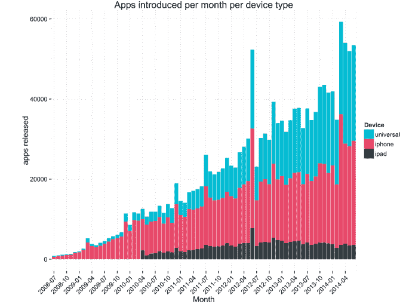
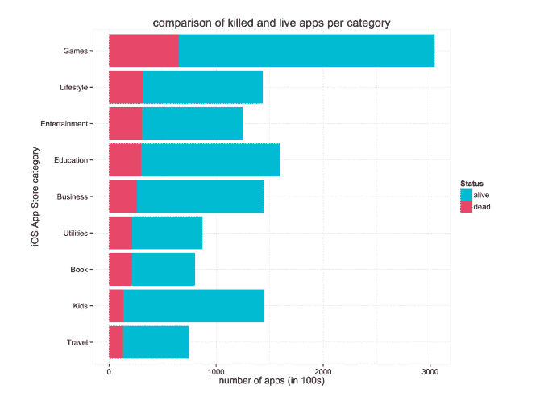
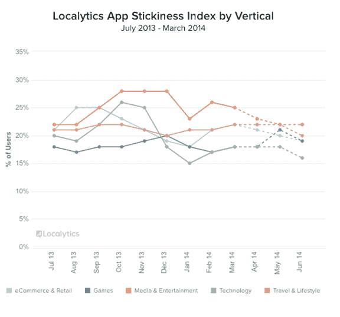

# 六年后的应用商店 

> 原文：<https://web.archive.org/web/https://techcrunch.com/2014/07/10/the-app-store-six-years-later/>

生日快乐， [iTunes](https://web.archive.org/web/20221007165211/http://www.crunchbase.com/product/app-store) App Store。[苹果](https://web.archive.org/web/20221007165211/http://www.crunchbase.com/organization/apple)的应用商店今天迎来了第六个年头，现在为消费者提供了超过 120 万个应用，根据该公司最新的官方数据，这些应用已经被下载了 750 亿次。

但对应用开发者来说，这个行业有时会很艰难，今天早上两家不同的分析公司发布的新数据有助于证明这一点。一家公司指出，自首次亮相以来，进入 App Store 的应用程序中有超过 21%现在已经“死亡”，而另一家公司则看到了一种被称为“应用程序倦怠”的趋势。后一种趋势可能表明，许多应用程序被用户视为一次性的——它们是我们玩的东西，直到我们感到无聊，完成一项任务，或者直到下一个伟大的新事物出现。

## 过时的应用程序和耗尽

与盒装软件的时代不同，今天的应用程序开发人员不必只做销售。他们必须找到并留住忠诚的用户，保持高参与度，考虑各种收入模式，包括移动广告和应用内购买，并努力保持在应用商店图表中的高排名位置，这是由[有时](https://web.archive.org/web/20221007165211/https://beta.techcrunch.com/2013/08/23/apples-app-store-rankings-algorithm-changed-to-favor-ratings-and-possibly-engagement/)难以预测和[千变万化的](https://web.archive.org/web/20221007165211/https://beta.techcrunch.com/2013/09/06/new-report-on-apples-app-store-algorithm-change-shows-how-even-a-minor-ratings-shift-affects-top-apps/) [算法](https://web.archive.org/web/20221007165211/https://beta.techcrunch.com/2013/12/13/widespread-apple-app-store-search-rankings-change-sees-ios-apps-moved-over-40-spots-on-average/)管理的。

据分析公司 [Adjust](https://web.archive.org/web/20221007165211/https://www.adjust.com/) 称，这些年来，迄今为止，总共有超过 1，601，413 个应用程序被上传到 App Store，但目前只有 1，252，777 个应用程序可用。

它说，自首次亮相以来，大多数退出 App Store 的“死亡”应用程序都在图书(27%)、娱乐(25%)和公用事业(25%)类别中。

与此同时，应用商店继续增长，每月增加多达 60，000 个新应用。Adjust 认为这一趋势没有放缓的迹象。该公司预测，到 App Store 7 岁生日时，将有另外 578，000 个应用程序加入其行列。

到 2016 年 1 月，预计还会有 952，977 人上线。

这些数字似乎是正确的。根据苹果之前公布的数据，App Store 的增长还没有开始放缓。从 2012 年到 2013 年，该公司在每年的 WWDC 发布会之间，向商店添加了 25 万个 iOS 应用程序。一年前，它增加了 22.5 万个应用程序(2011 年至 2012 年)，在此之前，大约有 20 万个新应用程序已经到来。

苹果公司首席执行官蒂姆·库克和 T3 最近表示，现在大约有 900 万注册开发者在开发 iOS，比去年增长了 47%。去年，该公司实现了 100 亿美元的销售额，通过与开发商的收入分成协议，迄今为止已经支付了 150 亿美元。苹果称，消费者每秒下载 800 个应用程序，迄今下载量超过 750 亿次。

但是在越来越多的移动应用中，许多应用从未出现过。Adjust 将长尾中最长的应用称为“僵尸应用”——这些应用没有吸引足够的注意力，无法定期在 App Store 的顶级列表中获得排名。

Adjust 表示，具体来说，活着的应用程序和僵尸应用程序之间的界限被保守地设定了——一个应用程序必须在一个月的三天中的两天里，在 39，171 个应用程序商店排行榜上排名。

该公司发现，多年来，“僵尸应用”的数量一直在增长:截至上个月(2014 年 6 月)，僵尸应用的比例为 79.6%(1，197，087 个中的 953，387 个)，高于 2014 年 5 月的 77%。这些数字比去年(2013 年 6 月)有所上升，当时 70.4%的应用是僵尸应用。

## 应用程序发现挑战

这对应用开发者来说意味着，绝大多数人不能指望 App Store 的热门搜索列表。

苹果最近几天一直在解决这个问题，在 iOS 8 中做出了一些改变。[iOS 8 应用商店引入了](https://web.archive.org/web/20221007165211/https://beta.techcrunch.com/2014/06/02/apples-ios-app-store-gets-massive-overhaul-with-trending-searches-video-previews-app-bundles-and-more/)更多子类别列表、应用捆绑、搜索改进，包括[相关搜索建议](https://web.archive.org/web/20221007165211/https://beta.techcrunch.com/2014/03/25/apple-improves-app-store-with-related-search-suggestions-full-rollout-to-complete-this-week/)和搜索趋势部分，等等。最值得注意的是，iOS 8 还将应用商店直接引入了移动操作系统本身。现在，当你在主屏幕上下拉，通过 Spotlight Search 在你的设备上搜索时，你可能会在结果中看到来自 App Store 的应用建议。

## 忠诚用户在减少

与此同时，Localytics 今天发布的一份相关报告并没有指出应用发现的问题，而是围绕留住用户的问题——或者该公司称之为“应用粘性”。该公司表示，整体应用粘性——一个应用的高级用户和忠诚用户的平均值，同时考虑了参与度和忠诚度——仍保持在 22%。

媒体和娱乐应用的粘性最高，而“科技应用”(如计时器、计算器)和游戏的粘性最低，截至 2014 年 Q2 青奥会，分别为 16%和 19%。

每月使用应用 10 次或以上的高级用户现在占 32%，这是第一次 [iOS](https://web.archive.org/web/20221007165211/http://www.crunchbase.com/product/ios) 在这个指标上与 [Android](https://web.archive.org/web/20221007165211/http://www.crunchbase.com/organization/android) 持平。(之前安卓的高级用户比较多)。然而，忠诚度在 iOS 上更高，为 24%，而安卓为 21%。

但是 [Localytics](https://web.archive.org/web/20221007165211/http://www.crunchbase.com/organization/localytics) 也指出了一种被称为“应用倦怠”的新兴趋势该公司表示，自 2011 年以来，高级用户的比例一直高于忠诚用户，现在这些数字差距甚至更大。从 Q1 到 Q2，超级用户增加了 1%，而忠实用户减少了 2%。

在 Q2，Localytics 测量的 25，000 个应用程序中共有 26%的高级用户和 17%的忠诚用户，这对应用程序开发人员来说可能是一个问题，因为高级用户通常会在短时间内大量使用某个应用程序，然后在他们达到“参与上限”时完全停止使用该应用程序，比如完成一个游戏、一项任务或特定功能。

从实用程序到游戏，许多应用程序都是这样使用的，但即使是其他应用程序——如照片共享、购物或社交应用程序——也出现了倦怠趋势，这表明一些用户不一定会“结束”应用程序，他们只是出于某种原因停止使用它。

随着 App Store 的持续增长，开发者今天面临的挑战也将增加。[排行榜已经很难进入](https://web.archive.org/web/20221007165211/https://beta.techcrunch.com/2013/02/20/the-app-stores-are-getting-full-only-2-of-iphone-top-publishers-in-u-s-are-newcomers-3-on-google-play/)，到目前为止，苹果还没有充分利用社交网络的力量，在朋友和其他更多观众之间分享应用程序。这给脸书留下了空间，让他可以利用应用安装广告乘虚而入，[可以大赚一笔。](https://web.archive.org/web/20221007165211/https://beta.techcrunch.com/2014/01/29/facebook-is-a-mobile-ad-company/)

随着应用商店的扩张，开发者需要找到新的方法让他们的应用被发现，不仅仅是通过脸书，而是通过其他广告和营销活动。一旦安装完毕，他们需要努力让当前用户参与进来。