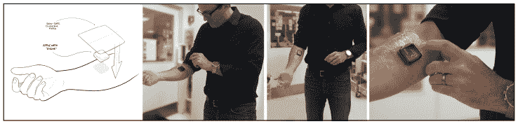
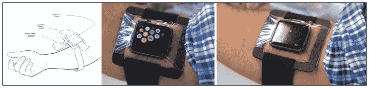
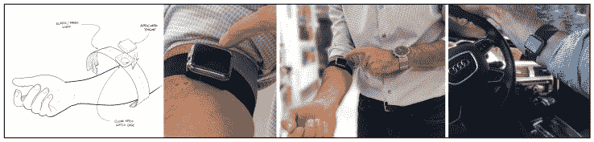
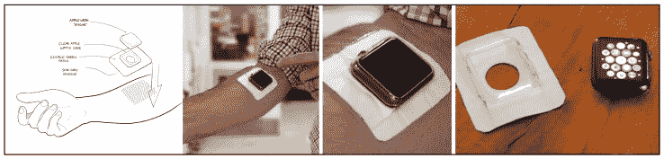

# Apple Watch 黑客:带来设计专业知识，重塑可穿戴设备 

> 原文：<https://web.archive.org/web/https://techcrunch.com/2016/03/16/the-apple-watch-hack-bringing-design-expertise-to-reinvent-the-wearable/>

凯文·杨是 Continuum 公司产品体验高级副总裁。

More posts by this contributor

半年前买了一块 [Apple Watch](https://web.archive.org/web/20221208063810/https://www.youtube.com/watch?v=eAespAEkQLY) 。这不是随便买的。作为一名苹果粉丝、手表收藏家以及在设计创新领域拥有 20 多年经验的我，对这次购买抱有极高的期望。虽然我喜欢时尚的 Apple Watch 的特性和功能，但我偶尔会对整体体验感到沮丧，原因有两个，当然是个人原因。

首先，Apple Watch 不会持续监测我的心率。因为我家族有心脏病史，所以我密切关注自己的健康。在几天或几周内跟踪我的心率将为我提供有益的纵向数据。Apple Watch 旨在每当健身应用程序启动时测量用户的心率，但在其他情况下不会记录用户运动时的心率，而这正是我想要测量的时间(我意识到这可以节省电池寿命，但我很乐意整天充电以拥有这一功能)。

第二，Apple Watch 很难契合我的审美生活。作为一个收集手表超过 20 年的人，我很失望戴上我的 Apple Watch 意味着不戴我的其他手表。我尝试过同时戴着苹果手表和我收藏的手表，一只戴在手腕上，但这很不舒服……我觉得自己像个科技书呆子(无意冒犯科技书呆子——我就是一个，但有时我会试图掩饰)。

所以我认为这是一个有趣的设计挑战，类似于我在日常工作中经常遇到的那种挑战。然而这一次，我既是设计师又是消费者。我能找到一种方法每天戴着 Apple Watch，收集连续的心率信息，同时还戴着我的其他手表吗？我在设计医疗设备和消费产品方面有丰富的经验，所以我希望在设计我的解决方案时运用这些知识。

我的第一个想法:Apple Watch 的机身可以和它的表带分开。这可能是解决方案的核心。这种表体“引擎”模块有可能在不使用表带的情况下重新定位在表体上。

接下来是四步设计流程:

**第一步:**确定 Apple Watch 的心率监测器戴在身体其他部位时是否能工作。我创建了一系列快速破解模型，看看如果我在跑步时将手表戴在脚踝、肩膀、前臂和腹部会发生什么。当苹果手表戴在我的脚踝、肩膀和前臂上时，它成功地监测到了我的心率——但不是我的腹部。这很可能是因为[苹果的光电容积描记过程](https://web.archive.org/web/20221208063810/https://support.apple.com/en-us/HT204666)依赖于读取血液的流动，腹部周围没有足够的“可见”血液流动。

> 消费者有独特的需求，公司应该支持和鼓励定制他们创造的产品和服务。

**第二步:**想好我身上的什么地方可以佩戴手表引擎。我很快发现选项并不多…尤其是因为我希望能够随时查看手表屏幕。我的脚踝和肩膀有固有的可视性——和屏幕访问的挑战。我坐在我的前臂上。在这个位置上，我可以在长袖衬衫下不连续地佩戴手表引擎。袖子卷起来是看不见的，但是需要的时候可以看到。

**第三步:**设计一个将 Apple Watch 戴在前臂上的流程。没有简单的方法把它固定在我的前臂上。Apple Watch 的腕带不够长，无法环绕前臂，即使如此，屏幕的方向也不适合观看。这意味着 Apple Watch 的表带连接点可能无法用来将它固定在前臂上。

**第四步:**原型。我知道 Apple Watch 的机身模块可以有效地在我的前臂上读取我的心率，于是我开始制作可佩戴的原型，将手表戴在我的前臂上。最后，我做了四个原型。

## 第一个原型:透明补丁

来自医疗产品的安全透明粘合剂(Tegaderm)覆盖在表体上。它的优点是易于使用，并且能很好地固定在手臂上。缺点是粘合剂在皮肤上看起来令人毛骨悚然，Apple Watch 屏幕有点难以透过粘合剂看到。

## 第二个原型:框架和乐队

表体置于塑料框架中的透明薄膜袋下，并添加了一条柔韧的织物带，以将表体固定在前臂上。表带工作良好，表体可以很容易地插入和取出，但它看起来设计过度，在手臂上笨重。

## 第三个原型:表壳和表带

一个透明的表壳与一条柔韧的表带相连(从第二个原型发展而来)。Apple Watch 卡入表壳，它将手表机身保持在正确的方向。这提供了一个更传统的外观——就像一个握着智能手机的锻炼带——并且它舒适，容易/快速地穿上和脱下。然而，这种配置仅限于前臂(可能还有脚踝)使用；理想情况下，我想要一种可以涂在身体其他部位的溶液。

## 第四个原型:胶粘补片

透明的表壳与柔韧的织物贴片相连。医用皮肤安全粘合剂(来自第一个原型)应用于贴片的下侧。表体扣入透明表壳。它的优点是易于使用，能很好地固定在手臂上，并能在身体的多个部位使用。没有缺点。

在设计行业工作，我们经常做我们称之为共鸣测试的事情:将我们的原型交给消费者，以了解哪些目标属性会引起他们的共鸣。这个测试过程不是为了找出统计上的赢家。相反，它专注于概念的演变——只发扬每个想法最成功的方面。虽然 Apple Watch 引擎的这次测试是 N 对 1，但我遵循了类似的方法，改进了每个概念，并为后续概念带来了最佳属性。

最后，第四个原型，苹果补丁，最有效地适应了我的生活。苹果补丁是怎么回事？

手表主体由透明的塑料外壳固定，外壳上贴有不伤皮肤的粘性贴片，这样我就可以不引人注目地佩戴它，同时还可以佩戴我收藏中最喜欢的手表之一。它还允许在我身体的不同位置灵活地佩戴它。该贴片还可以定制各种颜色和图案。因此，这种重新设计让 Apple Watch 能够如我所愿，不断向我提供关于我的心率的信息。事实上，我正卷起袖子，低头看着我的苹果手表，我可以报告我的心率是 58。

苹果手表被黑提供了两个很好的教训:

**原型学。**尽管实验性原型制作和测试是任何设计师方法的核心，但我对自己能够如此快速地通过创建非正式测试模型来发展和改进设计感到兴奋。这让我进一步体会到这种类似敏捷的方法对于创新和快速失败的重要性。

**每一项创新都可以定制和改进。**消费者有独特的需求，公司应该支持和鼓励[定制](https://web.archive.org/web/20221208063810/http://www.mddionline.com/blog/devicetalk/medical-device-hacking%E2%80%94why-are-patients-innovating-and-companies-failing-deliver-04-29-15)他们创造的产品和服务。随着创客运动和家庭 3D 打印的发展，让消费者成为设计和创新过程的一部分将变得更加重要。