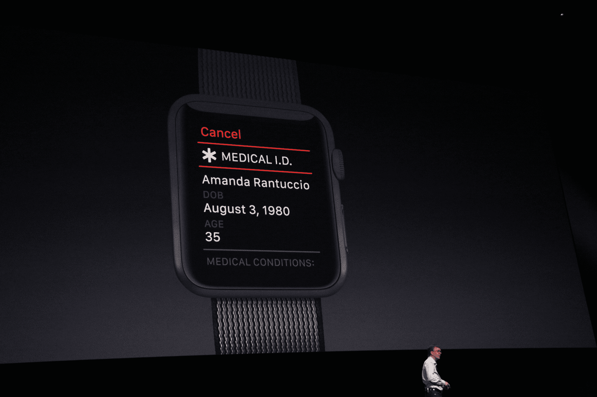

# Apple Watch 现在是一个 SOS 按钮和医疗 ID 手环 

> 原文：<https://web.archive.org/web/https://techcrunch.com/2016/06/13/the-apple-watch-is-now-an-sos-button-and-medical-id-bracelet/>

# Apple Watch 现在是一个 SOS 按钮和医疗 ID 手镯

苹果刚刚在 WWDC 将 Apple Watch 变成了一个 SOS 按钮[。使用 watchOS 3，您可以长按侧面按钮来启动与紧急服务的呼叫。](https://web.archive.org/web/20221207212419/https://beta.techcrunch.com/events/wwdc-2016/)

当您按住侧面按钮时，会开始倒计时。如果你继续按，电话就会响起，你可以和紧急服务人员通话。苹果手表知道你在哪个国家，会拨正确的号码。

一旦你打完电话，Apple Watch 就会给你的紧急联系人发送一条信息，并附上你所在位置的地图。

苹果也在把 Apple Watch 变成医疗 ID 手环。发出求救信号后，你的手表会自动开始显示你在手机健康应用程序中输入的所有医疗细节。支持 HealthKit 的应用程序还可以为您的医疗细节提供数据。如果你不省人事或者无法告诉急救人员他们什么时候到达，这可能是有用的。

这只是 [watchOS 3](https://web.archive.org/web/20221207212419/https://beta.techcrunch.com/2016/06/13/apple-overhauls-watchos-with-new-ui-and-faster-app-launching/) 中的新功能之一。Apple Watch 更新是一次全面的更新，将使您的手表更有用、更快。

