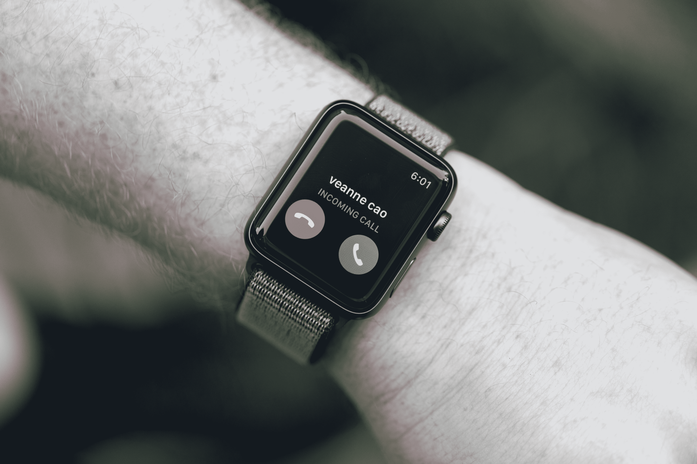
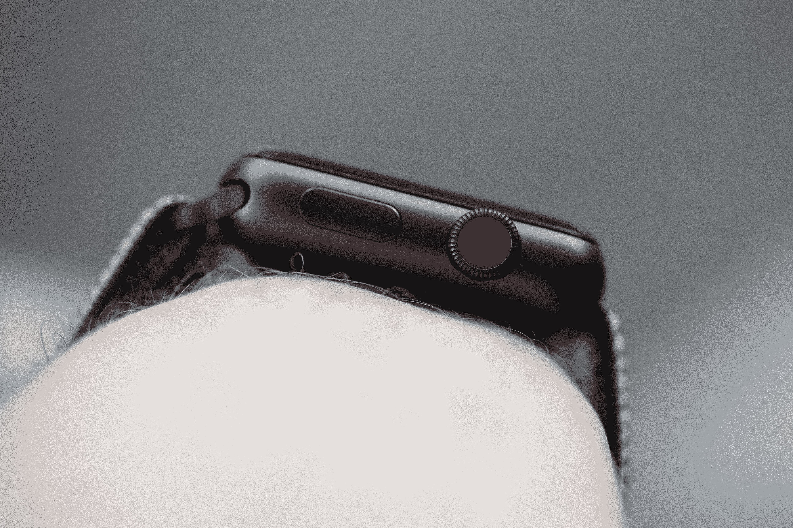
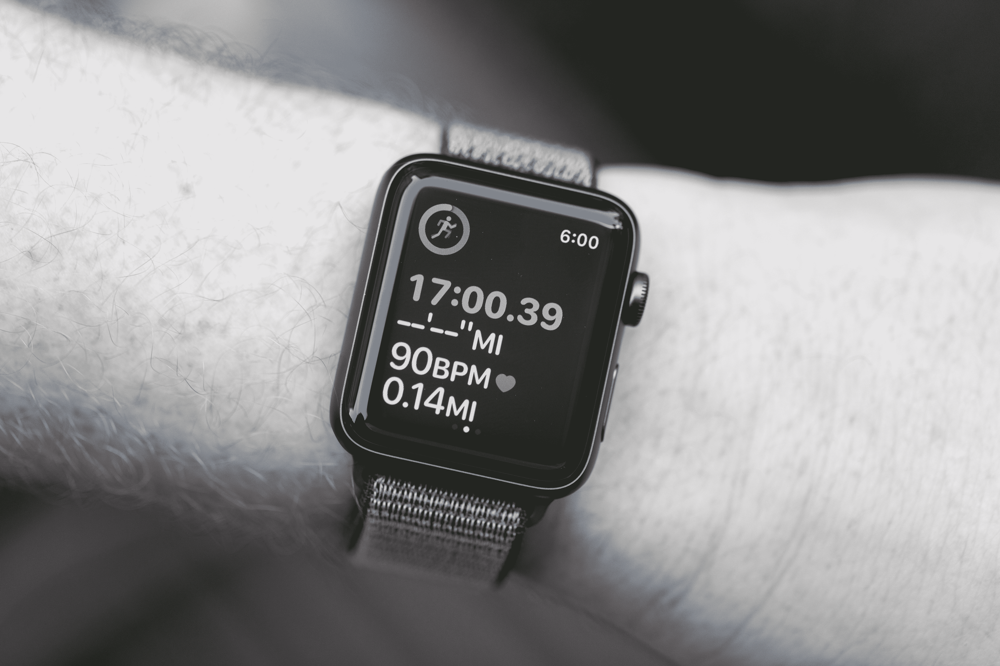
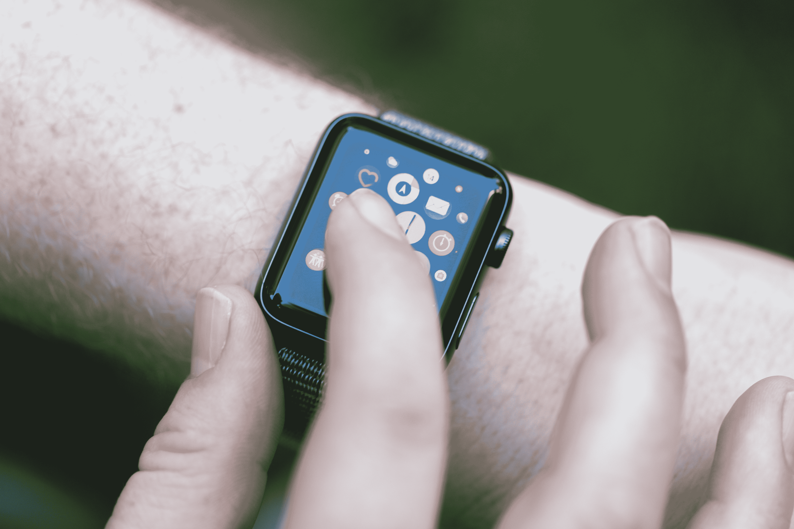

# 苹果手表仍然是打败 TechCrunch 的那个

> 原文：<https://web.archive.org/web/https://techcrunch.com/2017/09/20/the-apple-watch-is-still-the-one-to-beat/>

可穿戴设备的光泽已经消失。包装已经开始变薄，甚至像 Fitbit 这样的行业领导者也感到了压力。当然，也有一些例外。在低端，由于 15 美元的健身手环，小米等公司迅速成为市场份额的领导者。当然，还有苹果。

苹果手表成功地发挥了公司的优势，提供了统一的硬件/软件解决方案，充分利用了产品有限的屏幕空间。结果是一件罕见的事情:人们真的买了一块智能手表。因此，该公司在两代人的时间里没有对配方做太多改动，这并不奇怪。事实上，表冠上的小红点实际上只是一点粉丝服务，帮助佩戴者将他们的设备与旧型号稍微区分开来。

后来的车型更多的是精致而非重新定义。上次，它是一个更快的处理器，全球定位系统和整洁的小扬声器小玩意儿，游泳后吐水。事情又变得更快了，这一次，但所有人真正谈论的是，可以理解的是，LTE。通常情况下，苹果不是第一家提供这项技术的公司(三星和 LG 都已经抢先一步)，但它是最适合以一种方式提供这项技术的公司，这种方式可以让佩戴者重新思考他们与设备的交互方式。

## 回到手腕上

我已经带着手表生活了好几天了。作为一个经常将可穿戴设备作为工作的一部分(这是一种生活)的人，再次在我的手腕上戴上 Apple Watch 是一件好事。它很熟悉，很友好，也很合身——最后一条更是如此，这要归功于新的运动 Loop 表带，它看起来还不错，但无疑是我迄今为止试过的最舒适的智能手表表带。虽然，velcro/尼龙组合虽然简单，但随着反复扣紧和解开，可能会很快降解——对于一条 50 美元的皮带来说，这是一个遗憾。

总的来说，该公司在生产舒适的可穿戴设备方面做得比大多数公司都要好。他们一直提供两种尺寸选择，但即使是更大的 44 毫米框架也比大多数智能手表更适合，因为大多数智能手表都用小配件淹没了手腕。Apple Watch 与尼龙运动圈搭配时齐平，我经常忘记我戴着它——当我戴着卡通风格的大齿轮 S3 时，我说不出什么。

就实际使用而言，事实是最重要的应用程序一直都是一样的。这并不是说对杀手级智能手表应用的搜索没有完成，而是说可能永远不会有一个杀手级应用。像智能手机一样，设备的价值更多的是其各个部分的总和。对于绝大多数用户来说，没有一个应用程序足以证明 200-300 美元的价格是合理的，但综合起来，一些不同的应用程序有可能对你的日常生活产生有意义的影响。

## 电话，家庭

【T2

对一些人来说，LTE 的加入可能会再次改变现状。与更广泛的智能手表类别一样，LTE 并不是每个人的功能，或者至少不是每个人都认为是他们生活中必不可少的功能。到目前为止，我发现自己非常坚定地属于这一类。我在旧金山的街道上跑了一会儿，以测试这一功能，你知道，避免过早死亡，这是它真正派上用场的一个例子。

跑步者当然知道试图弄清楚你的智能手机在做什么这种持久的麻烦。蓝牙耳塞的出现在一定程度上缓解了这种痛苦，将 LTE 加入智能手表是这一过程中的下一个重要步骤。一旦您将手表从连接的手机范围内取出，默认表盘的中间会弹出四个圆点。

【T2

这是一种解放，感觉就像是在一步步治愈一种全天候的智能手机瘾。这项技术与苹果支付(Apple Pay)和地图(Maps)等机载应用的结合，意味着你实际上可以完成大多数人在手机上做的相当大一部分事情。当然，仍然有局限性，主要是由于有限的屏幕面积，但现在直接内置在手表中的 Siri 语音功能是一个很好的解决方案，很可能是迄今为止苹果智能助手的最佳论据。

音乐流媒体是发布时的一大盲点。老实说，这对跑步者来说和任何健身应用程序一样重要。苹果音乐流媒体将于下个月推出——与此同时，还有一些常见的解决办法，比如在你出去跑步之前，使用手表的存储空间在本地保存东西。但令人失望的是——也有点令人惊讶的是——该公司未能及时开发出功能。你还可以期待 Spotify 等其他关键流媒体服务的功能——当然，前提是他们愿意在自己的终端上添加这一功能。

这些都是外出时可以使用的不错的功能，但在我戴着手表的日子里，我一直在努力想出自己生活中跑步以外的许多场景，在这些场景中，把自己从手机中解放出来是必要的——甚至是特别有用的。当 Apple Watch 3 只不过是苹果谣言工厂的一点点谷物时，技术专家们屏息谈论该产品改变游戏规则的潜力。谁知道呢，也许在最近的记忆中第一次摘下手机的承诺会导致更多的用户没有手机。

## 我们可以解决这个问题

然而，与此同时，LTE 在现实世界中的主要用途与健康直接相关，这并非巧合。随着苹果自己的产品变得成熟，该公司显然也像其他人一样吸取了同样的教训:健身不仅仅是低端市场的主要驱动力。帮助用户做出更健康选择的承诺也在推动高端市场。这正是 Fitbit 决定全力以赴推出 Ionic 时所下的赌注，它很快成为了新款 Apple Watch 的核心产品。

该公司在过去两代产品中发布的大部分公告都与健身和健康直接相关。今年早些时候，该公司发布了 GymKit，这是一个开发平台，旨在让 Apple Watch 的兼容性在健身中心像 30 针 iPod 基座一样无处不在(不幸的是，在我参观的许多酒店健身房中，这种情况仍将继续)。

经过四次全面的操作系统升级，健身已经成为体验的主导，从跑步和游泳等活动，到将你的日常活动与短信和电话整合在一起的被动通知。这些功能也呼应了苹果公司将健身扩展到普通健康的兴趣。毕竟，正如该公司上周在台上急切指出的那样，这款手表的心率监测器是世界上部署最广泛的——这反过来几乎肯定会使它成为部署最广泛的健康监测器之一。

这在佩戴者的日常生活中是一个非常强大的工具，苹果将很高兴地列举一些事件，当手表在休息时检测到异常高的心率时，人们避免了灾难。这是对未来的有趣洞察，也是一个很好的论点，因为它继续与大型医疗保健公司就合作关系进行接洽。按照 FDA 的标准，Apple Watch 永远都不会是一款合适的医疗设备，但它仍然有潜力做很多好事。

## 对峙

 这个里面，连同外面，都没有太大的变化。LTE 版本的存储空间增加了一倍，达到 16GB，这有利于缓存内容，也意味着在等待 Apple Music 流媒体上线时，你可以存储更多的歌曲。然而，最大的变化是添加了双核苹果 S3 +苹果无线 W2 芯片。鉴于许多 Apple Watch 应用程序的轻量级性质，你可能不会每天都看到巨大的差异，但处理的改进带来了一些重要的附加功能，这些功能自然是使整个 LTE 体验工作的关键。

新处理器最终让 Siri 通过内置扬声器与你对话。这似乎是一件小事，但 Apple Watch 是 Siri 迄今为止最有用的应用程序。我很少在手机上使用智能助手的语音功能。也许我只是从来没有真正习惯它——但更重要的是，它只是更容易打字。当你面对 1.65 英寸时，那真的不是一个选项。

对着手表说话比一次输入一个字母要容易得多——虽然该软件在将手指涂鸦转换成字母方面做得很好，但除了快速输入文本之外，写任何东西都是一件苦差事。我也很惊讶的说，我并没有觉得和手表说话的行为超级尴尬。也许几十年的迪克·特雷西(Dick Tracy)已经让我们为这种不可避免性做好了准备，但在嘈杂的环境中快速拨打手表实际上有点效果——在这个过程中，我设法不觉得自己像个白痴。

与此同时，W2 无线芯片解决了将 LTE 智能手表带入世界的一个最大问题:电池。手表发布前的所有问题和笑话都围绕着这个关键问题，因为可穿戴设备的好坏取决于它的电池寿命。苹果在台上说，这款手表充电一次应该可以用 18 个小时——我发现这并不遥远。在解开手表和启动 LTE 的情况下，我度过了一整天，没有问题。

当然，这里有几个警告——即苹果音乐功能还没有推出。如果你花很多时间使用手表来播放音乐，电池会受到很大的冲击。虽然苹果在增加蜂窝功能的同时保持了电池寿命，但该公司需要努力在每个后续版本中改进电池。

鉴于其缺陷，Fitbit 的 Ionic 将承诺四天电池的标准定得非常高。当设备仍然需要在每次可穿戴设备上床睡觉时充电时，真正无处不在的活动和睡眠跟踪的承诺将无法实现。在如此小的外形中，这是一个崇高的目标，但 Fitbit 很高兴地表示，这不是不可能的。

## 购买和手机

我不能抱怨一份迫使我不断更换新的可穿戴设备的工作。和以往一样，我对自己盘子里的下一件东西感到兴奋，但是，苹果也设立了一个高标准。像它的前身一样，Series 3 主要是一种改进的工具。抛开 LTE 不谈，与去年的型号相比，这里几乎没有什么可以证明升级价格的合理性。苹果第一次尝试智能手表就非常成功，每一代产品都变得更好。

至于 LTE，如果我现在买一个新的苹果手表，我会认真考虑整个事情。对我们大多数人来说，329 美元和 399 美元之间的价格差距并不小。但更重要的是，你每个月在计划中增加的 10 美元肯定会增加。诚然，这只是几杯咖啡的事，但这些天来，每月 10 美元的服务费已经开始占据我们薪水的相当大一部分。

但是如果这是你和你生活中多一点无形自由之间的障碍，也许这是值得的。我们都可能从减少咖啡因的摄入中受益。