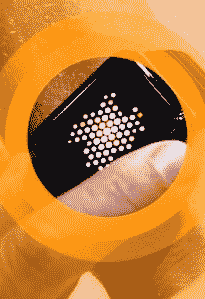

# 苹果手表是时间，拯救了

> 原文：<https://web.archive.org/web/https://techcrunch.com/2015/03/06/the-apple-watch-is-time-saved/>

在调查苹果手表的过程中，我和几个长期使用它的人谈过话。

有很多有趣的细节，其中一些我们会深入探讨。但是，到目前为止，最大的反复出现的主题是，一旦你有了 iPhone，你会多么少地使用它。

经过这些讨论，似乎可以肯定的是，Apple Watch 将很快成为你白天使用 iPhone 的主要方式。

戴过这款手表的人说，他们从口袋里拿出手机的次数比过去少得多。一个简单的点击来回复或看一眼手腕或听写是一个非常不同的交互模式，而不是拿出一部 iPhone，解锁它，然后被拖入它无情的注意力漩涡。

一位用户告诉我，他们白天几乎“停止”使用手机；他们曾经有过，现在没有了，就这样。当你想到过去十年智能手机屏幕的蓝光在多大程度上主导了我们的社交互动时，这简直是疯了。

苹果有几种方法来实现这一点。

## 保持警惕

手表将比一部单独的手机拥有更多关于你的背景信息。例如，它会定期检测您的心率，为您提供最后一次检查的时间，这可以为健康应用程序和其他相关过程带来重大好处。

这里有一个你可能不知道的趣闻——为了接收应用程序的通知，手表必须戴在手腕上并锁定。手表需要接触您的皮肤才能接收通知。当它离开你的手腕时，将不会有应用程序内的下拉通知或持续的 ping。当电池电量达到 10%时，推送通知也会停止。这些决定表明了苹果处理通知的谨慎。

通知在元素层面上也不同于手机上的通知——无论是开发者还是用户。这些是马上看到的*而不是在某个时候看到的*。你很快对他们采取行动，他们不会像在电话里那样堆积如山。**

 **还有一点额外的背景，因为你知道他们什么时候收到的，这意味着时间敏感的通知，如那些推荐精确的机构或在现场活动期间 ping 你的通知变得更加密切。

> 一位用户告诉我，他们白天几乎“停止”使用手机；他们曾经有过，现在没有了，就这样。

如果你是一个处理通知的开发人员，你应该知道它有多强大。

而且，作为用户，这些通知会作为应用程序的一部分在手表主屏幕上激活，允许你在没有任何滑动、解锁或其他垃圾的情况下对它们进行操作。这些是即时的、可操作的项目，你可以在没有拿出手机的固有义务的情况下访问它们。

## 力学

因为手表的屏幕太小，所以一直有很多关于它被用作“[通知窗口](https://web.archive.org/web/20230305031532/http://www.theverge.com/2014/9/9/6127913/apple-please-dont-screw-up-notifications-on-the-apple-watch)”的说法是的，通知是它的一个强大部分，但是设备的机制实际上支持的远不止这些。

广泛使用过这款手表的人说，触摸目标实际上非常精确和敏感。这意味着你将能够相当容易地触发更小的按钮和交互元素。(值得注意的是，[不同寻常的群集主屏幕布局](https://web.archive.org/web/20230305031532/https://techcrunch.com/2014/09/09/hands-on-with-the-apple-watch/)意味着应用程序的“热点”将在边缘，而不是中心。这样你可以向任何方向喷射到一个群体的边缘，找到一个应用程序。你的“底排”将成为你的“外环”)

显示屏也非常清晰，可以从手腕上轻松读取。当你的注意力集中在手表上时，你会想在手表上做比你想象的更多的事情，而不是把注意力转移到手机上。这意味着你可能会发现自己在手腕上阅读短文和其他内容。这可能会影响出版商开发应用的方式。他们不应该只是重定向机器，把人们踢到他们的手机；现在有机会给人们他们需要的东西，让他们回到他们正在做的事情上。

电池寿命也比一些[以前的报道](https://web.archive.org/web/20230305031532/http://9to5mac.com/2015/01/22/apple-targets-for-apple-watch-battery-life-revealed-a5-caliber-cpu-inside/)好得多，所以苹果一直在努力。在正常的断断续续的使用中，电池通常会在 25%左右，这意味着你应该能够坚持一整天。充满电只需要大约两个小时。

数字表冠是导航过程的重要组成部分，与滚动速度精确匹配。当在小屏幕上观看时，这应该会给人一种上下文感，因为你不是用手指在滚动。自手表首次展示以来，它的物理结构也发生了变化，现在有了更多的摩擦，感觉更重、更高端。

按住表冠可以激活 Siri，有消息称 Siri 在手表上的效果非常好。它可以用于标签，方向，手机执行的命令等等。如果——这是一个很大的如果，因为 Siri 对我来说多年来一直受到打击和错过——如果它真的是一种“说出来就忘了”的体验，那么使用你的手腕作为你生活的“指挥官”的信心是巨大的。

## 为什么看？

那么，我们来讨论一下。我们不得不买 500 美元的配件来回归正常生活，这是不是有点糟糕？当然可以。但这就是交易。

你不会放弃你的智能手机。浮士德式的交易已经达成。我们可以接触到整个信息和交流的世界，而我们却在它光滑的玻璃祭坛上牺牲了我们血腥的注意力。

但 Apple Watch 可以将部分注意力，更重要的是，将时间还给你。

如果你认为这款手表卖不出去，或者卖得不好，那么值得指出的是，只有非常非常非常少的产品可以让你给别人现金，然后拿回时间。

这将是 Apple Watch 要跟踪的指标:节省的时间。

我们这里有点玄学，但实际上我们唯一完全相同的资源是时间。国王并不比农民拥有更多的钱。不是每个人都能买得起 Apple Watch(或者甚至是 iPhone)，但是如果他们的经济状况允许，那么他们也可能愿意用金钱换取时间。

这就是 Apple Watch 的目标市场。不是“富人”(尽管有一个专门为他们设计的模型)，不是“科技极客”，也不是“苹果狂热分子”。人们想要更多的时间，这是一个非常大的目标。

出于某种原因，这是苹果一直难以表达的东西。这是手表的主要使用案例。不仅仅是说它是一个“通知中心”；那就是它允许你在没有任何额外干扰的情况下扮演 T2。

目前，iPhone 是苹果的主导业务，智能手机是我们日常生活中的一股霸气。但是总有一天会有东西来摧毁它。而且，正如苹果过去多次表示的那样，它愿意成为找到那个东西的人。有了 Apple Watch，我们可以看到这一过程的开端。

也许有一天，Apple Watch 可以完成不可能的事情:它可以让你停止使用手机。**