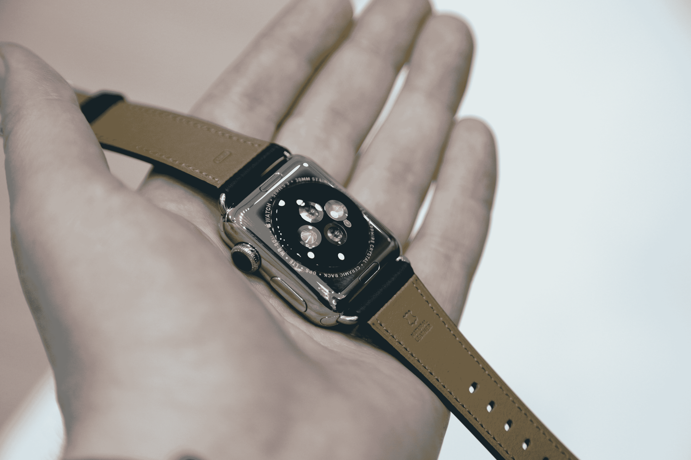
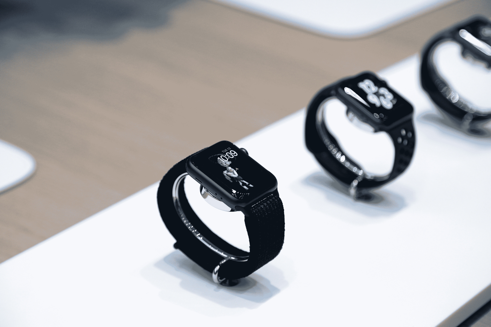

# Apple Watch Series 3 将改变很多锻炼方式

> 原文：<https://web.archive.org/web/https://techcrunch.com/2017/09/12/the-apple-watch-series-3-will-transform-a-lot-of-workouts/>

# Apple Watch Series 3 将改变很多锻炼方式

在最近几次 Apple Watch 升级中，苹果表现得有点谨慎——和许多公司一样，它无疑理解智能手表外形的局限性。他们很小，所以很难把事情推得太远。该公司在市场份额方面也没有太多竞争 Apple Watch 是智能手表市场上罕见的亮点。

从表面上看，[手表系列 3](https://web.archive.org/web/20230315095319/https://techcrunch.com/2017/09/12/the-new-apple-watch-series-3-has-cellular-built-in/) 保持了这一趋势。除了帽冠上的红色点缀和一个略厚的心率监测器外，这款产品与其前身几乎没有什么区别。和以往一样，最大的变化在内部。首先，有一个明显更强大的处理器，它将 Siri 的语音等新功能直接集成到设备中。

然而，正如预期的那样，这里的大消息是可选的 LTE。这肯定不是第一款提供该功能的手表，但对于那些将“苹果手表”和“智能手表”视为同义词的用户来说，这是一种重新思考空间的方式。不用手机就能打电话的功能很不错——我听说人们仍然用这种方式交流——但它的移动苹果音乐(大约一个月后推出)和移动支付才是真正的新典范。

该公司长期以来一直将苹果手表视为一种健身精品，这种冲动只是在最近几年才有所增长。正如无数分析师指出的那样，它仍然是智能手表购买的主要驱动力，即使大量便宜得多的健身手环继续充斥市场。这意味着最终结束将手机绑在手臂上，或者在跑步时试图防止手机从口袋中掉出的尴尬时代。

然而，对我来说，最引人注目的功能是在佩戴者坐着不动时监测不规则的心跳。我看不到苹果声称拥有真正医疗设备的未来，但这些智能日常用品是让消费设备真正以有意义的方式为佩戴者工作的好方法——该公司与斯坦福大学合作将它推向世界的事实无疑增加了合法性。

与 iPhone X 一样，发布两个等级(LTE 和非 LTE)是帮助产品达到更广泛范围的一种方式。蜂窝连接并不适合每个人，但它肯定会改变很多锻炼。