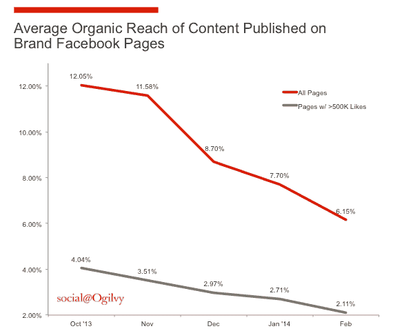

# 投资真正粉丝参与度的理由

> 原文：<https://web.archive.org/web/http://techcrunch.com/2015/07/30/the-argument-for-investing-in-true-fan-engagement/>

哈里森·施撰稿人

哈里森·施是

[Frankly](https://web.archive.org/web/20230307214225/http://franklyinc.com/)

.

More posts by this contributor

在脸书、YouTube、LinkedIn 和 Google+等网站推出以品牌为中心的服务后，社交 媒体成为企业获取新用户和吸引粉丝的地方。这似乎是一种获得曝光率的有效方式:企业基本上可以在脸书“租用”一个位置，就像一个小鞋子品牌可以在购物中心租用一个商店，以利用基础设施和繁忙的人流量。

随着社交网站上品牌页面的增长，他们跟踪了诸如“赞”或关注者数量等数量指标，以及诸如分享和转发其发布内容等互动。

虽然一个页面的关注者数量有价值，而且肯定能够预测一个品牌社区的健康程度，但这并不等同于真正的价值。很多社交 媒体的度量都是虚荣的度量。

正如 TechCrunch 的前编辑 Erick Schonfeld，[写道](https://web.archive.org/web/20230307214225/https://techcrunch.com/2011/07/30/vanity-metrics/)“虚荣指标是指注册用户、下载量和原始浏览量。它们很容易被操纵，不一定与真正重要的数字相关:活跃用户、参与度、获得新客户的成本，以及最终的收入和利润。”

事实上，订婚才是真正重要的。不幸的是，品牌在外部社交平台上过度投资社交努力，导致有机参与度下降。今年 1 月，由一个拥有超过 10 万个赞的品牌创建的《脸书邮报》的平均参与度为 0.14%。去年年底，Twitter 上最有吸引力的前 25 个品牌的帖子参与度仅为 0.07%。

其中一个原因是纯粹的噪音。社交 媒体平台现在异常拥挤，大大小小的企业相互竞争用户的注意力，以及用户的个人网络和他们喜爱的娱乐内容创作者产生的大量内容。

更令人担忧的是，品牌别无选择，只能接受社交 媒体平台自己做出的商业决定。[分析师预测](https://web.archive.org/web/20230307214225/http://social.ogilvy.com/facebook-zero-considering-life-after-the-demise-of-organic-reach/)随着平台为付费社交 媒体广告腾出空间，在社交 媒体网站上的有机接触——有多少用户会*看到*一篇帖子，更不用说参与其中了——将接近 0%。

> 最终，社交平台所有者说了算，他们可以限制有机接触并规定品牌指导方针，就像房东可以提高租金并驱逐租户一样。

正如营销专家杰伊·贝尔[在他为品牌拥有自己的社交社区的论点中指出的](https://web.archive.org/web/20230307214225/http://www.convinceandconvert.com/social-media-strategy/its-time-to-own-your-social-community/)，“我们忘记了社交平台的所有者是公司，而不是品牌内容的慈善分销商。一旦这些公司开始上市，它们的法律义务就变成了为股东、而不是你的股东实现价值最大化。”

看看脸书的品牌-页面-帖子有机触及记录及其自 2013 年以来的快速下滑就知道了。如今，平均而言，脸书网页只能有机地接触到 6%的粉丝(更大的网页只有可怜的 2%)，这是一年半前的一半。

因此，即使一个用户“喜欢”你的脸书页面，并且你把他们算作粉丝，他们也越来越不可能看到你的帖子。在这些平台上没有排他性，噪音是不可避免的，即使是对那些要求与你交流并有可能成为非常有价值的客户的人来说。

脸书上发布的内容在全球 100 个脸书品牌页面上的平均有机覆盖范围，粉丝总数超过 4800 万( [social@Ogilvy](https://web.archive.org/web/20230307214225/http://social.ogilvy.com/facebook-zero-considering-life-after-the-demise-of-organic-reach/) )。

除了限制有机接触，脸书还对影响谁能看到多少内容的网站算法进行定期更新。在任何时候，脸书可以限制或改变他们的张贴和身份准则。

这让我们想到了更广泛的一点:脸书在其平台上发号施令，因为它是“地主”品牌受制于它的规则、突发奇想以及最终的租金上涨。

一开始，品牌搬进了他们租赁的社交空间，在内容创作上投入巨资以吸引用户，并获得了令人印象深刻的参与度。租赁社交社区最初的价值主张很明确:用高质量内容换取暂时曝光。但是今天，随着有机传播的消失，创造独特内容所需的高投资回报价值减少。

因为最终，社交平台所有者说了算，他们可以限制有机接触，规定品牌指导方针，就像房东可以提高租金，驱逐房客一样。最重要的是，所有品牌在这些租赁的社交网站上的投资都没有为品牌建立长期权益，因为社交网站拥有他们粉丝的用户账户、照片、帖子和数据。

社交存在是品牌认知、发现和发展你的声音的营销的重要组成部分，在这些租赁的社交平台上培养追随者是实现这一点的必要手段。重要的是要记住投资你自己的财产的价值，那些提供资产净值并随着时间的推移而增值的财产。

当你参与社交营销时，你能做些什么来打破这些“租赁”习惯？考虑投资一个*拥有的* 社交社区——这是分散你的社交资产的好方法。

自有社交 媒体的一个例子是品牌网站上的论坛，这是桌面网络时代流行的社区平台。但是和房地产一样，咒语是一样的:位置，位置，位置。你在哪里投资建立你自己的社交社区是至关重要的。

在移动设备上构建用户所在的位置。花在数字媒体上的大部分时间(60%)都花在了移动设备上，其中 86%花在了本地应用上。充分利用今天的移动设备，在未来获得巨大收益。数字媒体 参与度去年增长了 24%，主要是受移动业务的推动。想象一下将要发生什么。

现在我们是一个移动驱动的世界，自有社交社区可以拥有实时、即时的家，并适应他们的移动习惯。企业应该投资一个强大的品牌本地应用程序，在一个专门的空间里招待他们的超级粉丝。

这也将使他们能够利用移动通讯功能，玛丽·米克尔[预测](https://web.archive.org/web/20230307214225/http://franklyinc.com/why-mary-meeker-predicts-messaging-boom/)将作为一种事实上的*通讯方式主宰我们的生活(我们正在朝着这个方向前进，因为移动设备上最常用的 10 个应用程序中有 6 个是通讯应用程序)。*

当你拥有自己的社交社区时，你可以控制语气、促销、信息节奏、参与度以及其他一切。在移动参与的新时代，这些是任何伟大的营销人员都应该拥有的工具。

更重要的是，自有社交社区是*质量*用户参与度和社区成长的地方。质量参与比*追随者数量*更有力量。如果你在租赁的社交 媒体页面上有 10 万名粉丝，你现在可以为你的最高质量用户——1000 或 5000 名对你充满热情的超级活跃用户——创建一个不同的空间。

为你的超级粉丝提供一个见面和直接与你互动的空间，这是他们单靠典型的社交 媒体网站做不到的。

自有社交推动高质量参与度和忠诚度，具有三个特殊特征:

**1。基于兴趣的真实对话。对话是这个游戏的新名字。营销不再是简单的内容传播，它已经渗透到每一个社交网站和媒体网站。技术在不断发展，现在是只有交谈才能提供的即时性、亲密性和互动性。**

你拥有的社交社区专注于共同的兴趣。用户加入是因为他们对某个兴趣充满热情，他们的积极参与会很快显示出他们对你的品牌和你促成的兴趣的忠诚度和亲和力。没有其他品牌的干扰，如果有的话，那是因为你把它们放在那里是出于战略目的。

主题可以是流动的，允许用户私下(与你的代表或另一个粉丝一对一)或广泛地(与整个社区)讨论他们喜欢的任何事情。另一方面，社交 媒体对话会让人觉得“在展示”，生硬或局限于客户服务话题。

**2。用户见解。**当一场对话在你自己的领域展开时，你会看到它最纯粹的形式。您可以调节、引导和消化您的用户产生的所有定性和定量数据，让您能够立即进行市场研究，而无需担心您的租赁资产。

你可以自由地进行测试和促销，并完全控制你的品牌和你的品牌粉丝之间的交流。

**3。独特的用户控制。**您是主持人，因此可以控制对您唯一的用户身份的访问。你可以保护他们免受算法变化、匿名和名称政策变化以及任何其他超出你控制范围的力量的影响，这些力量可能会将用户从社交网站上推下来。(这个很重要。例如，过去四年实施的实名制政策在脸书、Google+和 YouTube 用户中引起了轩然大波，而品牌则受制于这些平台的决定。)

租赁社交社区一直占据主导地位，因为它们容易创建。对有远见的营销人员来说幸运的是，技术正在快速发展，创建你自己的社交社区的障碍正在降低。

尽管为你的粉丝在你的手机和网络资产上聚集建立一个场所——你的“主场”——需要努力，但这项工作为高质量的参与建立了基础。请记住:自有社交和租赁社交房产并不相互排斥。它们相辅相成，你可以使用你的社交 媒体页面将超级粉丝吸引到你的酒店，在那里他们可以更深入地参与进来。

不要只在租来的土地上建立你的品牌。是时候拿回你的用户 参与度的控制权，给你最忠实的粉丝一个家。