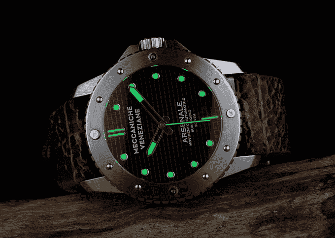

# Arsenale Automatic 是对昔日威尼斯造船厂 TechCrunch 的致敬

> 原文：<https://web.archive.org/web/https://techcrunch.com/2017/10/05/the-arsenale-automatic-is-a-tribute-to-the-venetian-shipyards-of-yore/>

# Arsenale Automatic 是对昔日威尼斯造船厂的致敬

在上个温暖的周末之前，我展示了一款非常酷的众筹手表，可能值得一看。这款名为 [Arsenale Automatic](https://web.archive.org/web/20221025222543/https://www.kickstarter.com/projects/975712226/arsenale-automatic-watch-tribute-to-venice-royal-s?ref=334191&token=c71c142a) 的帆船向威尼斯引以为豪的航海历史致敬，它看起来很野蛮，足以让我们想起她那充满暴力和瘟疫的过去。

这款手表配有 Miyota 或 ETA 机芯——日式或瑞士式——以及刷光精钢或老化 PVD 材质。边框铆钉——标有中午、3、6 和 9 的数字——让人想起另一个意大利品牌沛纳海，但它们应该代表舷窗铆钉。

这款手表的零售价约为 600 美元。目前，你可以在众筹页面上花 338 美元买到它。

这有什么特别的？很难找到一款众筹手表能够平衡各种功能。这一款特别有趣，因为它的传统——我从未见过威尼斯手表——以及它的设计。它可能不像欧米茄或百年灵那么昂贵，但不到 400 美元的一个不错的三手相机，你可以做得更糟。