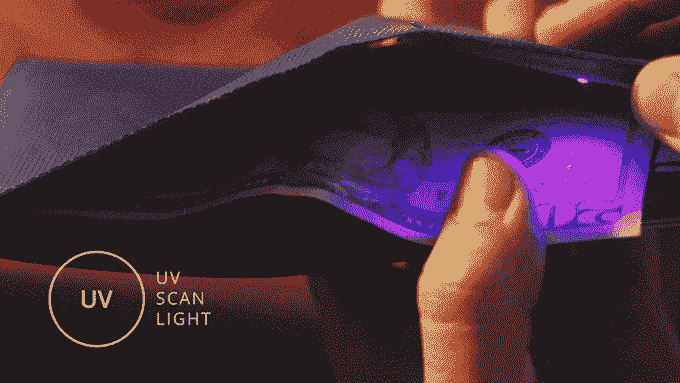

# Baggizmo Wiseward 不仅仅是一个钱包 

> 原文：<https://web.archive.org/web/https://techcrunch.com/2017/06/21/the-baggizmo-wiseward-is-more-than-a-wallet/>

# 巴奇兹莫·怀斯沃德不仅仅是一个钱包

在你裤子的一个洞里藏着一个钱包。不是一个肮脏、潮湿、塞满收据、香烟纸和一股臭味的钱包，也不是一个干瘪、光秃秃、无聊的钱包，里面什么也放不下，也没有东西可以坐在上面或吃:这是一个巴奇兹莫钱包，这意味着许多小配件。

它有一个完美的平板折叠设计，安装了一个可编程的 NFC 芯片。钱包打开后有一个内置的运动传感器和防盗系统，它甚至有一个紫外线灯，可以测试里面的钞票的真实性。这个钱包不断缠绕，有多种颜色，甚至内置了可充电电池，可以通过无线充电站充电。它还有很多其他功能，包括一个可定制的内部 LED，用于在黑暗的洞穴或扭曲的洞穴中照明。

这个钱包是一个非常富有的钱包，它的名字叫怀斯沃德。怀斯沃德是一种新的钱包，还不为人们所知，价格为 89 美元。它在 [Kickstarter](https://web.archive.org/web/20221207232156/https://www.kickstarter.com/projects/ladislavjuric/baggizmo-wiseward-wallet-meets-gadget) 上存活了一段时间，人们认为它非常值得尊敬，不仅因为它已经筹集了 18000 美元，还因为它们是为冒险和意想不到的事情而建造的。这是一个关于一个聪明人如何进行冒险的故事，并且发现自己在意想不到的人的奇怪口袋里。它是由拉迪斯拉夫·尤里克创建的，还没有得到充分的资助，你会看到它最终是否有所收获。

