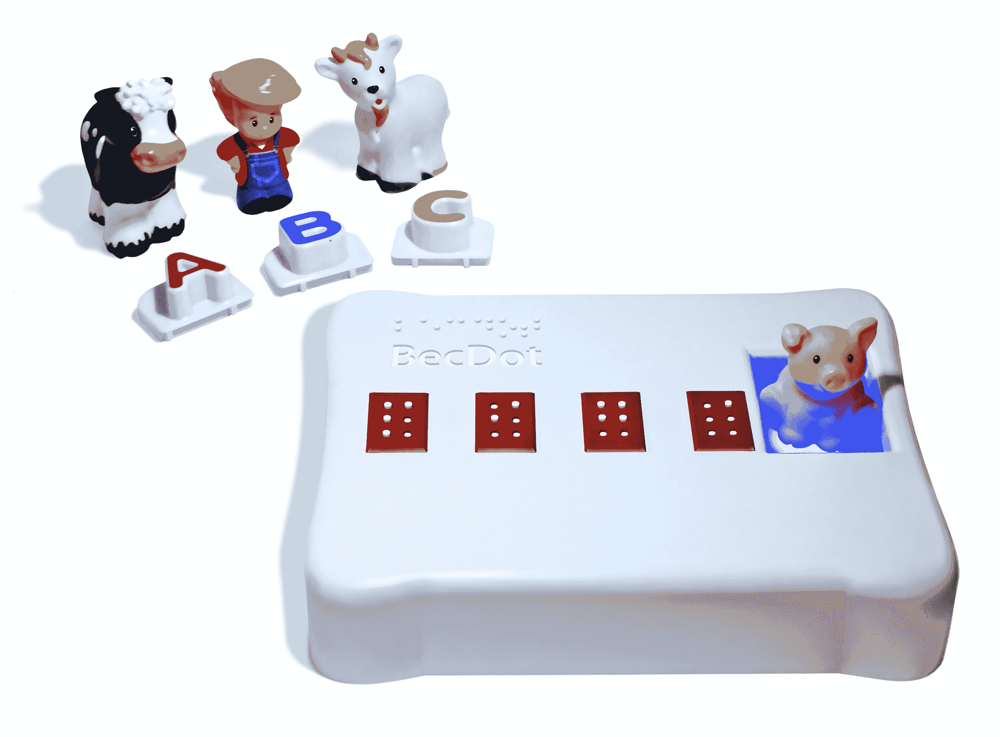
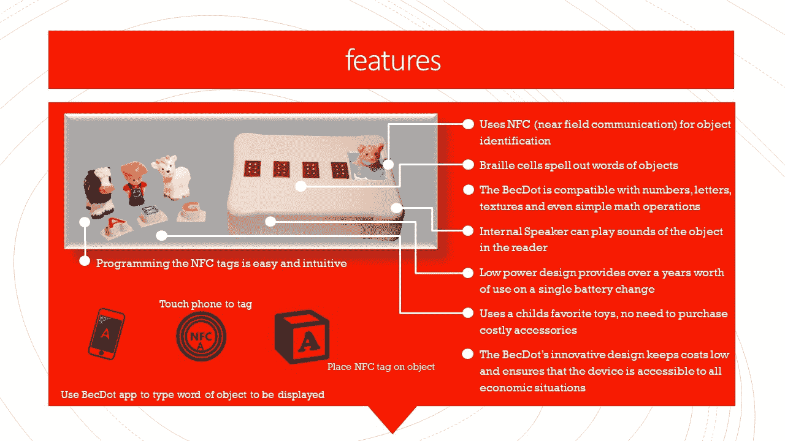

# BecDot 是一款帮助视力障碍儿童阅读盲文的玩具

> 原文：<https://web.archive.org/web/https://techcrunch.com/2018/01/18/the-becdot-is-a-toy-that-helps-teach-vision-impaired-kids-to-read-braille/>

像大多数人一样，学习盲文是一项技能，最好由需要的人在早期学习。但是患有视力障碍的初学走路的孩子通常很少或没有选择，这使他们在学业和社交方面落后于同龄人。[bec dot 是一个由面临挑战的父母创造的玩具](https://web.archive.org/web/20230320091514/https://memoriesforbecca.com/2017/09/25/introducing-the-becdot/)，它以一种有趣、简单的方式教孩子盲文，既耐用又实惠。

贝丝和杰克·拉库斯的女儿丽贝卡(这是她在玩原型)天生患有亚瑟综合症，这是失明和耳聋的常见原因。在发现现有的盲文玩具和教学工具要么太简单，要么太复杂，要么太昂贵后，他们决定自己动手。

杰克碰巧有产品设计的背景，在一家制造简单耐用的环境传感器的公司工作多年。但这是一个独特的挑战——如何制作一个兼做盲文教具的玩具？然而，几个月后，他创造了一个生产设备的原型，尽管是一次性的 3D 打印外壳。

你可以在 CES 的 TechCrunch 展台上看到它的实际应用:

BecDot 有一个彩色发光的表面，上面可以放置配备 NFC 标签(通过应用程序编程)的玩具。一旦检测到标签，例如在玩具牛上，就会出现多达四个盲文字母，由举起的钉子组成:C-O-W。该设备还可以发出父母或老师上传的声音。

是的，这很简单——就像这个年龄的孩子应该有的玩具一样。然而，它为盲人和部分失明的儿童提供了学习字母表的机会，并以与视力正常的儿童几乎相同的方式同时识别短词。有了声音、灯光以及与书本和课程相结合的可能性，孩子们可能会发现这很有趣。

 这里值得注意的是，残疾儿童经常遭受双重痛苦，首先是因为他们没有和其他孩子一样的感官或行动能力，其次是因为他们不能像其他孩子一样自然地与他们互动而导致的社会孤立。这反过来导致他们进一步落后，进一步孤立他们，如此循环往复。随着时间的推移，这种影响越来越大，缩小了孩子接受高等教育和就业的前景。我们说的是 70%的失业人口。

BecDot 和类似的设备可以帮助缩短这一循环，让孩子们通过玩耍与他人联系并自主学习。

 阻碍这类设备的一个因素是盲文显示器的复杂性和成本。如果你认为液晶显示器背后的东西很复杂，想象一下，如果每个像素都需要独立地上下移动，并经得起频繁的处理。电子阅读器的盲文版一次显示一两句话可能要花费数千美元，但孩子们当然不需要。

由于对可用选项不满意，杰克决定自己设计。他创造了一个简单的苏格兰轭机制，一次可以控制多达三个点，这意味着其中两个可以创建一个盲文字母。这都是由一个 Arduino Uno 控制的。简单就是便宜，其他部分远不贵；他告诉我，他的材料清单现在是 50 美元左右，他可能会得到低于 30 美元。

我认为，如此低的成本将使 BecDot 对任何有视力障碍学生的学校极具吸引力。当然，也没有什么能阻止视力正常的孩子玩这个小玩意，我相信他们会的。

目前 BecDot 还处于原型阶段，但在 CES 期间，当我见到他们时，拉库斯听起来很乐观。他们被一个名为[并非不可能](https://web.archive.org/web/20230320091514/http://www.notimpossible.com/)的组织选中参加奖励和展览，该组织在人道主义领域创造和倡导技术。杰克告诉我，他们在展会上的时间超出了他的预期，他们有机会与那些既能帮助将设备推向市场又能推动他和贝丝试图传达的信息的人交谈。

像这样的玩具(后续设备可以有更多的字母或空间用于输入)可以帮助缩小识字和社交差距，这种差距导致许多聋哑人和盲人失业，并在晚年依赖他人。回想起来，针对得不到充分服务、边缘化和高危人群的教育玩具似乎是显而易见的。从某些方面来说，这是一个简单的想法，但只有通过创造性和创新性的技术应用，当然还有爱，才有可能实现。