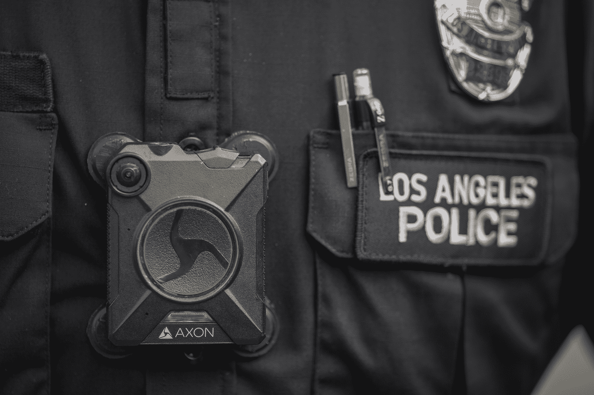

# 警察身体摄像头的好处是一个神话 

> 原文：<https://web.archive.org/web/https://techcrunch.com/2017/12/20/the-benefits-of-police-body-cams-are-a-myth/>

哈兰·于是

Upturn

也是警察随身携带相机政策记分卡的主要作者之一。

More posts by this contributor

自从迈克·布朗在佛格森的致命枪击案发生后的三年里，警察随身携带的摄像机已经作为主要阻止警察不当行为的工具出售给公众。其中一个主要卖点是[声称这些设备会对官员产生“教化作用”。](https://web.archive.org/web/20230121224531/http://www.npr.org/sections/alltechconsidered/2014/09/05/345784091/can-body-cameras-civilize-police-encounters)

这种观点认为，如果警察知道他们的行为被记录下来，他们会表现得更好。相机供应商[告诉](https://web.archive.org/web/20230121224531/https://www.axon.com/company/news/a-look-at-body-cameras)部门，他们的设备将减少过度使用武力和对官员的投诉。

但事实证明，在美国最大的警察部门之一，随身携带的摄像机并没有产生任何这些好处。

华盛顿大都会警察局最近发布的一项里程碑式的研究发现，佩戴摄像头的警察和不佩戴摄像头的警察行为方式基本相同。摄像头的存在对警察使用武力的频率或该市收到的不当行为投诉数量没有统计上的显著影响。

这些结果提出了一个重要的问题:如果这些好处没有出现，那么其他声称的体戴相机的好处——增加透明度、问责制和信任——会不会也是虚假的承诺？

到目前为止，几乎没有证据表明，部门拥有的、由官员操作的摄像头会带来任何有意义的改善。相反，一个被一些人视为可以保护黑人生命的工具实际上主要是帮助那些穿蓝色衣服的人。

全国各地的部门纷纷涌向随身携带的相机，作为一种时尚和几乎是反射性的改革。但是越来越清楚的是，随身携带的相机并不是对警察暴行的某种神奇的交钥匙反应。在弗格森事件后的这些年里，有多少官员因为随身携带的摄像机镜头而真正为自己的行为负责——要么被解雇，要么在更严重的情况下被起诉和定罪？我们打赌你想不出很多。

我们记得许多名字——来自斯塔滕岛的埃里克·加纳，来自克利夫兰的塔米尔·赖斯，来自北查尔斯顿的沃尔特·斯科特，来自巴吞鲁日的奥尔顿·斯特林，来自明尼阿波利斯的菲兰多·卡斯蒂利亚——因为我们看过那些可怕的视频。但请记住:那些视频来自旁观者的手机和安全摄像头，而不是警方的摄像头。

照片由大卫·麦克纽/盖蒂图片社拍摄

这不是巧合。佩戴和操作随身摄像机的是官员，拥有和控制记录镜头的是部门。各部门通常与警察工会协商，制定指导摄像头使用的政策和程序。因此，毫不奇怪，全国各地的随身相机政策在很大程度上有利于部门及其官员的利益，通常以牺牲公众利益为代价。

在大多数美国主要部门，公众没有容易的方法获得随身携带的摄像机镜头，即使(或者尤其是)在高调使用武力之后。

例如，[得克萨斯州的一项法律禁止](https://web.archive.org/web/20230121224531/https://www.facingsouth.org/2016/07/states-block-public-access-police-camera-footage)该州所有部门在所有刑事和行政诉讼结束之前发布任何记录致命武力事件的镜头，这可能需要几个月甚至几年。此外，加州的各个部门通常[通过明确援引该州公共记录法的调查记录豁免，向公众隐瞒所有的镜头。即使没有这样的法律限制，各部门也保留了广泛的自由裁量权来决定是否以及何时发布视频，这使得他们能够挑选出勇敢的视频迅速公开发布，同时隐藏有争议的视频。](https://web.archive.org/web/20230121224531/https://www.courthousenews.com/police-body-cam-law-sidelined-california/)

各部门几乎总是允许自己的官员在撰写初步报告之前观看摄像机镜头，这一事实进一步加剧了透明度的缺乏。这使得官员更容易在镜头前表演，甚至在严重使用武力后，也可能对真实发生的事情制造虚假的叙述。这是一个迂回曲折的过程，可能会让追究官员的责任变得更加困难。

长期以来，T2 担心佩戴在身上的摄像头会进一步加强执法活动，尤其是在警察过多的黑人和棕色人种社区，而不是带来责任。摄像系统是监视系统，摄像头集中在警员选择花费时间最多的地方。一如既往，供应商们正在寻求将[的面部识别功能整合到他们的摄像系统中，这将使他们成为危险的大规模监控系统。](https://web.archive.org/web/20230121224531/https://theintercept.com/2017/03/22/real-time-face-recognition-threatens-to-turn-cops-body-cameras-into-surveillance-machines/)

像所有技术一样，体戴式相机反映了制造和控制它们的人的价值观。可悲的现实是，这些摄像头反映的是警察的权力和利益，而不是他们宣誓服务的社区的利益。如果没有更深层次的结构性改革和真正的社区监督，我们就不应该指望佩戴在身上的摄像头能带来任何有意义的透明度或问责制。