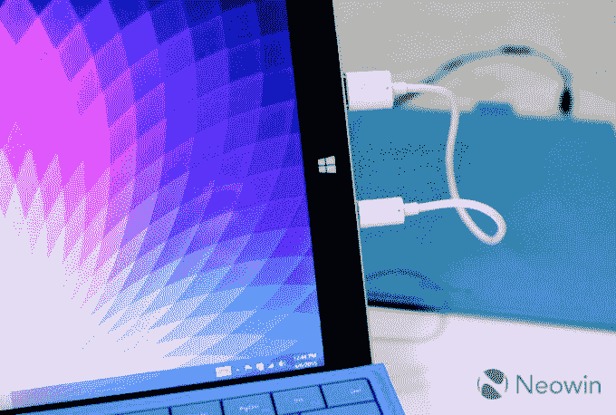

# 最好的 Surface 3 复活节彩蛋 

> 原文：<https://web.archive.org/web/https://techcrunch.com/2015/04/06/the-best-surface-3-easter-egg/>

# 最好的 Surface 3 复活节彩蛋

今天是硬件儿童的 [Surface 3](https://web.archive.org/web/20230129225115/https://techcrunch.com/2015/03/31/microsoft-announces-surface-3-a-cheaper-thinner-slower-surface-pro-3/) 回顾日——视频传入，我保证——这意味着媒体基本上获得了新的微软混合平板电脑的第一整天。这款设备与我们预期的差不多，是一款价格更低、封装更小的 Surface Pro 3。

然而，最重要的是一个简单的事实，你不必为 Surface 3 充电。永远不会。正如[Neowin](https://web.archive.org/web/20230129225115/https://twitter.com/bdsams)[的 Brad Sams](https://web.archive.org/web/20230129225115/http://www.neowin.net/news/here039s-what-happens-when-you-plug-a-surface-3-into-itself) 今天早些时候提到的，如果你将你的 Surface 3 *插入自身，*它声称可以充电一段时间。以下是萨姆斯:

当然，这需要测试，所以感谢上帝，TechCrunch 来了:

我不得不承认，这是一些该死的好工程。打破物理定律绝非易事。玩笑归玩笑，这就是给设备增加 USB 充电的后果。前进。