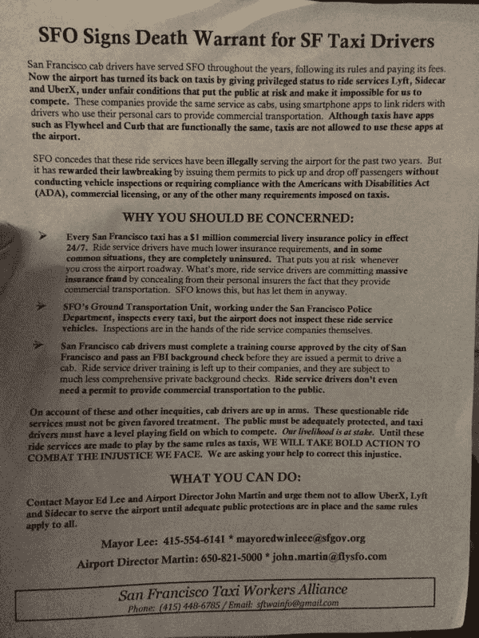

# 出租车导致 SFO 交通堵塞，以抗议优步、Lyft 和 Sidecar 

> 原文：<https://web.archive.org/web/https://techcrunch.com/2014/11/17/the-best-way-to-get-people-on-your-side-is-to-annoy-them/>

# 出租车导致 SFO 交通堵塞，以抗议优步、Lyft 和 Sidecar

今天是湾区交通的好日子[。](https://web.archive.org/web/20221007011114/https://twitter.com/semil/status/534597298962325504)

今晚，旧金山国际机场(San Francisco International Airport)的一大群湾区出租车司机决定，几乎不可能让乘客上车，以抗议该机场最近允许拼车公司在其场地内运营的决定。

但是[根据 Twitter](https://web.archive.org/web/20221007011114/https://twitter.com/avantgame/status/534580981110276096) 上 [的报道，抗议活动不仅限制了 SFO 替代打车应用的使用，还造成了任何试图进出机场航站楼的人的拥堵。](https://web.archive.org/web/20221007011114/https://twitter.com/jjgilz/status/534582204479700992/photo/1)

自从加州公共事业委员会(California Public Utilities Commission)为该州的拼车公司创建了一个法律框架以来，出租车的数量急剧下降，部分原因是新贵竞争者的价格较低。情况变得如此糟糕，以至于当地出租车行业的负责人警告说，18 个月后，这种局面可能会不复存在。

对出租车司机来说，SFO 是一个避风港，在过去几年里，它一直坚定地反对不可避免的进步。然而，在收到停止在 SFO 无证经营的通知后，优步、Lyft 和 Sidecar 最近都达成了协议，使他们能够合法地在机场接送乘客。

通过这样做，SFO 成为该国首批在其航站楼接受拼车服务的机场之一。但这一决定并没有得到当地出租车司机的认可，他们已经看到这些服务抢走了旧金山及周边地区的顾客。

今晚，这些出租车司机堵塞了机场车道的多条车道，表达了他们的不满。

他们还散发传单警告说，通过向优步、Lyft 和 Sidecar 发放许可证，SFO 实际上已经签署了当地出租车行业的死刑执行令。传单上有出租车行业对拼车公司的常见 FUD 抱怨——他们的司机没有执照，他们的汽车未经检验，他们不安全，不可靠。

在这一点上，这一行动似乎不太可能导致 SFO 撤销向拼车公司发放许可的决定。但是谁不喜欢好的抗议呢？

图片来源:[杰夫·吉尔摩](https://web.archive.org/web/20221007011114/https://twitter.com/jjgilz/status/534582204479700992/photo/1)