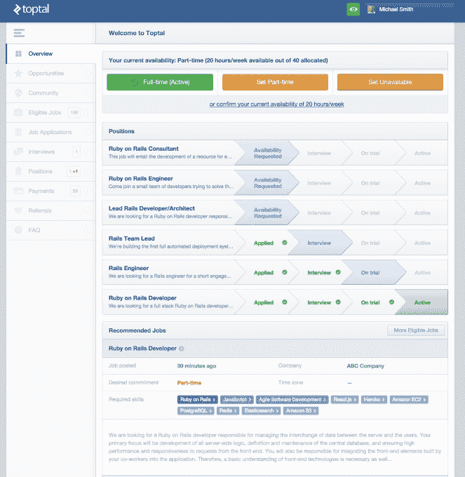

# 庞大的自由工程师市场 Toptal 现在出售设计师 

> 原文：<https://web.archive.org/web/https://techcrunch.com/2015/10/07/the-biggest-startup-no-one-talks-about/>

软件正在吞噬世界，但谁在摆桌子？工程师，每个人都需要他们。但是雇佣自由程序员的公司意识到一个丑陋的产品就像错误的代码一样糟糕。工程师面临的人才短缺，如今也催生了设计师的绝望情绪。为了响应这一号召，Toptal 希望将有空闲周期的设计师安排到有需求的公司，而不是工程师。

Toptal 是硅谷谈论得不够多的公司之一，因为它不打算筹集资金。但那是因为它不必如此。需求如此之大， [Toptal 的自由工程师市场](https://web.archive.org/web/20221224120823/http://www.toptal.com/)只需要安德森·霍洛维茨基金(Andre essen Horowitz)140 万美元的种子资金，以及像 Quora 的亚当·安吉洛(Adam D'Angelo)和亚当·洛克斐勒(Adam Rockefeller)这样的天使投资人，就能建立一个有利可图的业务。它的年运营成本有望达到 8000 万美元，而这只是从 2010 年才开始的。忠于公司的本质，创始人兼首席执行官 Taso Du Val 坚持认为“我们是世界上最大的没有办公室的公司。”

Toptal 找到了高质量的工程师，他们无论出于什么原因都不想要传统的朝九晚五的工作方式，或者在 startupland 更常见的朝九晚九的工作方式。它筛选他们以确保他们是最优秀的 T2 人，并为他们的服务设定合理的价格。与此同时，Toptal 从寻找自由职业者的公司那里获取工作要求，协商预算，并对他们进行审查。杜·瓦尔告诉我，评估双方可以防止任何人有“糟糕的经历”。

相信双方都是合法的，托普塔尔把他们撮合在一起。在客户签署合同之前，Toptal 平均只给他们发送 1.7 个编码员的选择，而不是让招聘者在几十份简历中进行分类。客户付钱给 Toptal，Toptal 付钱给自由职业者，Toptal 把差额装进口袋。Du Val 拒绝透露 Toptal 的利润率，但他表示这是“我们认为合理的加价”如果企业想直接雇佣开发商，他们总是可以买断开发商的合同。

拥有数千名工程师，Toptal 现在与大约 2000 名客户合作，从摩根大通和辉瑞到 Airbnb 和 Zendesk，再到羽翼未丰的初创公司。他们喜欢这项服务，因为它比自己采购更快更便宜，而且没有风险。任何演出的前两周都是试用期，如果客户不满意，他们可以出于任何原因选择不付费。消息不胫而走，所以如果 Toptal 的员工不值得，它就不可能发展得这么快。

Du Val 在开创性的 app house Slide 担任首席数据库架构师后创办了这家公司。在帮助 Artsy 的朋友编写代码时，他注意到在 oDesk 和 elance(现在合并为 Upwork)上找到优秀的自由职业工程师有多难，并认为他可以从自己的网络中找到更好的人才。它发展成为工程师的优步。

Toptal 首席执行官 Taso Du Val

现在，Toptal 正试图以同样的模式吞并邻近的自由设计师市场。客户渴望他们，所以它签署了 UX，用户界面，视觉和交互设计的专家。

这并不容易。虽然与工程师合作是一个管理时间表的问题，但最终一个应用程序要么运行顺畅，要么运行不畅。成功更客观。众所周知，与设计师一起工作是一个反复无常的过程。在内部，这种迭代是强制进行的。但如果 Toptal 不能确保其自由职业者拥有出色的沟通技巧，并且不会因为管理层不断的吹毛求疵而大发雷霆，那么与远程设计师打交道可能会很困难。

随着初创公司规模的扩大，保持高水平的人才可能是一个挑战。任何觉得优步和 Lyft 的车手质量随着他们的成长而有所下降的人都会理解。Toptal 的规模只有 Upwork 的 1/12，年收入为 10 亿美元，但 Upwork 也提供销售、客户服务、法律和其他许多类别的自由职业者。

Toptal 的核心业务也面临着越来越激烈的竞争。奇怪的是，它的早期天使之一罗杰·迪基已经开始了他自己的由 T2 投资公司支持的自由工程师市场，名为 Gigster。我们在电话里交谈时，杜瓦尔对此有点生气。但 Gigster 完全用自己的项目经理管理工程师，目前专注于服务初创公司市场。杜·瓦尔认为，为大公司服务才是真正的头奖，就像埃森哲和德勤在商业咨询领域所做的那样，但不是在工程和设计领域。

顶级设计师作品集

Toptal 还希望通过构建特殊工具来提高远程工作的效率，包括绩效评估和人力资源系统，从而增强其自由职业者的能力。此外，它还在试验自己的完全托管服务，因此，如果客户想要发送一份规格说明，并获得一个成熟的产品，Toptal 可以处理。

令人惊讶的是，当我问杜·瓦尔，从哲学层面上讲，他为什么要建立托普塔尔并把它作为自己的遗产时，他厉声说道:“我绝对不想把它作为自己的遗产。”但后来他收回了自己的话，说他为“建立一家未来公司”而“完全没有办公室”感到自豪。

在我们所处的这个时代，高薪技术专家似乎铁了心要在办公室长时间工作，而不是找到更好的工作与生活的平衡，或者带着他们的钱逃到一个孤岛上。这可能会提供另一种命运，在这种命运中，技术工人可以工作到足以过上好日子，而不是工作到死。