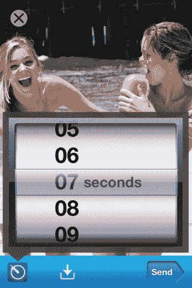

# 雷吉·布朗如何发明 Snapchat 

> 原文：<https://web.archive.org/web/https://techcrunch.com/2018/02/10/the-birth-of-snapchat/>

比利·加拉格尔撰稿人

More posts by this contributor

雷吉·布朗小心翼翼地用手指抚摸着钝器，欣赏着它紧紧卷曲的完美。抽这样一件艺术品简直是一种耻辱。

他靠在斯坦福大学金博尔宿舍的沙发上，与他以前兄弟会的两个兄弟大卫和扎克讨论周末的社交活动。

话题转到了女孩身上。雷吉的脸上出现了梦幻般的表情。

“我希望我可以发送消失的照片，”他沉思着，几乎心不在焉。

大卫和扎克笑了，并同意这将是有用的，如果照片消失了，然后转向谁来参加他们的聚会，那个周末。雷吉退出了。他在思考。

透过烟雾，大卫和扎克的聊天声渐渐消失了。雷吉把注意力集中在这个新想法的实用性上。一种发送消失图片的方式。他就不用担心发一张他老二的照片去勾搭人了！如果女孩消失了，她们会更有可能给他发性感的照片。

突然，他跳了起来，冲到大厅去看看埃文·斯皮格尔是否在附近。埃文和雷吉最近都从国外留学归来，他们在 Kappa Sig 的生活已经结束，他们搬进了金博尔宿舍，离唐纳不远，他们大一时住在那里。考虑着他消失的照片的想法——他将如何最好地向埃文解释——雷吉的上衣几乎没有碰到破旧的深蓝色地毯，他以半跑/半走的方式冲向大厅。

冲进埃文的房间，雷吉喊道，“老兄，我有一个可怕的想法！”甚至在雷吉解释完他的想法之前，艾凡就点燃了。他立刻充满活力——几乎陶醉了。这就像所有那些晚上一起聚会，除了他们在雷吉的想法喝酒。

“那是一个价值百万美元的想法！”埃文终于惊呼道。

雷吉感到宽慰和肯定；更重要的是，他感到了希望。即使未来的新生失败了，埃文没有放弃他的梦想，开始下一个卓越的技术公司。他是雷吉认识的最好的操作员，能够将这一灵感转变为现实。现在他们有了一个看起来很新鲜的想法。独一无二。

这两个朋友兴奋地讨论着所有裸照被泄露给媒体的名人。他们的应用程序可以解决这个问题！埃文快速而生动地做着手势，向雷吉解释他是如何看到人们来回发送消失的图片的。在这个时候，我们大多数人几乎还没有从翻盖手机和黑莓手机转向 iPhones。就在我们从聊天到发短信再到其他应用程序的时候，人们开始将应用程序转变为性爱应用程序。Tinder 将在一年后推出，随后是一大批模仿者。有了这个早期的照片分享想法，雷吉和埃文设想了一个有围墙的花园，供情侣们分享亲密照片。

他们将平分公司，对所有事情进行投票，并平分他们可能看到的任何损失或收益。因为埃文在管理未来新生和其他项目上有更多的经验，他将成为首席执行官。雷吉将成为首席营销官。

但两人都不知道如何编写足够好的代码来制作这个应用。他们需要招募他们的一个朋友加入他们。他们列出了参加过计算机科学课程的兄弟会成员。那一年，大多数大四学生仍然是经济学专业的学生，毕业后前往华尔街和主要的咨询公司——直到几年后，大多数人才开始在硅谷寻找财富。但是他们想出了几个名字然后去兄弟会招募他们。

埃文是一个特别有说服力的推销员，但他很难在最初的推销中说服人们。他邀请的前两个兄弟会成员拒绝了。

幸运的是，埃文没那么容易被吓住。他心中有一个完美的人选——他未来的大一共同创始人鲍比。埃文确信他能说服鲍比开发这个应用程序。他打电话给博比，解释了雷吉的想法。但是鲍比不相信。人们真的想用这个吗？埃文紧张地催促他，这个想法不同于其他人正在做的任何事情。这不像未来的新生会遇到一大群竞争者。他们从过去的两个项目中学到了很多，这是迄今为止最独特的想法。鲍比，终于被说服了，同意写代码，希望第三次会是他和埃文的魅力。

埃文、雷吉和鲍比的第一次尝试很糟糕:他们创建了一个笨重的网站，用户上传一张照片，然后设置一个计时器，显示照片何时消失。他们很快意识到，如果他们建立一个移动应用程序而不是一个网站，对用户来说会更容易和更隐私，因此会被更广泛地使用；直到今天，Snapchat 仍然没有提供一款网络产品。

他们坐在宿舍里，讨论用户应该如何与他们的朋友互动，以及什么样的功能会让人们告诉他们的朋友下载它。埃文负责管理这个小组，确保事情按时完成，让每个人都保持专注，而喧闹的雷吉就人们使用该应用程序的所有不同方式提出了想法。Bobby 比其他两个安静得多，也更矜持，他让小组成员脚踏实地，总体上同意 Evan 对应用方向的看法。

博比在接下来的一周投入了 18 个小时的编码时间，让他们完成一个工作原型。雷吉为这款应用想出了一个名字:Picaboo，它是童年游戏“躲猫猫”的翻版。埃文设计了这款应用的界面，用数字技术模拟了它的外观以及用户与它的互动方式，这样鲍比就可以把他的愿景变成现实。

他们在期末考试前几天完成了 Picaboo 的工作原型。他们需要人们下载应用程序，测试它，并希望把它告诉他们的朋友。埃文决定接近他以前的兄弟会成员；尽管被开除了，他仍然和大部分同龄人友好相处，他们仍然是校园里最喜欢社交的人。如果它要流行起来，埃文需要大众使用它。

埃文很快打出了几行关于应用程序。他之前已经告诉过很多人这个想法，但不是以如此广泛、公开的方式。他想象人们转发邮件，下载应用程序，然后立刻上瘾。脸书在七年前创办了一所学校，并像野火一样席卷了哈佛，随后蔓延到其他校园，乃至全世界。《斯坦福日报》当时写道，有多少学生因为沉迷于脸书而逃课。Instagram 在首次发布当天就被下载了 4 万多次。埃文使用一个名为 Flurry 的分析平台来跟踪有多少人下载了这款应用程序，他们使用它的频率以及他们互相发送图片的频率。是时候让世界看看皮卡布了。艾凡对电子邮件进行最后的润色，按下发送键。

然后。。。没什么。这是一枚哑弹。

在第一周下载了这款应用的兄弟会成员们玩得很开心，互相发送无聊的课堂照片或聚会照片。更重要的是，这很酷，因为这是他们第一次可以把他们的一个朋友制作的东西放在手掌里，放在手机上。但这并不严重；这只是埃文的小玩具。几十个人已经下载了它，并在摆弄它，因为这是他们的朋友创建的。但是他们并不完全确定它是什么，以及他们应该如何使用它。现在说 Picaboo 失败还为时过早——这个东西刚刚推出，几乎没用。但这与埃文梦想的童话般的发射相去甚远。

斯坦福校园。照片由 Easyturn/istock 提供

埃文参加了一个名为“设计和商业因素”的机械工程班，该班鼓励高年级学生产品设计专业的学生为应用程序或其他产品创建原型和商业计划。期末专题展示了这个原型和商业计划，占了本课程总成绩的三分之一。雷吉的想法比埃文考虑的要有趣得多，所以他在班上采纳了这个想法。当其他大多数学生三五成群地工作时，埃文独自研究他的想法。

在课程结束时，每个人都向风险投资家小组展示了他们的原型。斯坦福大学有几十门这样的创业课程，尽管团队做大很有吸引力，但绝大多数学生只是在玩创业游戏。如果大多数创业公司都失败了，那么大多数这类项目甚至都没有达到可以准确称为创业公司的阶段。

就像学校的科学展一样，每个人都要做一个视觉展示，放在后面的桌子上。每个小组派一名演示者向评委推销他们的项目并接受反馈。埃文坐在教室的后面，看着他的同学提出他们的想法。他们做了各种常见的陈述，从兴奋的学生寻求认可的过度修饰的陈述，到准备不足的本科生直到轮到他们时才结束。埃文第一次担心其他人会如何看待他的应用程序。兄弟会的兄弟们喜欢玩它——埃文的同龄人和这些风险投资家肯定会理解他一直努力建立的东西的价值。他们不得不这样，对吗？

最后，轮到埃文了。表演时间到了。他像参加聚会一样走到房间的前面，自信地向观众展示他、雷吉和鲍比在过去的六个星期里不知疲倦地工作的成果。埃文自信而自在，热情地向其他三十名学生、两名教授和六名风险投资家解释说，并不是每张照片都可以永久保存。他热情地争辩说，人们会从通过图片传递信息中获得乐趣。

回应？不够热情。

为什么会有人用这个 app？“这是有史以来最愚蠢的事情，”似乎是每个人语气背后的情绪。一位风险投资家建议埃文将照片永久保存，并与百思买合作拍摄库存照片。该课程的助教吓坏了，他把埃文拉到一边，问他是否开发了一个色情短信应用。

菲尔·奈特 1994 年出现在查理·罗斯

这个场景让人想起半个世纪前另一个斯坦福学生的课堂演示。1962 年，斯坦福大学商学院的一个名叫菲尔·奈特的学生向他的班级提交了一篇期末论文，题目是“日本运动鞋能像日本相机对待德国相机那样对待德国运动鞋吗？”奈特的同学对论文感到非常厌烦，他们甚至没有问他一个问题。那篇论文是奈特创立的耐克公司背后的驱动力。

那天坐在埃文教室里的风投们可能错过了至少 10 亿美元的投资回报。但是很容易用后见之明的眼光来看待优秀的想法，并发现它们注定会成功。从他们的角度想想吧——pica boo 的观点基本上是，“把自毁的照片发给你的另一半。”无常让人毛骨悚然，只属于政府间谍和变态。事后看来，我们可以看到脸书为 Snapchat 的繁荣发展创造了条件。但看着埃文在 2011 年的演讲，一点也看不出这是对脸书的自然反抗，也看不出这种反抗会超出我们小小的社交圈。

如果有人在寻找下一个脸书杀手，他们希望看到一个名为 Instagram 的照片分享应用程序，该应用程序刚刚筹集了 A 轮融资，对该公司的估值为 2500 万美元；更有可能的情况是，他们在看一些你从未听说过的已经死亡的应用或网站。

尽管第三次未能成功说服人们接受这个想法，埃文仍然毫不畏惧。因为他希望让雷吉和鲍比继续参与并推动这个项目，他告诉他们每个人都非常喜欢他们的想法。

他们的大多数同龄人都在知名银行和大型科技公司寻求实习机会，或者像鲍比一样，寻求全职工作。但是埃文和鲍比习惯于无视规范去追逐他们的创业想法。雷吉致力于此。最重要的是，他们真的很喜欢这个应用。虽然很原始，但使用起来很有趣。他们真的相信人们会想要发送删除自己的图片，不管是为了色情短信还是其他。

三人同意夏天搬到南方，去埃文爸爸在太平洋帕利塞兹的房子。在那里，他们将开发应用程序，获得用户，并努力成为下一个大型斯坦福创业公司。当他们就夏季的后勤工作达成一致时，雷吉感到越来越兴奋。只要埃文在他身边，就不会出任何差错。

—

2 月 12 日(周一)晚上 7 点，TechCrunch 的 Josh Constine 采访了[《如何拒绝 10 亿美元》](https://web.archive.org/web/20230315095321/https://www.amazon.com/How-Turn-Down-Billion-Dollars/dp/1250108616/)作者比利·加拉格尔，在他的[新书发布会上以及在旧金山图书公司](https://web.archive.org/web/20230315095321/https://www.booksinc.net/event/billy-gallagher-books-inc-marina)的签售会上，来听听 Snapchat 早期的故事吧。

