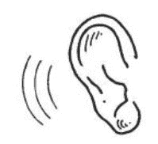

# 黑色星期五生存指南 

> 原文：<https://web.archive.org/web/https://techcrunch.com/2014/11/27/the-black-friday-survival-guide/>

积累以下指南中显示的研究数据并不容易。我在一家大型电子商店和一家大型购物中心目睹了零售行业长达七年的可怕景象。我看到的事情会让我余生不得安宁。我看着两个孩子被我称之为双倍宽的东西践踏，因为在黑色星期五，电路城以 80 美元的价格清除了梦幻节目。我曾经在混乱中躲在一个巨大的视频显示器后面一小会儿。我见过人们为了节省几美元而打斗、撕咬、践踏我们人类的其他成员。

接下来的可能是有史以来最全面的黑色星期五指南。这里有购物策略、购物指南、生存技巧，以及你会遇到的不同类型的黑色星期五购物者的详细介绍。请，如果你正在考虑在黑色星期五购物，想想你的家人，你的狗，你的生计，重新考虑。如果你仍然相信这样做是正确的，请务必通读黑色星期五生存指南。你的生活完全取决于它。

## **知己知彼**

**双宽**

这种黑色星期五购物者变得越来越普遍，就好像有一种流行病正在席卷全国，导致更多这种类型的购物者。几乎不可能避开这些购物者，所以利用他们庞大的体型为自己谋利。多想想纳斯卡而不是足球。当他们穿过吸烟者和大块头时，你将在他们后面起草(见下文)。一旦目标进入视线，快速的撞击应该会让他们绊倒足够长的时间，让你在他们把香肠手指放在上面之前抢先一步抢走最后一个 Kinect holiday 捆绑包——如果你执行这个动作，请小心一个大 Papi。一句简单的“看，那个端盖更便宜。”也许这就是半秒钟的分心。

*   优势:大小，重量，和美杜莎般的眼睛
*   缺点:头重脚轻，头脑简单
*   主要攻击:巨大的前臂
*   二次攻击:一系列种族和下流的诽谤
*   主要目标:儿童玩具，莱恩·布莱恩特销售，狩猎装备

**吸烟者**

 吸烟者一般都是女性取向，但看到一些男性也不奇怪。这种购物者通常在凌晨 3 点到 4 点在他们的小货车里烤蛤蜊，主要目的是创造一个大多数人不敢进入的恶劣的个人安全泡沫。小心，这些是结实的人；由于多年来每天抽三包烟，他们弯腰驼背，为黑色星期五做准备，肚子里至少有一整壶福尔杰咖啡。虽然他们可能很快下线，但他们也会很快喘不过气来。最好是给他们足够的空间去奔跑，目标是超越他们。

*   优点:身材矮小，行动迅速，气味难闻
*   缺点:轮胎很快
*   主要攻击:从毛孔中渗出的恶心的粪便气味
*   二次攻击:假指甲
*   主要目标:化妆品、自有品牌服装、钻石首饰

**大 Papi**

大块头 Papis 通常要么穿着 NFL 球衣，要么穿着真正的猎树服。两者都使它们很容易被发现。最好的办法就是不惜一切代价避开这些野兽。从远处看，它们可能看起来很温和，但它们通常会在她疯狂狩猎时陪伴她，并不惜一切代价保护它们的财产。如果你摔倒了，立即躲到人群中，因为一个大 Papi 最喜欢在凌晨 3 点打你的脸后制造当地新闻。

这些人也可能独自购物；这就是 NFL 球衣和迷彩服发挥作用的地方。这是他们在参加一般女性仪式时保持一点男子气概的方式。如果被单独发现，使用相同的策略对付双宽，因为他们通常处于相同的精神状态。

*   优势:身高，更长的手臂，天生的捕猎能力
*   弱点:言语上的软弱
*   主要攻击:中后卫大小的肩膀
*   二次攻击:几乎无法穿透的啤酒肚
*   主要目标:烹饪设备、廉价电子产品、女式睡衣

**母舰**

 这是迄今为止所有黑色星期五购物者中最致命的。母舰的主要目标是利用她的青少年后代和朋友一个接一个地袭击多个商店。这些孩子会做任何事情来打动他们的母亲，当母舰在商店前门外等待发动机运转时，他们的小身体使他们完美地躲避和穿过人群。青少年是很好的购物者，当在商店之间旅行时，它会杀死好奇的老前辈。她会把眼睛埋在包里，从商店里走出来，检查每一个包，以确保整个清单都被购买了。可怕的东西。

*   优点:分发一包购物者
*   缺点:无
*   主要攻击:6000 磅的 SUV
*   二次攻击:一群红牛驱动的少女
*   主要目标:破门者

**老前辈**

这些人可爱多于危险。老定时器可以是男性也可以是女性；没关系。他们的成员只有夹克或伦敦雾大衣通常给他们。男性老前辈通常会双手插在口袋里，在前门耐心地等待他们的女性同行。女性老前辈可能会摆出一副愤怒的样子，但大多数时候，她们会不知不觉地把一个破门者交给一个泪眼婆娑的母舰后代。做正确的事，站在老前辈一边。

*   优点:诚实和善良
*   弱点:诚实和善良
*   主要攻击:老太太的样子
*   次要攻击:无
*   主要目标:儿童玩具、取暖器和咖啡机

## 伙伴系统，总是

黑色星期五是严肃的事情；潜在的危险是非常真实的。请总是两人一组旅行。你们会互相支持。double-wide 倾向于像 7.99 美元的食品自助餐这样的产品展示，但请记住，在他们的上半部漫不经心的推一把可能会导致他们失去平衡，并可能挽救你伴侣的生命——或者至少让你净赚最后一把半价的汉娜·蒙塔娜梦想之星木吉他。

另一个潜在的风险策略是“盲目结账”。这就要求让一个购物者加入争论，而另一个人在进入商店时立即排队。如果你在商店开门后不久就要去商店，这是最好的表现。如果被发现，粗鲁的吸烟者通常会引起一股臭味，但是排队等候的人可以通过在等候时抓住一个随机的产品来应对这一点。结账的时候把这个不需要的东西交给店员就行了。不过你的时机需要准确无误。如果排队的服务员排队太早，如果购物者没有很快拿着商品回来，他们就会尴尬的两手空空。(专业建议:如果你是下一个排队的人，但没有产品，假装接一个重要的电话，走出队伍，30 秒后直接跳回到最后。)

## 沟通至关重要

 手表需要同步，应该始终有一条畅通的通信线路。获得蓝牙耳机，学习如何在手机上使用电话会议，甚至使用双向无线电都值得你骄傲的代价，以确保团队成员可以沟通——出于安全和效率的原因。

人们在黑色星期五死去。如果一个团队被分裂(有意或无意)，能够找到其他成员极大地减少了双宽或母舰死亡的机会。如果购物者没有在过道里疯狂地跑来跑去，它会给他们一种安全感，让他们头脑清醒。那些尝试盲结账的人通常可以通过持续的开放线路获得成功。

## 了解你的路线

最好的门杀手在最大的商店里。最好在感恩节前一天就去寻找这些地点，因为大多数时候商店都已经准备好了。门神通常被堆在端盖上或过道中间。记住这些地点，以及避开一大群吸烟者的最佳方法。

如果遵守伙伴制度的规则，带上你的伙伴。可能发生的最糟糕的事情是在周三自己去侦察地点，却在黑色星期五早早受伤，把你推到排队等候的角色。如果购物团体的两个成员都知道布局，那么每个成员实际上都是相同的，并且能够扮演多个角色。

## 带额外的补给

如果在郊区购物，在车里多装些固体和液体食物。最好远离富含纤维的能量棒或油腻的快餐早餐三明治。相反，带上午餐类的食物:火腿卷、花生酱三明治，甚至你孩子的午餐也可以。你需要从一种物质中获得优质蛋白质，你的身体更可能保留这种蛋白质，而不是想快速排出。

也不要掉进咖啡的陷阱。当然，除非你远离它对你膀胱的影响，并且可以在购物计划中加入一个便壶。这同样适用于大能量饮料。不要在未知的饮料上加油，因为它可能导致未知的后果。相反，多喝水，让身体的天然肾上腺素提供额外的能量。在感恩节前一天计划一个午睡，确保你的家在感恩节后处于合适的状态，允许这样的活动。

## 计划，计划，计划

 没有理由在黑色星期五占便宜。现在就利用在线黑色星期五网站来确保这些交易真的物有所值。在价值 100 美元的商品上省下 10 美元真的值得被一艘母舰碾过吗？不。但是在一台 1000 美元的高清电视上省下 300 美元可能是。

关于黑色星期五，要记住的最重要的事情是，商店是为了赚钱，而不是为你省钱。只买热门商品。零售商利用感知销售的概念，在一年中最大的购物日之前的几周内，温和地抬高其他商品的价格。不要在黑色星期五的下午带着买高清电视的目标走进百思买。这正中他们的下怀。等到接下来的几周，整个系列真正开始销售。如果你不喜欢破门者，省点压力，在黑色星期五和你的火鸡日剩菜呆在一起。然后你就可以准备去网络星期一了。

[注:这篇文章最初发表于 2010 年，但它是一篇不太及时的文章，值得重新发表。尽情享受吧！]

图片来自[僵尸生存指南](https://web.archive.org/web/20221207112939/http://www.amazon.com/Zombie-Survival-Guide-Complete-Protection/dp/1400049628)