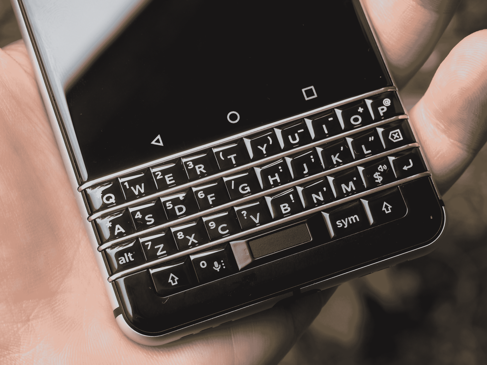
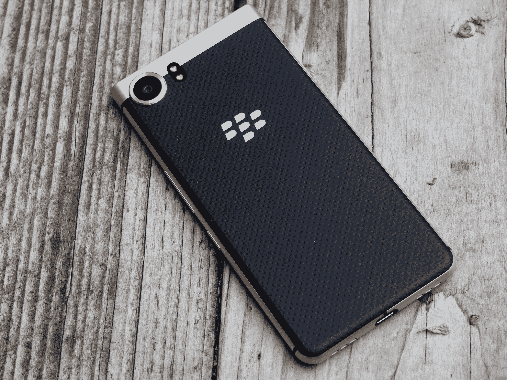
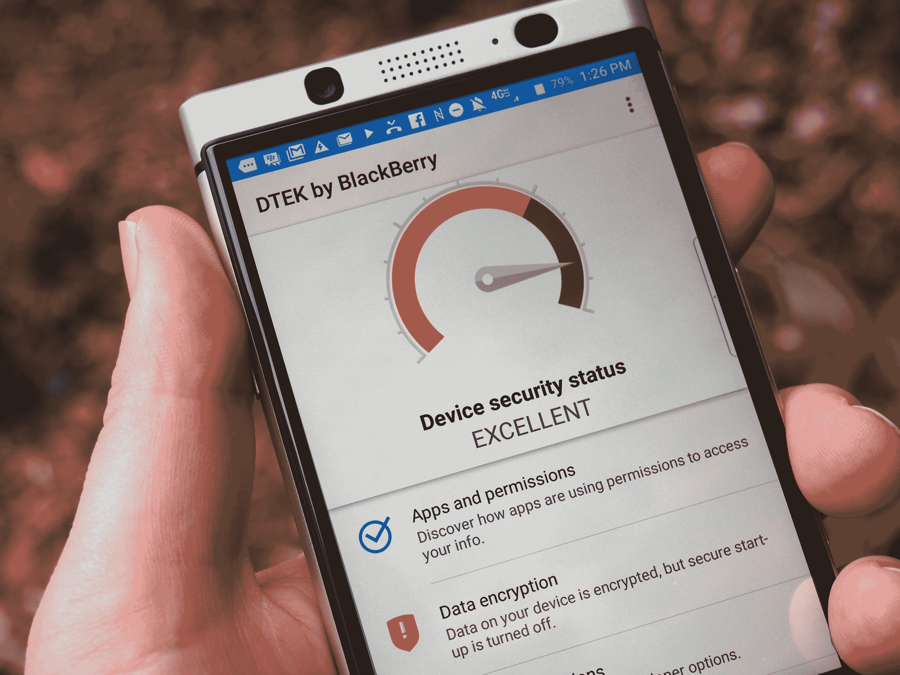
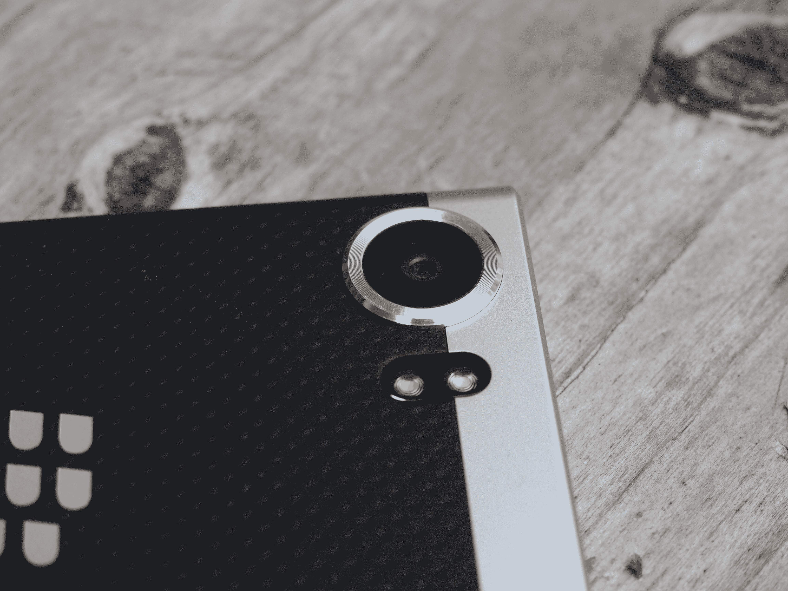

# KeyOne 是黑莓 10 年前就应该生产的手机 

> 原文：<https://web.archive.org/web/https://techcrunch.com/2017/05/04/the-blackberry-keyone-is-an-interesting-insight-into-what-might-have-been/>

KeyOne 是一款来自另一个时间线的设备，黑莓并没有完全错过触摸屏革命。在那个平行宇宙中，比夫·坦南没有当选总统，也没有人强迫忠实的拇指打字者放弃他们心爱的 QWERTY 键盘。人们很容易想象这款设备及时出现拯救黑莓的历史。

目前来看，这款设备是一款毫不掩饰的小众产品。中国电子产品制造商 TCL 目前在全球大部分地区拥有黑莓的品牌权，该公司在这款手机发布前也承认了这一点。虽然很容易将实体键盘的回归视为怀旧的迎合，但这不值得完全忽略。

TCL 拥有硬件知识，而当你过着自己的生活时，黑莓一直在软件方面默默地做着自己的事情。该公司一直专注于安全和生产力应用程序，这是智能手机软件中远不那么性感的一面，但它可能有助于该品牌在未来重新点燃一些 IT 部门的爱。

## QWERTY 的回归

当你想到黑莓时，首先想到的是安全性或生产率。但是他们在骗谁。是键盘。一直都是，永远都是。“黑莓拇指”是西装革履的商界人士过去常常半认真地谈论的一个话题。查一下。这里是[WebMD](https://web.archive.org/web/20230126181406/http://www.webmd.com/arthritis/news/20050126/blackberry-thumb-real-illness-just-dumb#1)上的一个东西。没有键盘的黑莓就像没有指点杆的 ThinkPad。当然，世界上的事情是存在的，但是有什么意义呢？

自 iPhone 时代开始以来(或者自黑莓最终承认这一点以来)，该公司一直被困在触摸屏和键盘之间的中间地带，从未很好地管理这两个压倒一切的设计元素之间的黄金比例。KeyOne 的折衷方案是一个坚固的键盘搭配一个 4.5 英寸的显示屏——全尺寸，但以今天的标准来看是小的。

结果就是又高又瘦，身高介于 iPhone 7 和 7 Plus 之间。键盘挤在听筒的下半部分，打字时整个东西都是头重脚轻的。这看起来像是一个非常关键的设计缺陷，存在于一个非常好的硬件中。尽管 TCL 显然在节省空间的技术上花了一些心思——最引人注目的是在键盘的空格键中巧妙加入了指纹识别器。

至于键盘本身，它需要一些重新训练——或者可能是停止训练——来恢复速度，除非你这些年来设法从 QWERTY 键盘跳到下一个 lo。我承认，我曾经试图从触摸屏的冲击中坚持下来，当摩托罗拉发布第一个带有滑出式键盘的机器人时，我真的很兴奋。

然而，我早就失去了那些拇指打字的技能，我怀疑很多人都失去了。我对实体键盘的喜爱也随之消退。在使用 KeyOne 的时间里，我试图让自己恢复速度，但从未以任何有意义的方式成功过。我确信，如果我再坚持一段时间，我本可以更好地掌握这些东西(所有与我交谈过的 TCL 代表都声称已经很快掌握了它)，但冒着整个努力听起来虚无主义的风险，这到底有什么意义呢？

## 旧的遇见新的

尽管如此，你还是不得不称赞 TCL 的团队设计出了一款外观令人惊讶的手机。老实说，在 CES 上第一次有人向我展示当时的 Mercury(仍然喜欢这个名字)时，我对他们在这里所做的事情印象深刻。

这款手机将经典的黑莓设计元素与更现代的外形完美结合。这有点怀旧，但并不完全像“新”诺基亚 3310。黑色柔软的背衬与圆角和顶部的银带搭配得很好。就连车尾的相机环凸起也很醒目。

黑莓的长期用户也会对它的一些小细节感到熟悉，比如侧面的“确信”键，它可以与各种常用的应用程序和功能相关联。我喜欢让我的用户启动 Spotify。该死的比克斯比。

它比黑莓横幅上生产的最后两款 DTEK 设备好看得多，而且它因为看起来不像市场上所有其他该死的手机而得分。当然，这种非标准的设计语言导致了一些奇怪的妥协，比如显示器和键盘之间的一排触摸按钮(包括 home)。我发现自己每次试图击中要害时都在烦人地敲空格键。

## 软件即服务

撇开品牌不谈，这是黑莓真正的公司仍在运作的地方。该公司这些年来一直在软件方面保持着旺盛的精力。该公司终于在 2015 年接受了一些现实，当时它首次在 Priv 中采用了 Android。

自那以后，该公司对无处不在的移动操作系统进行了改进，目前，该系统看起来很像 Android，尽管加载了专有应用程序，这些应用程序具有各种用途。BBM 在这里，当然，是为了那些坚持自己数字的人。与此同时，DTEK 是一个相对较新的功能，它可以根据不同的工厂提供手机安全状态的快照。

Hub 是该公司已经提供了一段时间的产品。它将您所有的各种消息应用程序聚合成一个单一的流。它有点像一个通知中心，只是从电子邮件、电话、短信和脸书等社交应用程序中获取了更多上下文和可操作的信息。对于那些有敏感信息的人(或者是极度偏执的人)来说，整个屏幕都有一些不错的小细节，比如隐私阴影，它可以遮挡除一小部分屏幕之外的所有内容，以保持信息的隐私。

黑莓口味的操作系统还执行一些后端安全功能，这有助于使其成为最安全的 Android 手机之一，这很可能使其成为 it 部门寻找通常嫌疑人的替代品的有力候选人。

## 成功的关键

KeyOne 是那种你想喜欢的手机。至少，在最近的记忆中，这是来自黑莓阵营(或者说是它的残余)的最引人注目的硬件。该公司制造了一款漂亮而独特的手机，以有趣的方式将当前的设计趋势和经典的黑莓图标结合在一起，是的，键盘又回来了。

这款手机的电池续航时间很长，相机也能拍出好照片。与其他旗舰相比，处理能力有点不足(该公司表示，这部分是由于电池问题)，但你可能不打算在这上面运行 VR，无论如何，对吗？黑莓也在软件方面做了一些有趣的事情，大部分是在公众视线之外。

但我们很难忽视这种潜在的怀疑，即这艘船很久以前就驶向了黑莓。如果 KeyOne 的一些等效版本及时出现，取代最早的 iPhones 和 Android 手机，也许我们会生活在一个非常不同的时间线。然而，就目前而言，世界已经转向触摸屏和自带设备模式。KeyOne 感觉像是一个有趣的思想实验。