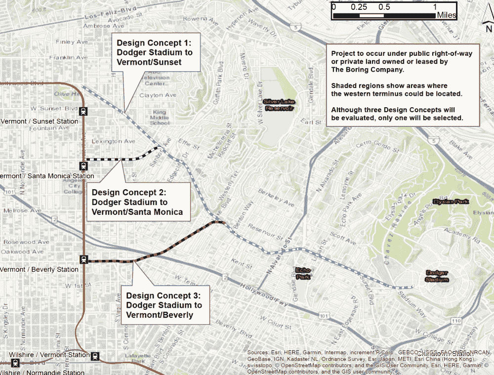

# The Boring Company 向 Dodger Stadium 提议 hyperloop 

> 原文：<https://web.archive.org/web/https://techcrunch.com/2018/08/16/the-boring-company-proposes-hyperloop-to-dodger-stadium/>

# 无聊公司提议 hyperloop 去道奇体育场

Boring Company 昨天宣布了一项提案，计划建造一条 3.6 英里长的 hyperloop，在不到 4 分钟的时间内以大约 1 美元的价格将粉丝从城市直接运送到道奇体育场。

这条拟议中的环路被称为[“防空洞环路”](https://web.archive.org/web/20230205141657/https://www.boringcompany.com/dugout)，将从道奇体育场延伸至 Los Feliz、东好莱坞或 Rampart Village 社区的私有 Boring Co .地产。为了增加公共交通的使用，从而减少交通拥堵，该公司计划在洛杉矶地铁红线附近建设，目前正在该地区的三个红线站之间进行选择。当最终路线确定后，隧道将建在地面以下 30 到 44 英尺，如果在像桥梁这样的基础设施下穿行，隧道会建得更深。

防空洞环路的建议地图

理论上，这种零排放的隧道系统将有助于鼓励洛杉矶人使用公共交通，并开始摆脱城市的汽车堵塞形象和由此产生的烟雾。

该环路将包括一个在 Vin Scully 大道和日落大道下运行的地下隧道、两个环路电梯(主要是电动滑冰鞋进出使用的电梯)和通风/出口竖井。每一个电动滑冰鞋将能够承载 8-16 名乘客。

一开始，Boring Co .计划每场比赛只为体育场容量的 2.5%(1400 人)提供服务，根据城市和用户的反馈，有可能将容量提高到 5%。对于一项旨在减少城市交通拥堵的计划来说，这些令人印象深刻的数字不太可能产生重大影响。

Boring 公司表示，如果洛杉矶市接受这一提议，它将在 14 个月内完成环路建设。这将标志着继今年夏天早些时候芝加哥市[接受在奥黑尔国际机场和芝加哥市中心](https://web.archive.org/web/20230205141657/https://techcrunch.com/2018/06/14/elon-musk-has-new-plans-to-tunnel-into-chicago/)之间修建隧道的提议后，该公司第二次被接受。如果防空洞环路上的地面在芝加哥环路之前被打破，它可能标志着由 Boring Co .建造的第二条隧道。

然而，防空洞环路并不是该市收到的唯一建议。除了 Boring Co .的隧道之外，洛杉矶[正在考虑空中快速交通技术公司的缆车方案](https://web.archive.org/web/20230205141657/https://www.wired.com/story/dodger-gondola-bust-traffic/)，这种缆车每小时可以运载 5000 名乘客，远远高于城市交通，并将他们送到体育场。