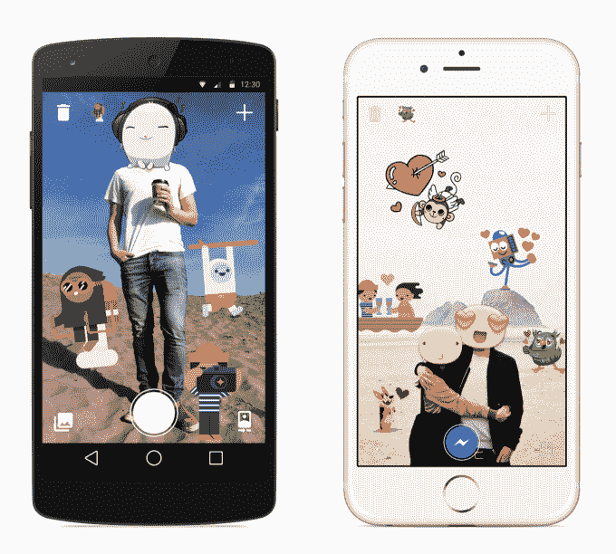
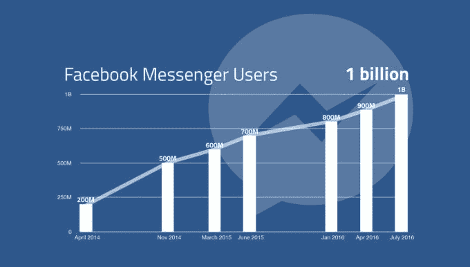
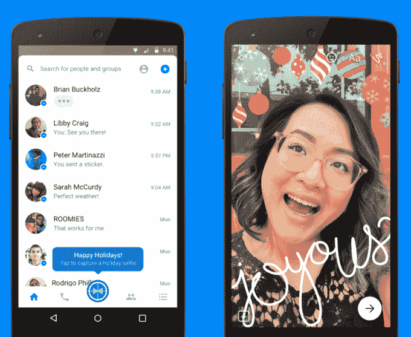

# Facebook Messenger 如何演变成聊天摄像头 

> 原文：<https://web.archive.org/web/https://techcrunch.com/2017/03/08/the-camera-is-the-keyboard/>

一张图片胜过千言万语…没有人愿意在小小的屏幕上打字。即使你在所有的文本中加入了 mash，它仍然会失去讽刺或真诚的微妙之处。为了表达全方位的情感，即时通讯应用必须让我们面对面，尽管我们相距遥远。

“我们喜欢把相机想象成新的键盘，”Facebook Messenger 产品经理托尼·利奇(Tony Leach)告诉我。因此，9 个月前，他的团队开始了一个雄心勃勃的项目，将这个拥有 10 亿用户的聊天应用重新定义为分享图像的方式，而不仅仅是文字。

[这体现在](https://web.archive.org/web/20221218151632/https://techcrunch.com/2016/12/15/facebook-messenger-camera/)Messenger 主屏幕上的一个快门按钮，超过 5000 个图形过滤器和贴纸，你可以添加到照片和视频以及计算机生成的艺术中，将任何文本变成叠加的插图。Messenger 甚至有自己的故事功能，名为 [Messenger Day](https://web.archive.org/web/20221218151632/https://techcrunch.com/2016/09/30/messenger-day/) ，虽然目前只在少数国家可用，但预计很快将在更大范围内推广，包括美国。关于它是如何工作的，请点击这里查看我们的故事]

Messenger Day 和“相机作为键盘”这句话应该很熟悉。该功能是对 Snapchat 首创的故事幻灯片格式的另一种解读。在 [Snap 的 IPO 申请文件](https://web.archive.org/web/20221218151632/https://www.sec.gov/Archives/edgar/data/1564408/000119312517029199/d270216ds1.htm)中，它描述了自己的理念，称“就像闪烁的光标成为台式电脑上大多数产品的起点一样，我们相信相机屏幕将成为智能手机上大多数产品的起点。”

但正如我们不会把每一个按算法排序的订阅源都称为脸书的模仿品，也不会把每一个聊天服务都称为 ICQ 的克隆品一样，视觉交流不仅仅是 Snapchat。无论是谁推广了它，任何不接受这个概念的消息应用程序都注定要失败。

“渐渐地，随着通信变得更加可视化，我们不得不建立一个更强大的相机，”脸书的信使负责人 David Marcus 说。

## 获得视觉效果，一个像素一个像素

2013 年，Messenger 首次涉足视觉交流领域，增加了贴纸。据一位熟悉开发过程的消息人士透露，当时，该公司实际上不愿意开发这一功能。脸书的领导层认为贴纸对于孩子们来说只是一个愚蠢的玩具，他们在亚洲的受欢迎程度不会传到西方。

脸书的粘贴应用

惊喜！贴纸大受欢迎。但是它们只出现在你的信息线索的空白背景上。到 2014 年，Snapchat 已经证明了在照片和视频上叠加文本、表情符号和绘画的流行程度。这种拼贴风格让人们不仅可以展示他们的感受或他们正在做的事情，还可以在上面进行修饰和即兴创作。将图像、文字和符号结合在一起，人们可以立即传达生动而微妙的想法，为喜剧开辟了新的机会。

就在 2014 年年中，脸书开始认真对待克隆业务。它推出了一个过于复杂的 Snapchat 克隆版，名为【T2 弹弓】，在 Messenger 上添加了一个[自拍摄像头](https://web.archive.org/web/20221218151632/https://techcrunch.com/2014/04/28/facebook-messenger-video/)和[文本和绘图](https://web.archive.org/web/20221218151632/https://thenextweb.com/facebook/2014/10/16/facebook-messenger-update-ios-lets-draw-photos-sending/#.tnw_uyLeCU9R)叠加，并推出了一个名为[的专用独立应用程序，用于装饰照片。再次，视觉传达是成功的。Messenger 的用户数量激增，仅在 7 个月内就从 2 亿增加到了 5 亿。](https://web.archive.org/web/20221218151632/https://techcrunch.com/2014/12/19/facebook-stickers-for-messenger/)

Messenger 最终在 2015 年与 Snapchat playbook 分道扬镳，推出了一个[开发者平台](https://web.archive.org/web/20221218151632/https://techcrunch.com/2015/03/25/facebook-launches-messenger-platform-with-content-tools-and-chat-with-businesses/)，让你通过 Giphy、PingTank 和 ESPN 等应用分享 gif、增强照片和视频剪辑。脸书意识到，并不是所有的用户都有足够的创造力去想象他们自己的图像，所以提供途径让他们进入视觉交流变得更容易。

与此同时，Messenger 通过使用[面部识别](https://web.archive.org/web/20221218151632/https://techcrunch.com/2015/11/09/facebook-photo-magic/)来简化照片共享，帮助您向朋友发送您的照片。而且它实际上开始让用户与[视频通话](https://web.archive.org/web/20221218151632/https://techcrunch.com/2015/04/27/facebook-messenger-video-chat/)面对面。Messenger 的迅速崛起还在继续，每隔几个月就会增加一亿活跃用户。

Facebook Messenger 的视频通话、照片魔法和内容应用平台(左起)

但是它丰富的视觉交流功能都被 Messenger 牢牢地束缚住了。对于一个诞生于群发文字聊天时代的应用来说，它们本质上是相机的权宜之计。目前还不清楚下一步该怎么做，Messenger 在 2016 年上半年一直专注于一直不太好用的聊天机器人。

尽管移动十亿人的家具会很可怕，但脸书需要从根本上改造其界面，将摄像头置于 Messenger 的核心。

## 将相机居中

马库斯告诉我:“相机是开始一场对话或分享你希望人们评论的时刻的一个很好的方式。”这就是为什么它不能藏在聊天线索里。当你发短信时，你通常会想到你要先和谁说话。但是对于视觉交流来说，是你想要捕捉的自发瞬间或者你想要做出的傻样点燃了分享的火花。

所以在 12 月中旬， [Messenger 推出了它的大改版](https://web.archive.org/web/20221218151632/https://techcrunch.com/2016/12/15/facebook-messenger-camera/)。收件箱的顶角变成了圆形，以提示用户他们总是远离相机，相机现在位于 chrome 其余部分的下方。一个大的透明快门按钮覆盖在底部导航栏的中间。在多年处于边缘地位后，相机成了应用程序的中心。

但马库斯告诉我，我们并没有只是将一个普通相机移植到应用程序中，“我们已经以一种非常符合你用信息做的事情类型的方式做了这件事。”

一旦您拍摄了照片或视频，您可以从 5000 多张图片中选择添加到顶部，这些图片是围绕人们在 Messenger 中共享的最受欢迎的问题和陈述进行主题化和分类的。有图形表示“饿吗？”，“想出去玩吗？”、“在路上”、“想你”等等。

这不是你在 Instagram 上看到的那种给艺术增添趣味的滤镜，也不是 Snapchat 上看到的那种讲述你一直在做的事情的滤镜。它们是为现在时态设计的，就像图解键盘快捷键一样。

这组图片已经对 Messenger 行为产生了影响。马库斯告诉我，“缓慢但肯定的是，我们看到它被用于对话的开始”，导致越来越长的聊天会话。

这些艺术品在情人节或澳洲日等节日期间特别成功地促进了信息的传递，脸书会临时提供带有相关图标的特殊过滤器。注入这些惊喜让用户不断回头寻找新的分享方式。Snapchat 的旋转自拍镜头也是如此，但 Messenger 给了用户一个额外的暗示，那就是这里有值得探索的东西。它用节日主题“包装”了快门按钮，以表明只要你打开应用程序，就有特殊的滤镜可用。

对于那些有点怕拍照的人来说，由于脸书收购了 MSQRD，Messenger 集成了 Snapchatty 自拍面具。如果你想让你的照片的背景变得有趣，你可以添加环境滤镜，让你的屏幕成为一盏熔岩灯，或者添加你可以用手挥动来操纵的图案。Messenger 还具有 Prisma 式的“风格转换”过滤器，使您的照片或视频看起来像线条画或毕加索的画。

如果你想表达一些完全独特的观点，脸书会根据你输入的内容自动生成过滤器。你可以把一个朋友的名字、一个内部笑话或者任何你想要的短语变成一组重叠的图形。这是脸书深厚的人工智能和设计人才基础在意想不到的地方产生回报的一种方式。

## 使短信人性化

为了视觉而视觉可能很有趣，但 Messenger 相机的真正考验是它是否能让枯燥的日常物流对话不那么令人心碎。任何曾经在短信上讨论购物清单或晚上外出计划的人都知道，它是如何从原本令人愉快的事情中吸取人性的。

“我在杂货店寻找我妻子向我要的东西。我不记得那是马铃薯淀粉还是马铃薯粉，”总理托尼·利奇回忆道。“我只是拍了一张照片，画了‘你想要哪一张？’她圈出了她想要的那个，这让谈话变得容易多了。利奇没有因为忘记而受到责备，而是用视觉效果来缓解这种情况。这些都是 Snapchat 和 Instagram 不用担心的功利用例。

今天，在美国，Messenger 的摄像头只是用于私人谈话。然而，在波兰和澳大利亚，用户可以通过 [Messenger Day](https://web.archive.org/web/20221218151632/https://techcrunch.com/2016/09/30/messenger-day/) 广播他们的视觉创作和邀请，这可以创建一个照片和视频的幻灯片，在 24 小时后消失。脸书告诉我，Messenger Day 将很快推广到更多地方，包括美国。从表面上看，它可能看起来只是 Snapchat 的另一个脸书克隆，就像 Instagram Stories 和脸书 Stories 一样。然而，在内心深处，它是基于一个专为通信而建的相机。

如果 Messenger 可以让我们的日常交流变得轻松有趣，它可能会吸引用户远离它的竞争对手和短信的现状。脸书必须避免让应用程序变得杂乱，以免影响其便利性。有时候，简短的几句话是表达观点的最佳方式。但随着智能手机成为我们身份的渠道，消息传递成为移动体验的核心，我们的聊天应用必须灵活地包含每种表达形式。