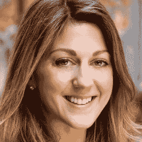

# Chan Zuckerberg Initiative 的幕僚长透露了大赌注慈善事业的计划 

> 原文：<https://web.archive.org/web/https://techcrunch.com/2015/12/11/the-chan-zuckerberg-initiative/>

“他们愿意接受风险，投资那些可能需要 10 年、20 年、50 年才能看到真正具体成果的事情，这太令人惊讶了，”[陈·扎克伯格倡议](https://web.archive.org/web/20230130225738/https://www.facebook.com/notes/mark-zuckerberg/a-letter-to-our-daughter/10153375081581634)的幕僚长凯特琳·福克斯说。

在数周的[批评之后，在看到细节或结果之前，福克斯与我谈论了近一个小时关于普里西拉和马克慈善基金会的战略。](https://web.archive.org/web/20230130225738/https://techcrunch.com/2015/12/03/zuckerberg-responds-to-critics-explains-how-hes-spending-45b/)

CZI 的结构将类似于脸书的收购。这对夫妇将委托专家领导，在没有太多微观管理的情况下，为重大问题寻求开创性的解决方案。我们的目标是利用将 Chan-Zuckerberg fortune 组织成一个有限责任公司而不是一个非营利组织所提供的灵活性，来进行探索敏捷性影响的实验。

从某种意义上说，CZI 看起来更像是一家初创公司，而不是一家慈善机构。这种非传统的性质理所当然地提出了关于过程和结果的问题。冒更大的风险意味着由马克的 450 亿美元脸书财富资助的一些努力有可能会失败或功亏一篑。

但是，一些今天和明天最紧迫的挑战、疾病和不公正不会通过逐步解决它们的症状而被击败。“陈·扎克伯格倡议”的结构赋予了它自由和资金，让它能够对人类问题的根源做出重大改变。

Chan 和 Zuckerberg 自己做不到。Priscilla 是一名医生，负责监督这所小学，这对夫妇试图重新构想 K-8 教育。马克经营着地球上最大的公司之一。他们没有必要的时间或基础知识来领导减贫、推进医学、改善政治或减少不平等的努力。他们知道这一点。

“总的来说，他们哲学的一大支柱是让这些领域的领导者有能力，”福克斯告诉我。她解释说，陈和扎克伯格仍将深入感兴趣的领域，以确定谁是最有远见的领导者。一旦他们招募到他们信任的专家，这对夫妇将使他们能够管理基金会的资源。

这反映了马克[如何组织脸书收购 Instagram、Oculus 和 WhatsApp 等公司。他授权凯文·斯特罗姆、布伦丹·伊里布和简·库姆完全自主地运行他们的产品。他们是照片、虚拟现实和国际信息方面的专家。扎克相信他们将继续成为领导公司的最佳人选，但现在在脸书的旗帜下有了共同的目标。](https://web.archive.org/web/20230130225738/https://techcrunch.com/2015/03/25/safety-in-numbers/)

其他科技巨头的收购在母公司的沉重枷锁下停滞或瓦解。然而，赋予脸书收购的独立性将每一笔交易的影响力推向了新的高度。现在扎克伯格把这个游戏计划带到了慈善事业中。

“因此，与其对每一项投资进行微观管理，不如找到他们信任的人，然后帮助他们做出决定，”福克斯说。

承担更高的风险可以使 CZI 成为更传统方法的补充。马克的脸书联合创始人[达斯汀·莫斯科维茨和他的妻子卡莉的基金会 Good Ventures](https://web.archive.org/web/20230130225738/http://www.goodventures.org/about-us) 专注于数据驱动的慈善事业。起初，他们专注于使每一美元的具体利益最大化的方法，如蚊帐和直接现金转移。但是好的冒险已经进化了。现在，它和 CZI 都将支持改变世界的高风险长期理念，而这正是老派慈善机构所回避的。[更新:这段文字已经过编辑，以更准确地反映良好的风险投资的重点。]

拥有可靠的影响模型的组织需要有人来开路。福克斯告诉我，CZI 可能会测试和确定帮助他们的方法，并把他们引向更保守的资金来源。这可能包括治疗疾病或产生能量的硬科学尝试，不需要持续捐赠的自我维持盈利模式——登月慈善。

福克斯将把她在洛克菲勒基金会管理咨询和制定战略的经验带到她在 CZI 的办公室主任职位上。这不是沃顿商学院毕业生第一次将慈善理念应用于盈利模式。

凯特琳·福克斯，陈扎克伯格倡议办公室主任

在 CZI，有很多开放性的问题需要她来回答。该组织仍在研究如何衡量其长期计划的成功。同时，它决定了如何最好地发现支持什么。

目前它不接受主动提议。CZI 尚未表明是否会资助艺术或向有需要的人直接转移现金。福克斯承认，公众对有限责任公司结构如何运作的担忧是有道理的，但他敦促人们在 CZI 拿出结果之前保留判断。

它寻求最大化这些结果的一个方法是尽可能保持 CZI 的精简。福克斯表示，这有两个主要优势。首先，保持较低的员工人数可以确保尽可能多的钱用于慈善事业本身。第二，它让陈、扎克伯格和他们信任的专家们与情况保持密切联系，形成简短的反馈循环，以便他们能够尽快学习和纠正。

CZI 及其批评者都会对透明度特别感兴趣。福克斯说，该基金会努力做到难以置信的透明。然而，她指出，在某些情况下，特别是当 CZI 与其他集团共同投资时，受赠者不希望受到额外的关注。或者，如果它投资于营利性部门，它可能不会立即披露其参与情况。这种保密可能会激怒某些人，因为有些人可能会辩称，问题解决者之间的公开合作会加速取得成果。然而，通过支持私营企业，CZI 可以获得超额回报，并计划将其再投资于行善。

对 CZI 的强烈反对主要集中在扎克伯格作为有史以来最成功的技术专家之一的历史上。然而，批评者在很大程度上忽略了一个事实，即该基金会的名字以陈(Chan)开头，加州大学旧金山分校(University Of California，San Francisco)校长萨姆·霍古德(Sam Hawgood)博士称赞她在医学院期间“致力于帮助我们社区中最缺乏服务的人”。福克斯告诉我，虽然扎克伯格带来了他的远见卓识和乐观主义，但陈以她当老师和医生时的视角为他们的工作奠定了基础。

通过尽早开始，两人将有足够的时间成长为捐助者。虽然其他主要捐赠者直到晚年才获得或承诺捐赠数十亿美元，但陈和扎克伯格的年轻是一个机会。

“他们是非常有耐心的慈善家，”福克斯说。“他们不需要在一年内、两年内得到明确的结果。这意味着 CZI 的资金在短期内需要更负责任的分配，以最大限度地减少浪费。但是，如果陈和扎克伯格能够找到正确的方法和合适的人来执行这些方法，他们就有机会解决我们这个世界上最令人烦恼的困境。不仅仅是那些影响我们今天或他们新生的女儿马克斯的人，而是那些影响未来几代人的人。