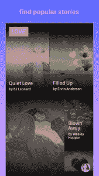
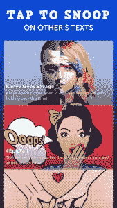
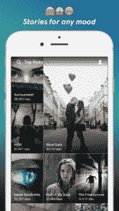

# 青少年为之疯狂的聊天小说应用

> 原文：<https://web.archive.org/web/https://techcrunch.com/2017/06/13/the-chat-fiction-apps-that-teens-go-crazy-for/>

你听说过聊天小说应用吗？如果不是，那么你很可能不是青少年。

这些以短信形式呈现的电子书替代品在过去几个月里一直占据着应用排行榜的主导地位。对于习惯了平装书的人来说，这种格式可能有点奇怪，但至少年轻人在阅读。

这些是受欢迎的。

## 钩状的

[上钩](https://web.archive.org/web/20230304013521/https://itunes.apple.com/us/app/hooked-chat-stories/id1024818709?mt=8)是引发狂潮的 app。它于 2015 年推出，此后一直保持着人气。它目前是所有类别中排名前 40 的免费应用。主题从喜剧到恐怖故事，并且总是以消息的形式显示。

用户必须不断滚动才能知道接下来会发生什么。这个想法是，对于从小就用这种方式交流的年轻人来说，发短信的方式更容易引起共鸣。虽然应用程序本身是免费的，但用户必须为完整的体验付费。

每周花费 2.99 美元，每年花费 39.99 美元。其业务引起了包括 Greylock Partners、Foundation Capital 和 Founders Fund 在内的知名投资者的关注。

## 故事

[纱](https://web.archive.org/web/20230304013521/https://itunes.apple.com/us/app/yarn-chat-fiction/id1195233335?mt=8)很招人喜欢。这也是一个类似短信故事的应用程序，价格完全相同。但是内容是原创的，有一些不同的主题。

其中一些包括与一线明星的假想对话，或者想象中的关于约会的群聊。他们还有一个“真心话大冒险”栏目，以及关于使用 Siri 等个人助理的笑话。虽然这些主题听起来不太像“书”，但这是它们在 iTunes 中被标注的类别。

和 Hooked 一样，它目前的排名高于 Kindle。这款应用是由叉骨和弹弓制造商[科技](https://web.archive.org/web/20230304013521/http://www.science-inc.com/mobile/)研发的。

## 轻敲，水龙头

[Tap](https://web.archive.org/web/20230304013521/https://itunes.apple.com/us/app/tap-chat-stories-by-wattpad/id1182496809?mt=8) 最近由 [Wattpad、](https://web.archive.org/web/20230304013521/https://techcrunch.com/2017/02/22/wattpad-debuts-tap-an-app-for-reading-chat-style-short-stories/)社交出版平台推出。它的工作方式很像其他聊天小说应用程序，并且完全相同的费用来获得完整的体验。

好吧，如果商业模式没坏，就不要修复它。从爱情故事到犯罪故事，Tap 让你很容易看到什么是热门，并告诉你有多少人在浏览它。也可以写自己的故事，分享给朋友。

这个 app 在排行榜上也做得相当不错。但愿今天的青少年知道真正的书是什么样子。