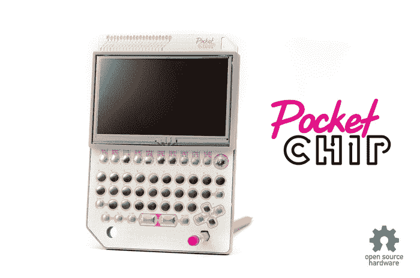

# 这种芯片是一台 9 美元的电脑，几乎可以做所有的事情

> 原文：<https://web.archive.org/web/https://techcrunch.com/2015/05/08/the-chip-is-a-9-computer-that-can-almost-do-it-all/>

# 这种芯片是一台 9 美元的电脑，几乎可以完成所有功能

如果你需要一台信用卡大小的电脑，不用再找了。[芯片是一台 9 美元](https://web.archive.org/web/20230322160428/https://www.kickstarter.com/projects/1598272670/chip-the-worlds-first-9-computer)的单板电脑，运行 Linux，可以做任何你想让它做的事情……包括玩雷神之锤。

该主板包括 Wi-Fi 和蓝牙，以及 VGA 和 HDMI 显示器的可选端口。在主板上，您会发现 1GHz 处理器、512 RAM 和 4GB 存储空间。你可以安装一个简易版的 Debian，你甚至可以把它插到一个叫做 PocketCHIP 的东西上，在一个和最初的 Game Boy 差不多大的包里增加一个触摸屏和键盘。

你为什么需要这个东西？首先，这很酷。一台 9 美元的电脑 VGA 适配器 19 美元，HDMI 适配器 24 美元——是一个了不起的壮举。就像树莓派一样，媒介就是信息。既然我们有能力购买一台微型电脑，我们都会发现我们可以使用它的地方。此外，创造者还增加了手持设备，作为一种创新的刺激。如果你可以随身携带这个小家伙，用它玩游戏，或者把它当作迷你电脑，黑客心态就会占据上风，你可能希望扩展这个平台。

该芯片已经突破了 50，000 美元的目标，目前约为 200，000 美元。他们预计在一年内发货，他们是一家公司，所以他们有一些坚实的制造支持。虽然你显然可以拿起一个树莓 Pi 2，用它来摇滚，但这个小家伙似乎是尝试可穿戴设备和微型设备的人的完美解决方案，这是一个肯定会在未来几年增长的兴趣领域。无论如何，这是一个令人惊讶的诱人的小电脑，它将是伟大的，看看爱好者可以做什么。