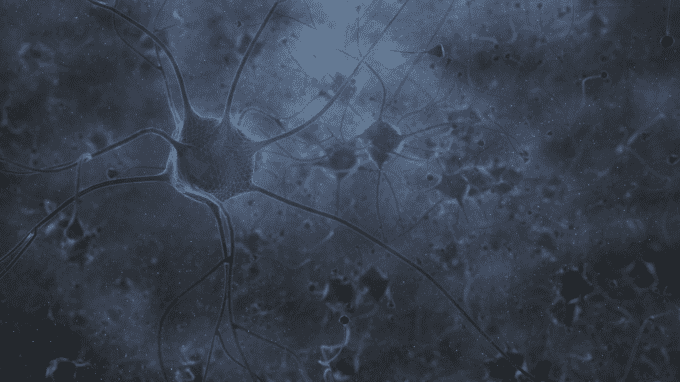
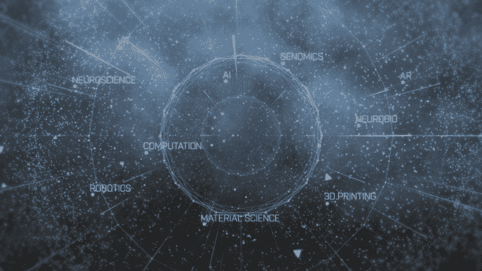

# 人类和人工智能的结合将定义人类的未来 

> 原文：<https://web.archive.org/web/https://techcrunch.com/2016/10/12/the-combination-of-human-and-artificial-intelligence-will-define-humanitys-future/>

布莱恩·约翰逊撰稿人

布莱恩·约翰逊是神经假体开发商的创始人兼首席执行官

[Kernel](https://web.archive.org/web/20230205223625/http://kernel.co/)

的创始人

[OS Fund](https://web.archive.org/web/20230205223625/http://osfund.co/)

还有布伦特里。

More posts by this contributor

通过过去几十年夏季大片和硅谷产品，人工智能(AI)变得越来越熟悉和性感，并充满了反常的反乌托邦诱惑。

谈的比较少，在关注度和资源上也一直相形见绌的，是人的智能(HI)。

从章鱼的神秘大脑和蚂蚁的群体思维到围棋深度学习机器和无人驾驶汽车的自动驾驶，智能的各种形式是现存的最强大和最宝贵的资源。我们自己的头脑是以大量多样性为特征的现象的最熟悉的例子。

然而，HI 在各种各样的智能中是独一无二的，因为它具有无与伦比的设计、修改和构建新型智能的能力。嗨定义了我们人类以及我们与地球上一切事物的关系。现在，通过 HI 和 AI 的结合，我们正处于智能增强的边缘，这可能是我们这个时代和历史上最重要的技术发展。

## 主工具

各种形式的智力为我们追求的每一个机会和寻求解决的每一个问题提供了动力。它位于一切事物的上游。它既是主要工具，又是所有工具的主人。它不仅是做事情的最普遍的手段，它也是决定什么值得做的有意义的力量。

智慧让我们能够创造治理的形式，治愈疾病，创造艺术和音乐，发现，梦想和爱。通过将发现转化为意义，将经验转化为价值，将价值转化为决策，智力也是决定这些事情(而不是其他事情)是否值得做的因素。

从石头到人工智能，人类工具的演变可以被视为日益强大的努力套利的轨迹，我们利用自己相对于工具的比较优势，把事情做得更好，做更多新的事情。沿着这条轨迹，体现重要智能水平的工具是我们迄今为止最强大的工具。

在这种追求努力套利的过程中，最小的智力进步都有能力为人类、个人和集体带来巨大的收益。250 万年前一个看似简单的变化——使用石器屠宰动物——导致早期原始人走上了成为现代人的道路。

从这个不起眼的起点开始，在整个人类历史中，我们创造了增加我们个人和集体智慧的工具，并成为我们自然自我的延伸。我们从锤子和斧子等简陋的功能性工具开始。仅仅过了几万年，我们就进步到了更智能的工具，比如恒温器，以及基于法治而非专制的治理技术。

每一次进步，我们都愉快地放弃了一小部分代理权，以换取已知的预编程结果。我们的工具可以代表我们做越来越多的事情，把我们解放出来做其他更想做的事情。

这种进展一直在继续。随着我们对为我们做事的工具越来越熟悉和舒适，我们急切地用更多的代理来换取预期的收益，即使我们对这种交易的特定实例中的选择和假设并不熟悉。总的来说，我们的冒险得到了回报，由此产生的实际收益通常远远超过损失。

例如，亚马逊的推荐算法是世界上最强大的力量之一，它决定了人们读哪些书，听哪些观点，以及我们学习什么——然而这些推荐决策是如何做出的，我们大多数人都不知道。

发现无数新的阅读选择的收获是显而易见的。预期的损失，包括人际联系的减少和隐私的损失，要么没有像预期的那样发生(例如，通过各种在线媒体，我们现在可以通过书籍与更多的人联系，而不仅仅是当地的独立书店老板)，要么是我们容易犯的错误(放弃我们阅读习惯的一些隐私，以换取更好的推荐)。

## 人类的新伙伴关系

我们正处在一个有趣的转变点上，我们正从把我们的工具作为我们自身的被动延伸，转变为作为主动伙伴与它们一起工作。斧头或锤子是手的被动延伸，但无人机与其操作者一起形成了分布式智能，更接近于狗或马，而不是设备。这些工具可以以前所未有的方式与我们互动，例如在才艺比赛中与我们合作编排舞蹈，或者帮助我们编写小说或新的科幻电影。

我们的工具现在是自己的演员，它们的未来掌握在我们手中。想想汽车的进化:从马车到 Model-T，从定速巡航到自适应巡航，再到现在的无人驾驶汽车。

工程师们现在正在使用微妙的道德模型对汽车进行编程，以确定在事故不可避免的情况下，是否会撞到行人或偏离道路并危及司机的生命。

这种汽车在真实情况下得出的结论可能与你或我在驾驶座上做出的决定大相径庭，但事后看来，我们可能会认为它们好得多，即使它们最初对我们来说似乎很陌生。理想情况下，这种技术进化的决策能力可以与进化的 HI 一起蓬勃发展，以重新思考假设，重构可能性并探索新的领域。

我们已经看到国际象棋演变成一种新的游戏，像芒努斯·卡尔森这样的年轻冠军已经采用了利用人工智能国际象棋引擎的打法。有了未经增强的人类和无人机一起跳舞的早期例子，已经很明显，人类和人工智能将能够形成令人眼花缭乱的各种组合，以创造新的艺术、科学、财富和意义。如果照片中的人类以强大的方式增强，我们能做什么？例如，如果每个人都有完美的记忆力，会发生什么？

简而言之，我们正准备迎接一个爆炸性的生殖时代，通过一个简单的等式:HI+AI 所代表的寒武纪大爆发，人类的能力将大幅提高。当 HI 与 AI 结合时，我们的思维能力、创造力和智能将会有历史上最大的进步。

虽然我们在健康诊断、交通协调、艺术和音乐领域开始了 HI+AI，但我们的合作伙伴关系正在迅速扩展到技术、治理和关系的共同创造，以及我们的 HI+AI 想象力带我们去的任何其他地方。

开启这个强大的新未来的最大瓶颈是，我们人类目前在如何参与这些可能性方面受到高度限制。我们与我们新创造的智能的联系受到屏幕、键盘、手势界面和语音命令的限制——受限的输入/输出模式。我们很少接触自己的大脑，这限制了我们以强大的方式与硅基机器共同进化的能力。

相对于我们在人工智能发展上取得进展的容易和速度，单就我们天生的生物能力而言，HI 目前是一个智力潜力的内陆岛屿。释放人类大脑尚未开发的能力，并将其与这些新能力联系起来，是当今最大的挑战和机遇。

今天，实现这种解放的最有力的途径是神经假体。近年来，世界各地的研究实验室在了解大脑如何工作、如何将其与外部资源联系起来以及我们如何更深入地挖掘其潜力方面取得了巨大进展。越来越多患有神经退行性疾病的人活得更长，这显然是对这些设备最直接的需求。这些设备——通过直接扩展 HI，包括我们的记忆和其他认知能力——可能会导致大脑和身体前所未有的长寿。(完全披露:我已经在这个领域开了一家公司。)

改善 HI 还有其他途径，包括基因组学和药理学干预。但是这些有一个严重的限制，它们无法扩展大脑与我们的智能工具(AI)进行交流的能力。

为了真正实现 HI+AI 的潜力，我们需要将人们接收、处理和使用信息的能力提高几个数量级。为此，神经假体是迎接这一挑战的最有希望的途径。

## 新的叙述

从艾萨克·阿西莫夫的作品到《终结者》和《神秘博士》,我们已经看到了未来智能的愿景，这影响了我们对充满机器的未来的想象。这些愿景让社会对潜在的未来机器智能的缺点和风险变得敏感。与所有新技术一样，损失比收益更容易想象。

的确，我们创造的每一项新技术都会带来新的风险，需要深思熟虑和明智的行动。拯救生命的医学进步也使细菌战成为可能；化学工程导致了化肥和粮食产量的增加，但也导致了化学战。核裂变创造了一种新的能源，但也导致了核弹。

随着我们开始人类迄今最伟大的探险，现在是讨论 HI+AI 的时候了。但与其让以风险为锚的危言耸听推动讨论，不如让我们从 HI+AI 的承诺开始；我们画的画取决于我们使用的画笔。

我们为 HI+AI 的未来创造的故事很重要，因为它们创造了行动的蓝图，有意识地和下意识地为我们的决策而奋斗。采用基于恐惧的叙事作为我们的主要参考框架，开始限制想象力、好奇心和探索本能，而这些一直是人类的核心。

## 史诗般的冒险

我们都生活在一个获得前所未有的创造力的时代。利用我们的自然智能和我们在过去一千年中逐步建立的智能的外部扩展，我们现在已经开发出了诸如基因组学、合成生物学和机器人学等创造工具，这些工具实际上允许我们以任何我们可以想象的方式为我们的存在编程。我们已经从玩家发展成为游戏的创造者。

这是我非常感激的事情，也是我每天早上从床上跳起来的原因。我们正在经历一个史诗般的故事，未来由我们来把握。

这就是为什么 HI 是我们现在可能正在做的最重要的事情。当历史上最大的机遇摆在我们面前的时候，我们不应该成为我们自己故事中最大的限制因素。