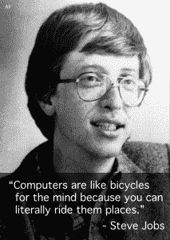

# 三明治电脑展将拓展你的思维进入新的计算领域 

> 原文：<https://web.archive.org/web/https://techcrunch.com/2015/10/14/the-computer-show-by-sandwich-will-expand-your-mind-into-the-new-computing-horizon/>

【YouTube = https://www . YouTube . com/watch？v=FvTN9siaT-M]

一些人说计算机会一直存在下去，而另一些人则不这么认为。亚当·利萨格和罗克珊娜·阿尔塔米拉诺是那些说他们会留在这里并确信无疑的人。有多确定？如此确信他们录下了一场表演。

[Lisagor](https://web.archive.org/web/20221207082128/https://twitter.com/lonelysandwich?ref_src=twsrc%5Egoogle%7Ctwcamp%5Eserp%7Ctwgr%5Eauthor) ，在 CB 上也被称为孤独三明治，他和他的合作伙伴制作了一系列有用的视频来帮助你在计算机世界中导航。在这些视频中，你会遇到像 Reddit 上的那个人和两个制作电脑艺术的人这样令人惊叹的人。这是对 20 世纪最重要的时尚的迷人审视。

该剧以 1983 年为背景，风格看起来像一部名为[电脑编年史](https://web.archive.org/web/20221207082128/https://www.youtube.com/user/ComputerChroniclesYT)的流行视频系列。然而，在李萨格的系列中，多人在交谈。

这些视频是 Tandy 兼容的。你可以在这里看到更多的[秀](https://web.archive.org/web/20221207082128/http://computer.show/)。

我们在一家大三明治店与李萨格和他的伙伴坐下来讨论这次展览和个性化电脑的未来。他人很好。

**TC:** 嗨！你是谁？

亚当·李萨格:我们是亚当·李萨格和罗克珊娜·阿尔塔米拉诺。我们住在一起，有一个孩子，还和罗克珊娜的哥哥托尼一起制作了“电脑秀”。

**TC:** 这些视频是关于什么的？它们是给谁的？孩子？

艾尔:这些视频是为 1983 年的典型技术消费者准备的，他们对 1983 年及以后(包括 2015 年)的所有现代技术趋势和产品感兴趣。

给我们介绍一下电脑吧？

艾尔:史蒂夫·乔布斯说过电脑就像大脑的自行车，他的意思是你可以骑着它们到处跑。

 **TC:** 网络的未来是什么？

艾尔:网络的未来是更全面的，只是声音更大。

**TC:** 你为什么要拍这部剧？电脑是一种时尚吗？

艾尔:当我们说计算机至少在未来十年都将存在时，我想我们代表了我们的未来学家同行。

这部剧的前景如何？哪种计算机可能很快就会出现？

艾尔:电脑可以是任何颜色，从棕色到浅米色到灰褐色。在未来的某一天，甚至可能会有写着“电脑展”的电脑，就像你最喜欢的午餐盒一样。

你希望节目中还有哪些人？有神职人员吗？

艾尔:你问的很有趣，我们即将播出的一集叫做“电脑和上帝”，我们邀请了来自世界上所有宗教(甚至是古怪的宗教)的代表来讨论上帝是否喜欢电脑以及他玩什么电脑游戏。

【YouTube = https://www . YouTube . com/watch？v=WaawXXqXExo]

**TC:** 电子游戏是电脑吗？弹球？

艾尔:在某种程度上，一切都是电脑。任何有删除按钮的东西从技术上来说都是电脑。弹球有两台，所以从技术上讲它是一台超级计算机。

**TC:** 谢谢！