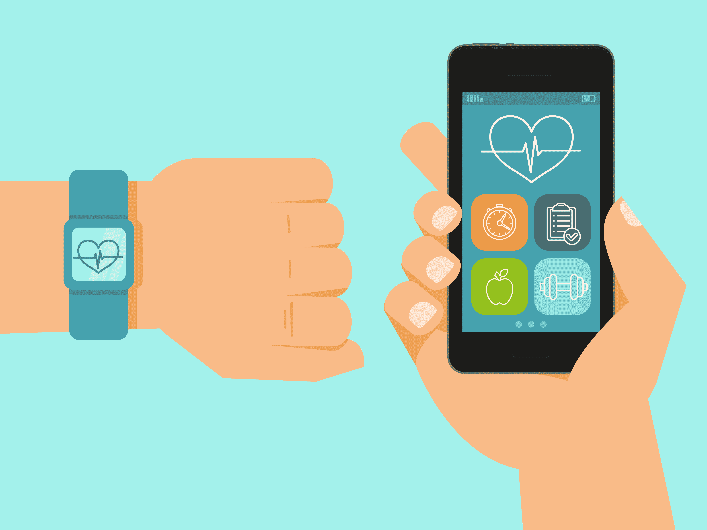
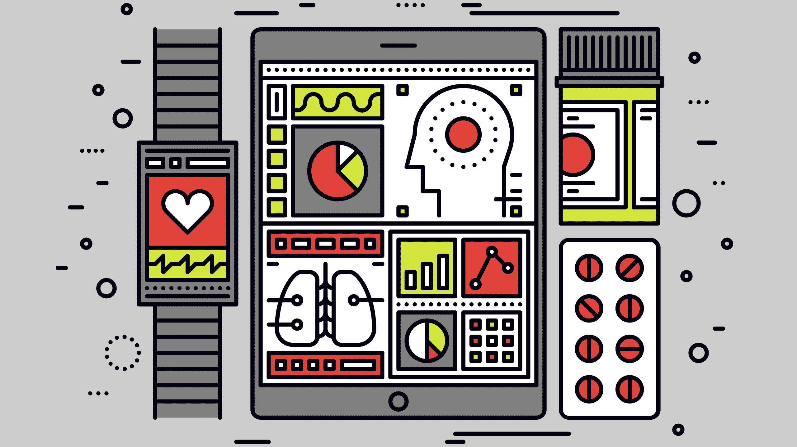
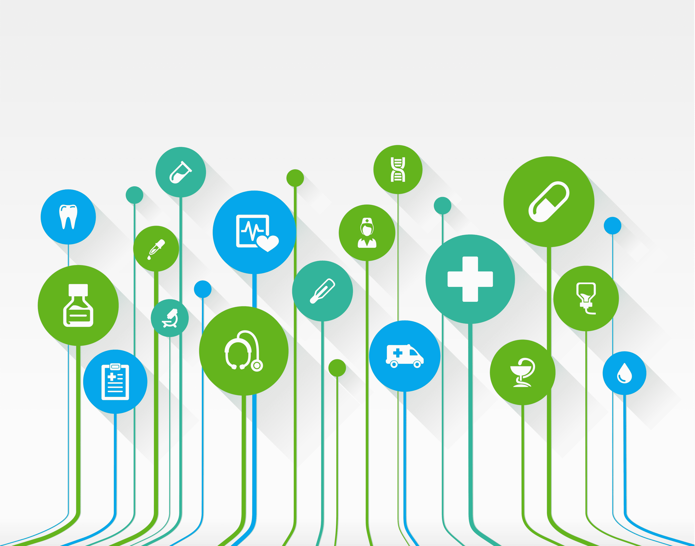
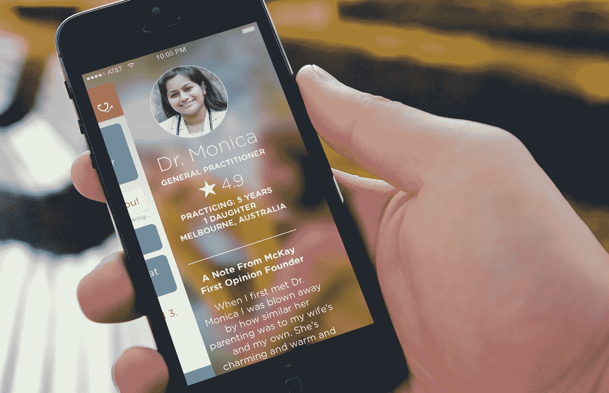

# 医疗保健的消费化 

> 原文：<https://web.archive.org/web/https://techcrunch.com/2017/06/05/the-consumerization-of-healthcare/>

山姆·迈尔斯是

[Balderton Capital](https://web.archive.org/web/20221025230525/http://www.balderton.com/)

在那里，他负责该公司的北欧投资组合，重点投资于安全、医疗保健、汽车和移动互联网技术。

最近，我在公寓对面的全科医生那里注册了。我在那里住了一年了。由于对官僚主义严重过敏，我推迟了注册。去年，我想去看专家。我对我的私人医疗服务提供者的回答嗤之以鼻，他说我首先需要咨询我的医生……可以肯定地说，这从未发生过。

医疗保健中的“可及性”往往意味着医疗服务的可获得性，通常归结为医疗服务的可负担性，以及可获得医疗服务的受众规模。我的轶事显然是小摩擦的例子，而不是任何关于获得医疗保健的“真正”问题，但在我们生活的“按需”世界中，简单的注册和零摩擦的加入是王道，获得也意味着在你需要的时候获得正确的医疗“产品”。

这是最让我兴奋的医疗进步。产品现在被直接送到患者手中——这比让他们任由医生的日程表摆布要好。

**“柜台交易”的新含义**

五十年前，在杂货店里，消费者和商品之间曾经有明显的界限。食品杂货只能通过商店的店员进入，店员是看门人。有人提供建议是有用的，但随着时间的推移，很明显，允许自己做决定要好得多。

同样的转变正在医疗保健领域发生。由于在网络时代信息获取的改善，当人们生病时，他们通常会知道自己哪里出了问题。此外，他们通常有健康意识，因此渴望确保他们今天保持健康，这样他们明天就不会成为病人。

由于这种行为的改变和信息获取的改善，现在市场上存在消费级医疗保健产品和数字工具的空间，以确保这些产品以新的方式提供给大量受众。

那些在医疗保健领域成功打造消费产品和品牌的企业将在未来几年大获全胜。

**新的患者路径**

所以人们越来越健康:这意味着什么？

在过去，医疗产品几乎普遍为医疗系统内的患者保留。当这些商品从柜台后转移到商店时，它们被重新包装并立即提供给那些想要它们的人。

这发生在诊断和测试中。像瑞典的 Werlabs 这样的公司提供详细的血液测试。在英国， [Thriva](https://web.archive.org/web/20221025230525/https://thriva.co/) 提供小规模的家庭测试。实验室已经在为医院处理这些样本了，那么为什么不把多余的能力提供给消费者呢？

这种趋势随着治疗而继续。像 [Dr. Ed](https://web.archive.org/web/20221025230525/https://www.dred.com/uk/) 这样的公司正在通过将过程编码成在线调查问卷来重新包装处方的获取途径，该调查问卷在药物分发之前得到医生的批准。像 [IESO 健康](https://web.archive.org/web/20221025230525/https://uk.iesohealth.com/)这样的产品使患者能够直接与治疗师联系，而不需要转诊，这很可能为那些可能没有被诊断的人提供心理健康护理。

医学数据是时候改变了。我们的数据目前隐藏在不同的患者记录中，但由于像 [PatientsKnowBest](https://web.archive.org/web/20221025230525/https://www.patientsknowbest.com/) 这样的平台，我们的数据再次成为我们自己的数据。

数字工具也在改变我们管理疾病的方式。行为改变项目正在转化为产品，并在以前不可能的大量患者中推广。这在解决影响一个国家人民的医疗保健问题时尤其有力，这些问题源于不良的生活方式。

[英国的 OurPath](https://web.archive.org/web/20221025230525/https://www.ourpath.co.uk/) (披露:我是个人股东和顾问)和美国的 [Omada Health](https://web.archive.org/web/20221025230525/https://www.omadahealth.com/) 在糖尿病方面做得很好。这两种药物的使用者都可以直接接受新的治疗，而无需转诊。

但是它并没有完全脱离医疗系统。我们总是需要全科医生和专家的专业建议。有许多令人难以置信的创始人正在研究如何将医生的智慧转化为按需服务。

最大的变化是获得初级保健的机会。技术正在消除位置障碍，使患者能够在线咨询医生，从而减少旅行和等待时间。这对于传统上存在接入和成本问题的偏远地区尤其令人兴奋，尤其是在新兴市场。

这些产品中有许多是由在医疗保健和消费产品领域拥有丰富经验的团队开发的。

这在整个欧洲都在发生——从北欧的 [Kry](https://web.archive.org/web/20221025230525/https://kry.se/) 和 [MinDoktor](https://web.archive.org/web/20221025230525/https://www.mindoktor.se/) ，到 [PushDr](https://web.archive.org/web/20221025230525/https://www.pushdoctor.co.uk/) 。英国的[随处医生护理](https://web.archive.org/web/20221025230525/https://doctorcareanywhere.com/)，法国的[内科医生](https://web.archive.org/web/20221025230525/https://www.mesdocteurs.com/)。其他公司，如 Meru Health 和 Virta Health 正在建设轻资产专家诊所，将管理特定疾病的数字工具与医生的远程咨询相结合。

**未来的挑战**

谈到医疗保健，我们应该经常问自己这样一个问题:消费者真的最了解吗？什么时候我们应该被允许选择自己的治疗方法，什么时候我们会因为这样做而受到伤害？网上药店的处方流程被批评为过于宽松；新数字疗法的安全性需要证据基础的支持，就像传统医学一样。

还将有一场关于新产品如何融入现有医疗体系的辩论。在政治和哲学层面:我们如何确保消费者医疗保健——通常(但不总是)是私人医疗保健——不会侵蚀公共医疗保健的资源？

此外，我们什么时候移交给传统的医疗保健系统进行诊断或治疗？例如，使用手机附带的摄像头可以在皮肤科做很多事情，但在什么情况下我们需要咨询皮肤科医生呢？

最后，主要的争论围绕着谁来买单。一种选择是让每个人自掏腰包，但要让负担不起这种医疗保健的群体也能获得这种医疗保健，就需要由国家系统报销，而国家系统已经在努力应对不断上涨的医疗费用。另一个选择是在保险套餐中认可这些产品，或者说服雇主为他们的团队更健康买单。

无论如何，我坚信数字工具和消费级产品，以及它们在改善医疗保健方面的奇迹。尤其是，我迫不及待地想摆脱候诊室和官僚作风，让医疗系统触手可及。