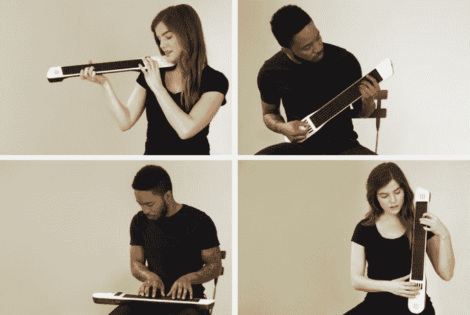
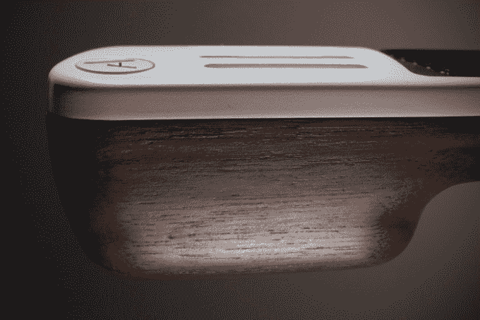

# Artiphon INSTRUMENT 1 集交响乐、摇滚乐队和 DJ 于一身 

> 原文：<https://web.archive.org/web/https://techcrunch.com/2015/03/07/the-crowdfunded-artiphon-instrument-1-mixes-high-and-low-musical-tech/>

仅仅过了四天， [Artiphon INSTRUMENT 1](https://web.archive.org/web/20230219002119/https://www.kickstarter.com/projects/artiphon/introducing-the-artiphon-instrument-1) 这款电子设备几乎可以成为你想要的任何乐器，它已经超过了 [Kickstarter](https://web.archive.org/web/20230219002119/https://www.kickstarter.com/projects/artiphon/introducing-the-artiphon-instrument-1) 的目标近 25 万美元。

Artiphon INSTRUMENT 1 允许您使用 iPhone 作为控制器，以多种不同的方式在一台设备上演奏数百种乐器。作为 DJ，你不仅可以演奏钢琴、小提琴、吉他或循环节拍，还可以混合演奏这些乐器的方式。例如，你可以用钢琴键的声音弹吉他，或者用班卓琴的声音弹钢琴。

Artiphon 还开发了一个配套应用程序，这样你就可以对设备进行编程，让它成为你想要的任何乐器。“可以使用任何数量的组合，”创始人迈克·布特拉说。

有一天，布特拉和他的乐队在旅途中，产生了制作 Artiphon 乐器 1 的想法。

“我带着中提琴、大提琴、吉他、电吉他，所有这些乐器，很难随身携带。我开始思考 GarageBand。它可以听起来像任何东西，因为它是软件。我希望这样的东西作为一种工具存在，”他说。

碰巧的是，Butera 还拥有声音研究的博士学位，并且当时是立体声系统的产品开发人员——这些技术技能使他能够想象出这种乐器的样子。

这个产品花了四年时间，经过多次迭代，才成为我们今天看到的样子。一个更早的版本在 2013 年 CES 上首次亮相[。](https://web.archive.org/web/20230219002119/https://www.youtube.com/watch?v=VIRYbkjJJTE)

美国在线创始人史蒂夫·凯斯喜欢这个想法，并给了布特拉一些投资资金用于研发。戴夫·麦克卢尔、埃里克·赖斯和一些来自纳什维尔的音乐天使也在飞机上。布特拉总共筹集了 70 万美元，雇佣了一个工程师团队，请来了他的联合创始人 CMO·雅各布·戈登，开始在不同的音乐家身上测试该产品。

诸如 The Weeks、Wild Cub、Moon Taxi、Mikki Ekko(蕾哈娜的《Stay》的制作人)甚至莫比等乐队都为该产品注入了活力。

大多数 Kickstarter 活动开始时都没有这么多支持。“Kickstarter 告诉我们，实际上，我们比大多数活动领先 99%，”Butera 说。

那么，为什么要在 Kickstarter 上发起一场已经获得如此多支持的运动呢？其中一部分是出于营销目的将想法公之于众。Kickstarter 为 Butera 和他的团队提供了接触潜在感兴趣的大众的平台。但它也能提供将产品投入生产所需额外信息。

“硬件相当密集，”布特拉说。“天使投资有助于 R&D 进程，但我们需要营运资金来制造它。”

Artiphon 活动在某些方面让人想起了 Gtar。对于那些不熟悉的人来说， [GTar](https://web.archive.org/web/20230219002119/https://techcrunch.com/tag/GTar) 是一款交互式数字吉他，可以帮助初学者使用 iPhone 上的应用程序学习演奏。GTar 比最初的竞选目标多了 25 万美元[。不同的是，Artiphon 可以简化初学者，但也可以成为几乎任何乐器，它被编程为。它也处于比 GTar 在那场运动结束时更晚的资助阶段。](https://web.archive.org/web/20230219002119/https://www.kickstarter.com/projects/incident/gtar-the-first-guitar-that-anybody-can-play?ref=discovery)

明年，我们还可以在当地苹果商店的货架上看到这款仪器。Butera 证实，他的公司正在与苹果的零售部门进行讨论，他计划在 2016 年底前将 INSTRUMENT 1 添加到其他零售商店。

Artiphon 的工作人员将于下周前往电影、互动和音乐节，与节日参与者分享乐器。“我们可能也会有一些很棒的自发表演，”布特拉说。

https://www.youtube.com/watch?v=K_l8VWztGiU