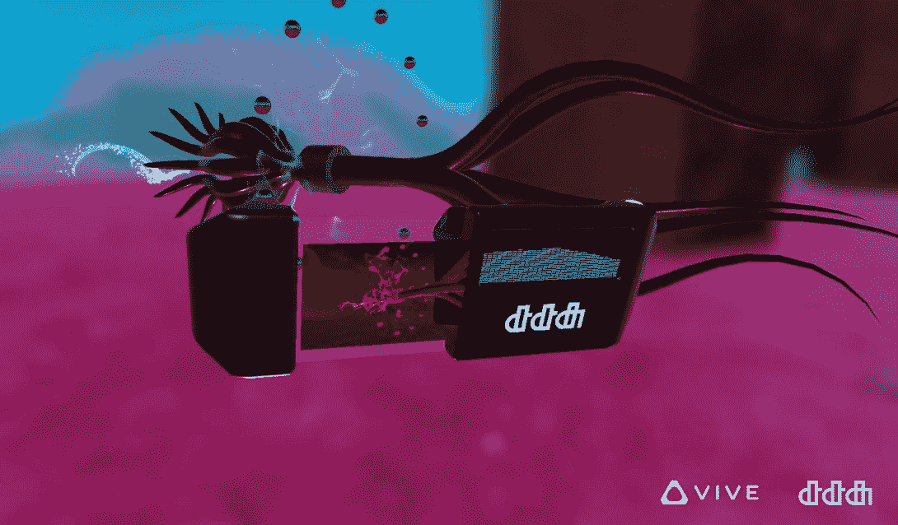

# D3-U 是一款 VR 相机，你可以拿在手中

> 原文：<https://web.archive.org/web/https://techcrunch.com/2017/01/10/the-d3-u-is-a-vr-camera-you-hold-irl/>

随着 VR 和 AR 的成熟，它们将更多地借用彼此的专业知识；第一，更具沉浸感的环境；另一方面，在虚拟和现实之间游走的智能手段。这种跨界的一个例子是[D3-U](https://web.archive.org/web/20221025230940/http://dotdotdash.io/projects/6323087)，这是一种为在 VR 中拍照而制造的物理相机。

它是由设计机构 dotdotdash 与 Vive 合作开发的，但不要指望很快会有零售版本。这更多的是对最近发布的 Vive 追踪器的概念验证和演示，而不是实际产品。

问题是，没有一种非常自然的方式来捕捉虚拟现实中的图像，尽管可以说有一个问题。当然，你可以在运行模拟的计算机上点击打印屏幕，但是你真的想稍微倾斜一下你的头，盯着你视野的边缘，以便得到正确的取景吗？号码

相反，D3-U 利用追踪器将现实世界的设备变成虚拟设备，追踪器可以附着在游戏中的物体上(自然地)追踪它们。追踪器的动作就像耳机一样被捕捉，使用嵌入式红外信标，旨在使配件制作更容易。

开发者扎克·克劳斯尼克解释说:“这只是简单地将冰球校准到 3D 相机的模型，然后确保大小在空间上完全匹配。”这样你就有了实际拿着相机的体验，让它以各种方式模仿真实世界的运动。

 在游戏中，D3-U 显示它所处的模式，预览你正在取景的镜头，并有一个快门释放按钮和操纵杆，用于在曝光模式之间切换。在演示中，用户必须使用相机拍摄外星生物的照片，检查各种波长并四处移动以获得最佳角度。附近甚至有一台打印机可以打印出你拍摄的照片。

未来的版本可能会添加快门速度设置等内容，因此虚拟摄影师可以像真实摄影师一样在曝光设置上做文章。谁敢打赌最终会有物理上精确的光圈叶片模拟？

现在，明确一点，我不认为这是一个必须具备的配件或任何东西。无论如何，它目前只是一个一次性的原型，由设计工作室 dotdotdash 创建，所以即使你尝试过也不会得到一个。但这很好地证明了虚拟世界可以通过智能地与现实世界交叉而得到实质性的改善。

[https://web.archive.org/web/20221025230940if_/https://www.youtube.com/embed/j3dRGoD_EXQ?feature=oembed](https://web.archive.org/web/20221025230940if_/https://www.youtube.com/embed/j3dRGoD_EXQ?feature=oembed)

视频