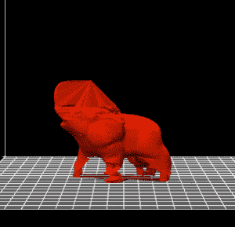

# 达芬奇 1.0 一体机是一体化 3D 打印机的未来 

> 原文：<https://web.archive.org/web/https://techcrunch.com/2014/12/11/the-da-vinci-1-0-aio-is-the-future-of-all-in-one-3d-printers/>

当我们进入这个 3D 打印十年的后半期时，我们来到了一个十字路口。一方面，反叛的开源 RepRap 人群叫嚣着要保持 3D 打印免费，而 3D 系统和 Stratasys 的帝国力量——以及无数试图将 3D 打印商业化并创造第一台受欢迎的家用打印机的模仿者——为了获得市场份额和用户，陷入了一场底部竞赛。由此产生的二分法将有时会爆炸成一股熔化的塑料和悲伤的惊人先进的 DIY 打印机与有时也会爆炸成一股熔化的塑料和悲伤的惊人先进的专有打印机对立起来。 [XYZPrinting 达芬奇 1.0 一体机](https://web.archive.org/web/20230128100948/http://xyzprinting.com/)坚定地站在后者一边。

AiO 是一个封闭的盒子，包含一个完整的 ABS 3D 打印系统以及一个激光 3D 扫描仪。当激光获取物体的轮廓时，搭建平台下的转盘缓慢旋转物体，最终的物体可以直接从扫描软件中打印出来。它实际上是一台 3D 复印机，配有真正的物体进/出系统。简而言之，这是一个星际特雷肯复制者——合情合理。

首先，让我们花点时间来惊叹这个东西到底是什么。您可以将对象放入其中，并制作该对象的 3D 副本。如果你认真思考这意味着什么，你会意识到我们已经从比特时代进入了原子时代。虽然 AiO 可能不是世界上最好的 3D 打印机，但它确实将 3D 复印带入了你的家庭或办公室。让它深入人心。几年前，这在科幻小说中被认为是不可能的。但不再是了。但这还不是最神奇的。这台打印机最令人惊讶的是它 799 美元的价格标签。没错:799 美元可以让你得到一个 7.8×7.8×7.5 英寸的 ABS 外壳和一个 3D 扫描仪。一台好的彩色激光打印机在 2013 年也就那么贵。

但是它是如何工作的呢？关于 AiO 的一切都足够了。这些印刷品出人意料地光滑细致。我运行的 3D 打印测试(见下图)顺利通过，我打印的马里奥星星树礼帽看起来像是从任天堂商店出来的。没有清理-打印机打印在预先校准的加热玻璃表面上，以确保出色的打印效果-除了电机和小风扇的低沉运动，机器几乎没有声音。我对打印过程也没有任何抱怨，尽管这个软件在 Mac 上有点问题。

[gallery ids="1093602，1093595，1093594"]

扫描仪很好，但需要规划。不建议扫描有光泽的物体，甚至会丢失一些无光泽物体的细节。我用这台机器扫描了一些物品，包括一个哑光石膏石像鬼和一只瓷象。你可以在这里查看石像鬼，但是大象没有成功。然而，一个[小狮子雕像](https://web.archive.org/web/20230128100948/http://www.thingiverse.com/thing:588335)，除了头部周围的一些缺失像素外，看起来很棒。虽然结果并不完美，但对于印刷来说还是不错的。就像以前的复印机一样，这台机器打印出来的 3D 拷贝质量不高。我只能想象如果我打印一份副本的副本会发生什么。也许我会创作第一本 3D 杂志？

[gallery ids="1093603，1093601，1093599，1093598，1093593，1093592，1093590，1093587"]

https://vine.co/v/OrLaUJpZ12x

把这两个惊人的特点放在一起，你会得到真正特别的东西。然而，预先警告:AiO 实际上很大，可能是 Makerbot 的两倍，比家用激光打印机稍大。它在几个重要方面也受到限制。

当 AiO 运行良好时，这是一个奇迹。物体被打印到玻璃衬底上，没有粘着，像变魔术一样出现。如果你熟悉 3D 打印，试图从一个顽固的盘子上挖出一个塑料部件，往坏里说是令人不安，往好里说是不可能的。这些物体似乎就像饼干从特氟隆饼干板上滑落一样。例如，当试图打印石像鬼时，失败得很惨。细丝团成了一团烟雾，开始发臭。塑料熔化了整个喷嘴，由此产生的堵塞需要用小镊子挖很多才能清除。因为整个机器都在一个封闭的盒子里，所以接触打印头是有限的。这证明了 3D 打印的发展方向——与专有耗材的一体化易用性——以及许多陷阱。大多数爱好者会对不得不处理密封外壳和灯丝墨盒感到恼火，但正如惠普和其他打印机制造商所知，钱不在打印机，而在墨水。

[gallery ids="1093588，1093585，1093584，1093583，1093580"]

这就是症结所在。AiO 使用 1.75 毫米 ABS 灯丝，但需要一个特殊的墨盒。然而，这不是一个普通的盒子。里面是一个微型 EEPROM，它可以告诉打印机墨盒中还剩多少灯丝，最重要的是，它可以防止你自己重新填充墨盒。您可以[破解墨盒](https://web.archive.org/web/20230128100948/http://voltivo.com/blog/da-vinci-reset-eeprom)再次读取“满”。虽然 600 克[的墨盒仅售 30 美元](https://web.archive.org/web/20230128100948/http://www.newegg.com/Product/Product.aspx?Item=28-840-002)，但如果你有自己的灯丝的话，使用它还是不错的。这个要求是我们进入一个受 DRM 保护的 3D 打印的奇怪新世界的第一个暗示。

然而，如果你能接受专有的灯丝和/或准备在 XYZPrinting 停止生产这些墨盒或停业时(让我们面对它，这很可能会发生)重新填充灯丝墨盒，你可能是幸运的。你也可以等待一个更开放的 3D 打印机模型，它使用标准灯丝，扫描质量略好，但对于 799 美元，你可能需要等待一段时间。简而言之，AiO 是一项迷人、廉价、令人印象深刻的技术，如果你对 3D 打印感兴趣并想尝试一下，它非常值得一看。