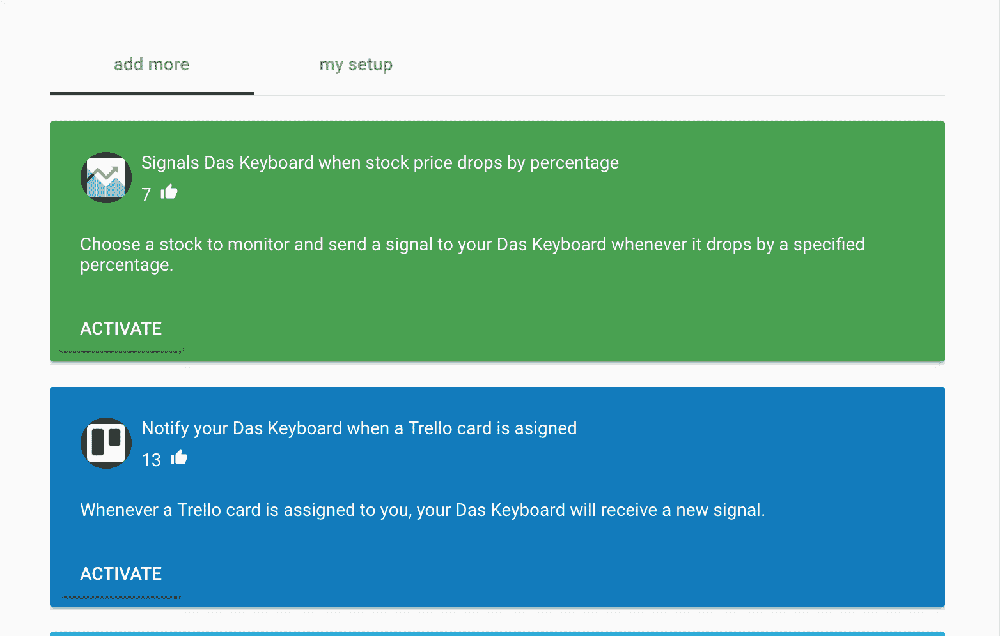
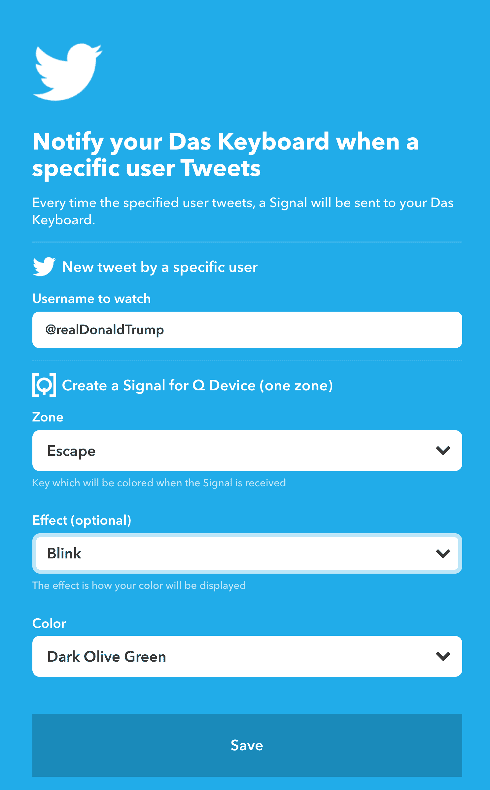

# Das 键盘 5Q 为您的 I/O 键增加了物联网功能

> 原文：<https://web.archive.org/web/https://techcrunch.com/2018/10/01/the-das-keyboard-5q-adds-iot-to-your-i-o-keys/>

# Das 键盘 5Q 为您的 I/O 键增加了物联网功能

就在你认为你的键盘不会受到物联网的威胁时， [Das Keyboard](https://web.archive.org/web/20230326125755/https://www.daskeyboard.com/) 推出了 5Q，这是一款智能键盘，可以根据你正在使用的应用程序向你发送通知并改变颜色。

这种键盘并不特别新——你可以找到点亮彩虹所有颜色的游戏键盘。但是 5Q 几乎是完全可编程的，你可以连接到自动化服务 IFTTT 或 Zapier。这意味着你可以做一些事情，比如当有人经过你的巢相机时，闪烁空格键为红色，或者当室外温度低于 40 度时，闪烁 Tab 键为白色。

当有人发推文时，你也可以让一个按键闪烁，这可能是有益的，也可能是令人沮丧的:

这款售价 249 美元的键盘非常坚固，由 Das Keyboard 制造的开关——名为[Gamma Zulu](https://web.archive.org/web/20230326125755/https://www.daskeyboard.com/technology/gamma-zulu-switch/)——咔嗒声很好，但不会太响。这些键在中间点有一点柔软，所以如果你习惯樱桃风格的键盘，你可能会注意到这里的不同。也就是说，这些按键的额定驱动次数为 1 亿次，远远超过任何竞争对手的开关。正如你在下面看到的，每个键上的 RGB 发光二极管非常亮，非常明显，但是当键的灯全部熄灭时，键盘就完全不可读了。这取决于你想成为神经癌的[病例，是一个特征还是一个缺陷。右上角还有一个媒体控制旋钮，按下时会调出 Q 应用程序。](https://web.archive.org/web/20230326125755/https://www.daskeyboard.com/blog/type-like-a-badass-go-blank/)

整个软件包设计得很好，但 5Q 回避了一个问题:你真的需要一个键盘来通知你何时收到新邮件吗？该软件的 Mac 版本现在也有点问题，但他们正在不断更新它，我能够安装和运行它没有问题。然而，奇怪的事情有时会发生。例如，现在我的 Escape 和 F1 键闪着红光，我不知道如何关掉它们。

也就是说，Das Keyboard 是非常棒的键盘。就外形和按键质量而言，它们绝对是我的最爱，如果你需要一个键盘，当加密货币超过某个点或你的特斯拉股票即将下跌时，它可以通知你，那么 5Q 就是最好的选择。这是黑客为黑客设计的键盘，正如你在下面看到的，颜色的变化真的很迷人。