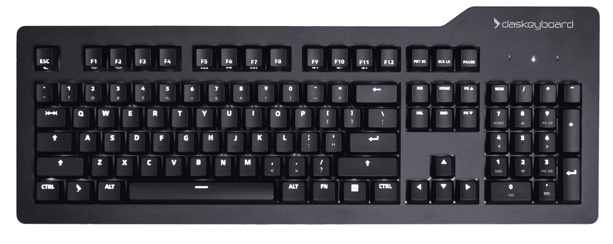

# Das Keyboard Prime 13 将游戏键盘带入董事会 

> 原文：<https://web.archive.org/web/https://techcrunch.com/2016/11/22/the-das-keyboard-prime-13-brings-the-gaming-keyboard-to-the-board-room/>

# Das Keyboard Prime 13 将游戏键盘带到了董事会会议室

如你所想，我对键盘有着深刻而持久的看法。我本身不是一个游戏玩家——我确实喜欢偶尔玩玩游戏——但是我经常打字。所以我总是寻找舒适、清脆、小巧的键盘。Das 键盘 Prime 13 就是这些。

Das Keyboard 多年来一直致力于为游戏玩家和铁杆电脑用户创造非常好用的键盘。他们的 [blank 4C 型号](https://web.archive.org/web/20221221185949/https://techcrunch.com/2015/02/03/the-blank-das-keyboard-4c-is-for-mavis-beacon-graduates-only/)仍然是我最喜欢的键盘之一，多年来我一直在 Das 和罗技之间徘徊，最终选择了 Das。

最新的型号有点像 Aeron 键盘椅——所有的业务，但现在再次弹出离合器并让它唱歌是很好的。这是一个背光键盘，带有 Cherry MX 开关，可实现最大点击量和全数字键盘。然而，这个模型不是闪光的彩虹 led，而是从半透明的键帽投射出可调光的白光。这些开关触感柔软，这意味着向下移动时没有“咔嗒”声，但当键帽实际碰到电路板时会有。每次按键后，按键会迅速弹出，空格键听起来就像一个破旧的 IBM 键盘。如果这一切有点深奥，请记住这一点:你会感觉到按键在你的手指下移动，不像现代的 chiclet 键盘，每一次按键都是一次嘈杂而令人满意的冒险。

Das Keyboard 正在销售这款产品，作为无聊的工作键盘的替代产品。它没有游戏玩家渴望的许多功能，但它有一个板载 USB 端口，而且非常纤薄紧凑。我已经使用我的测试仪几个星期了，它从我恶心的手里变得有点脏，但是，正如你从这些新闻照片中看到的，整个键盘被挤压到一个最小边框的区域。唯一奇怪的地方是右上角的灯和 USB 端口隐藏。否则它几乎是一个完美的矩形。

键盘有完整的 N 键翻转和大量的行程。它将成为一个优秀的编程键盘，而且因为没有特殊的宏或音量控制，它在极简主义的桌子上看起来会很好。我认为这种模式不太适合游戏——Das 和其他公司为此制作了出色的键盘——但这更像是一种“拔掉插头，拖到数据中心”的键盘，或者是工作站的一个不错的 clicky 附件。149 美元有点贵—[在多个主板上有数百个支持 Cherry MX 的键盘](https://web.archive.org/web/20221221185949/https://mechanicalkeyboards.com/shop/index.php?l=product_list&c=10)—但我喜欢金属面板和微妙的背光。也最好决定你要找什么样的开关。举例来说，这些比，比如说，[这些 IBM 键盘克隆](https://web.archive.org/web/20221221185949/https://www.pckeyboard.com/)要软一点，你必须评估你想要多少噪音和“点击感”。然而，一旦你使用了 clicky 键盘，你可能就再也不会使用那种柔软的、拐弯抹角的键盘了。只是不要让你的同事偷走这个东西和/或因为太多的键盘噪音而驱逐你，你就会成为黄金。

【https://platform.vine.co/static/scripts/embed.js】T2