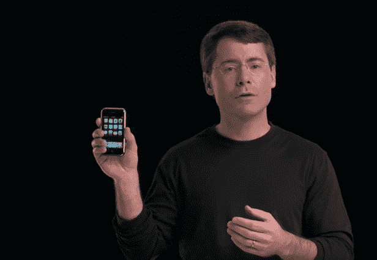
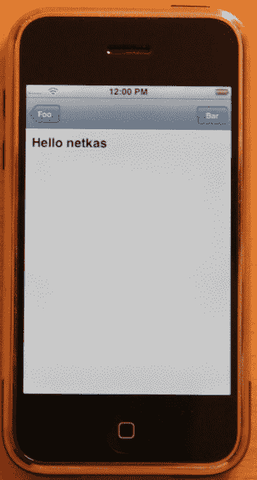
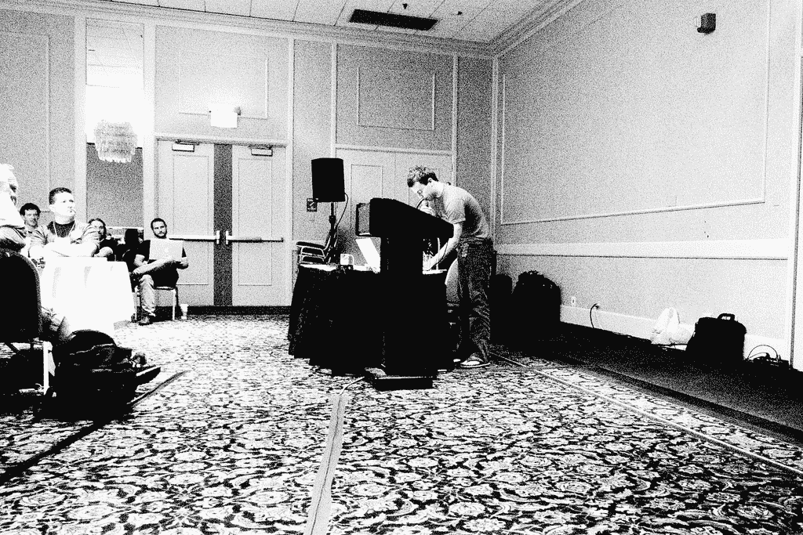
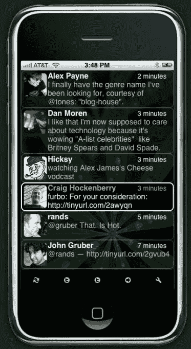
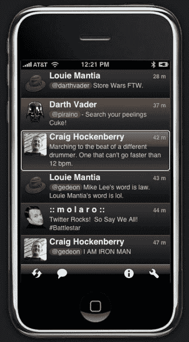
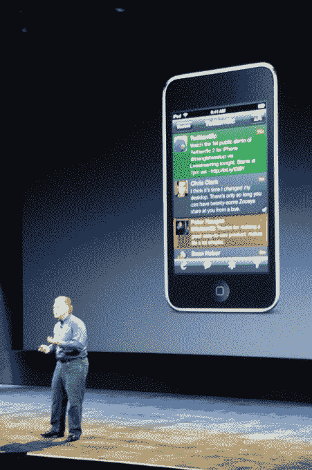

# 永远改变你手机的那一天 

> 原文：<https://web.archive.org/web/https://techcrunch.com/2018/03/06/the-day-that-changed-your-phone-forever/>

这篇文章中有很多链接，其中很多在今天的网络上很难找到。一定要花时间去探索！我也尽量避免技术术语，所以即使你不知道你的雨燕来自地面上的一个洞，你仍然可以跟随。

## 触摸未来

对我们许多人来说，在 2007 年 6 月底拥有第一部 iPhone 是对未来的一瞥。我们都想知道我们口袋里的玻璃和金属里面是什么。

苹果告诉了我们这款设备能做什么，但是对于如何操作，T2 说得很少。我们不知道任何关于处理器或其速度的事情，不知道有多少可用内存，也不知道你如何构建应用程序。在许多方面，这个新设备是一个黑色和银色的盒子。

作为开发者，我们想了解这款设备的功能。我们想了解[我们的软件设计将如何改变](https://web.archive.org/web/20221204200648/https://furbo.org/2007/07/02/beyond-sweet/)。我们很好奇，有很多东西要学。

知道我们做到了。我们称之为越狱。

[https://web.archive.org/web/20221204200648if_/https://www.youtube.com/embed/XDxtjVKJ76A?start=240&feature=oembed](https://web.archive.org/web/20221204200648if_/https://www.youtube.com/embed/XDxtjVKJ76A?start=240&feature=oembed)

视频

## 越狱

第一款在苹果之外开发的 iPhone 应用。

发现发生得很快。在[暴露文件系统之前，只花了几周时间](https://web.archive.org/web/20221204200648/https://www.engadget.com/2007/07/10/iphone-hackers-we-have-owned-the-filesystem/)。几个月后，整个原生应用体验被解锁。开发[工具链可用](https://web.archive.org/web/20221204200648/http://landonf.bikemonkey.org/code/iphone/Toolchain_In_MacPorts.20070812.html)，人们正在为本地应用编写[安装程序。](https://web.archive.org/web/20221204200648/https://arstechnica.com/gadgets/2007/08/iphone-installer-and-new-guides-make-iphone-hacking-easier-than-ever/)

这种快速的进步要归功于用来制造第一代 iPhone 的工具。苹果依赖与 Mac OS 相同的基础设施。他们选择了一个熟悉的环境来加快他们自己的发展，但是同样的熟悉让我们这些在库比蒂诺之外的人能够很快地解决问题。

[你好世界。](https://web.archive.org/web/20221204200648/https://web.archive.org/web/20070911035418/http://iphone.fiveforty.net:80/wiki/index.php/UIKit_Hello_World)

例如，iPhone 上的许多软件都是使用 Objective-C 创建的。Mac 开发人员长期以来一直使用一种叫做`[class-dump](https://web.archive.org/web/20221204200648/http://stevenygard.com/projects/class-dump/)`的工具来显示应用程序的各个部分，并了解事物如何相互通信。在获得第一代 iPhone 的应用程序和框架后，这个软件给了苹果写的东西很大的洞察力。

最重要的一块是一个叫做`UIKit`的新东西。它包含了所有的用户界面组件，比如按钮和表格视图。因为它们与我们在 Mac 上使用的类似，所以制作用于点击和滚动的项目不费吹灰之力。

这个难题的另一个重要部分是操作系统:Unix。苹果的这一选择意味着许多开源软件可以立即在我们的 iPhones 上使用。我们可以用它来[构建我们的应用](https://web.archive.org/web/20221204200648/https://clang.llvm.org/docs/CrossCompilation.html)，然后[将它们](https://web.archive.org/web/20221204200648/https://matt.ucc.asn.au/dropbear/dropbear.html)复制到手机上，并且最有可能的是，[在/var/logs/CrashReporter 中查看 LatestCrash.plist 的内容](https://web.archive.org/web/20221204200648/https://web.archive.org/web/20071022031855/http://phonedev.tumblr.com:80/post/11480920)。

我清楚地记得我第一次在我的 iPhone 上得到一个 shell 提示，并使用`[uname](https://web.archive.org/web/20221204200648/https://en.wikipedia.org/wiki/Uname)`来查看系统信息。[我在家](https://web.archive.org/web/20221204200648/https://twitter.com/chockenberry/status/206255882)。

## 早期应用开发

我并不孤单。成千上万的其他开发者发现这款新设备的内部和外部一样神奇。听到 iPhone 应用程序开发出现爆炸式增长，这并不令人惊讶。

这个新兴社区的一个关键时刻出现在一个名为 C4[1] 的独立开发者大会上。在 2007 年 8 月举行的，许多与会者有新的设备，并发现其功能。我们中的大多数人也是经验丰富的 Mac 开发者。我们刚刚去了 WWDC，听到了苹果公司对“甜蜜解决方案”的宣传。

在这场完美风暴中，有一场关于“iPhone API”的[“铁编码器”](https://web.archive.org/web/20221204200648/https://web.archive.org/web/20070907182327/http://ironcoder.org/blog/about/)竞赛。会议组织者 Jonathan "Wolf" Rentzsch 要求我们[【发挥创意】](https://web.archive.org/web/20221204200648/https://web.archive.org/web/20090615231214/http://rentzsch.com:80/c4/ironCoderLive)。我们*是*。

我自己提交的是一个 web 应用程序，它用 JavaScript 实现了图形计算器。它集中体现了几个月前我们都不喜欢的苹果提案:运行缓慢的笨重用户界面。不是我们大多数人希望的三明治…

另一方面，本地应用让我们大吃一惊。竞赛的获胜者是由 Glen 和 Ken Aspeslagh 编写的视频会议应用程序。他们比苹果早三年建立了自己的[前置摄像头硬件，并编写了类似 FaceTime](https://web.archive.org/web/20221204200648/https://web.archive.org/web/20071011193817/http://macdaddyworld.com/?p=38) 的东西。[一个惊人的成就](https://web.archive.org/web/20221204200648/https://www.youtube.com/watch?v=iew4rXsorTw)考虑到第一代 iPhone 甚至没有摄像头。

[https://web.archive.org/web/20221204200648if_/https://www.youtube.com/embed/iew4rXsorTw?feature=oembed](https://web.archive.org/web/20221204200648if_/https://www.youtube.com/embed/iew4rXsorTw?feature=oembed)

视频

但对我来说，排在第二位的应用程序是未来的光辉典范。首先，这是一款游戏，在手机上运行得相当好。但更重要的是，它展示了伟大的设计和编程如何从现实世界中获取某些东西，使其在触摸屏上无缝工作，并显著改善整体体验。

卢卡斯·纽曼和亚当·贝茨在 C4 之前几天开发了[关灯](https://web.archive.org/web/20221204200648/http://www.artofadambetts.com/weblog/2007/08/lights-off-first-native-iphone-game/)应用。后来，卢卡斯帮我开始使用越狱工具，在某个时候，他给了我源代码，让我看看它是如何工作的。幸运的是，我擅长做备份**和**维护软件:[你的 iPhone X 仍然可以运行我们 10 年前都羡慕的那个代码](https://web.archive.org/web/20221204200648/https://www.youtube.com/watch?v=Ec-LwLAbIXQ)！

卢卡斯·纽曼在 C4 展示关灯[1]。(来源:[约翰·格鲁伯](https://web.archive.org/web/20221204200648/https://twitter.com/gruber)

如果您是使用 Xcode 的开发人员，请获取

[project that’s available on GitHub](https://web.archive.org/web/20221204200648/https://github.com/chockenberry/LightsOffTouch)

。这个项目的越狱文件夹包含了卢卡斯发给我的所有东西。Xcode 项目会修改该代码，以便可以构建和运行它——除非必要，否则不做任何更改。跑起来要比

[the original](https://web.archive.org/web/20221204200648/https://web.archive.org/web/20070827004217/http://www.deliciousmonster.org:80/)

，但请不要抱怨了

[resolution not being 1-to-1](https://web.archive.org/web/20221204200648/https://github.com/chockenberry/LightsOffTouch/blob/master/Lights%20Off%20-%20iPhone%20X%20Edition.png)

.

在代码中，你会看到像根视图控制器这样的东西，它也是一个应用程序委托:记住我们都在学习如何在没有任何 T2 文档的情况下编写应用程序。也完全缺乏属性、故事板、资产目录和许多其他我们在现代工具中认为理所当然的东西。

如果没有 Xcode，还是运气好。长期[“iPhone 发烧友”](https://web.archive.org/web/20221204200648/https://duckduckgo.com/?q=site%3Adaringfireball.net+Troughton-Smith) Steve Troughton-Smith 在 App Store 上出售改进版[。我仍然喜欢这款游戏，并且经常玩它:它入选 iMore 的名人堂是当之无愧的。](https://web.archive.org/web/20221204200648/https://itunes.apple.com/us/app/lights-off/id292025150?mt=8&at=10l4G7&ct=ICONFACTORY_BLOG)

现在我有了工具**和**灵感。接下来发生了什么？

## Iconfactory 的首批应用

iPhone 上 Twitterrific 的第一个版本。和[笔](https://web.archive.org/web/20221204200648/https://www.jetpens.com/Pilot-G-3-Gel-Ink-Pen-0.38-mm-Black/pd/272)。以及 [slerp](https://web.archive.org/web/20221204200648/https://web.archive.org/web/20071021023336/https://phonedev.tumblr.com/) 。

2007 年 6 月，我们刚刚为 Twitter 发布了广受欢迎的 Mac 应用程序的 2.1 版本。将一些 Cocoa 代码从一个平台转移到另一个平台应该很容易，对吧？

iPhone 上 Twitterrific 的第一个版本。和[笔](https://web.archive.org/web/20221204200648/https://www.jetpens.com/Pilot-G-3-Gel-Ink-Pen-0.38-mm-Black/pd/272)。以及 [slerp](https://web.archive.org/web/20221204200648/https://web.archive.org/web/20071021023336/https://phonedev.tumblr.com/) 。

[其实不是。但是我学到了很多东西，玩得很开心。iPhone 吸引了各种各样的程序员，包括我们自己的](https://web.archive.org/web/20221204200648/https://furbo.org/2007/08/19/mobiletwitterrific/) [Sean Heber](https://web.archive.org/web/20221204200648/https://twitter.com/BigZaphod) 。

2007 年，Sean 在做 web 开发，对 Objective-C 和 Mac 编程一无所知。但这并没有阻止他和我们其他人一起在`class-dump`标题中闲逛，编写他的第一个应用程序。

但他更进了一步，目标是为 2007 年 11 月的每一天编写一个应用程序(灵感来自于他妻子做的 NaNoWriMo。)他称之为 [iApp-a-Day](https://web.archive.org/web/20221204200648/http://www.appleiphoneschool.com/iapp-a-day/) ，它在越狱社区大受欢迎。这种关注最终让他在 [Tapulous](https://web.archive.org/web/20221204200648/https://web.archive.org/web/20080718210727/http://www.tapulous.com:80/about/) 获得了一个职位，与负责 iPhone 首款热门产品特许经营权的才华横溢的人们一起: [Tap Tap 复仇](https://web.archive.org/web/20221204200648/https://en.wikipedia.org/wiki/Tap_Tap_Revenge)。

在一个月的时间里，Sean 展示了 iPhone 可以是开发者想要的任何东西。当然，它可以玩游戏，但它也可以[记录你的预算](https://web.archive.org/web/20221204200648/http://www.appleiphoneschool.com/leftover/)，[演奏一首曲子](https://web.archive.org/web/20221204200648/http://www.appleiphoneschool.com/piano/)，或者帮你[挂一幅画](https://web.archive.org/web/20221204200648/http://www.appleiphoneschool.com/level/)。

Sean 和 I 都有我们在此期间制作的应用程序的档案。诚然，代码很糟糕，但对我们来说，它代表了更伟大的东西。读着它，我想起了我们对未来进行实验的美好时光。

在 UIKit 的早期版本中有很多惊喜。找到 XML 解析器花了很长时间，因为它被埋在 OfficeImport 框架中。一些重要的东西完全不见了:没有办法用 Objective-C 返回浮点值。

还有一些奇怪的工程决策。您可以将任意的 HTML 放入文本视图，这对于像`<b>`这样的简单标签来说很好，但是对于更复杂的标签来说会崩溃。视图还使用了`LKLayer`进行合成，这有点像 Mac OS Leopard 中新的[核心动画，但又不一样。表格还引入了一个新概念，叫做“单元格重用”，它允许快速滚动，但是它很复杂而且难以操作。如果有像刚刚为 AppKit](https://web.archive.org/web/20221204200648/https://en.wikipedia.org/wiki/Mac_OS_X_Leopard) 发布的[那样的视图控制器就太棒了。](https://web.archive.org/web/20221204200648/https://developer.apple.com/documentation/appkit/nsviewcontroller)

但这并没有阻止我们尝试和学习我们能做什么。然后就出事了:[我们停了](https://web.archive.org/web/20221204200648/https://furbo.org/2007/09/11/silence-is-golden/)。

## 真正的 SDK

Twitterrific 在 App Store 发布会上的设计。

苹果公司已经竭尽全力让 iPhone 上市。我们这些编写越狱应用的人在第一个产品中看到了一些瑕疵，但它们根本不重要。[真正的艺人船](https://web.archive.org/web/20221204200648/https://www.folklore.org/StoryView.py?story=Real_Artists_Ship.txt)。只有[傻子](https://web.archive.org/web/20221204200648/https://web.archive.org/web/20061205211900/http://www.mercurynews.com/mld/mercurynews/news/columnists/16057579.htm)觉得很烂。

每个运过产品的人都知道“咻，我们做到了！”紧接着是“下一步是什么？”

也许这个问题的答案受到了所有越狱的影响，或者也许库比蒂诺的经理们在推出之前就知道他们想要什么。不管怎样，当史蒂夫·乔布斯宣布推出官方 SDK 时，我们都很激动，仅仅在手机发布五个月后。

iPhone SDK 承诺在 2008 年 2 月发布，考虑到任务的规模，当它仅仅推迟了几天，没有人感到失望。发布会伴随着市政厅剧院的一场活动。

十年前的今天，我们第一次了解到模拟器和 Xcode 的其他变化，新的令人兴奋的框架，如 Core Location 和 OpenGL，以及一个全新的应用程序商店，它将我们的产品送到客户手中。Jason Snell [为 Macworld 转录了事件](https://web.archive.org/web/20221204200648/https://www.macworld.com/article/1132376/liveupdate.html)。还有一个视频[。](https://web.archive.org/web/20221204200648/https://youtu.be/HfMvym5SxHU?t=19m32s)

## 轮到我们成为真正的艺术家了

从所有好消息中恢复过来后，各地的开发人员开始考虑发货。我们不知道我们会有多长时间，但我们知道我们必须抓紧时间。

最后，我们有大约四个月的时间来准备我们的应用程序。感谢 Iconfactory 在越狱时代学到的东西，我们有了理解设计和开发问题的开端。但是我们仍然努力工作来建造

[the first iPhone’s Twitter app](https://web.archive.org/web/20221204200648/https://iconfactory.com/twitterrific_touch/)

.

就在 App Store 推出之前，苹果在年度设计颁奖典礼上增加了新的类别。我们很高兴能因为我们在 iPhone 上的工作赢得 ADA 。

有多激动？我在下载新 SDK 时使用的感叹词[与](https://web.archive.org/web/20221204200648/https://twitter.com/chockenberry/status/767688189)[获得那个银色立方体](https://web.archive.org/web/20221204200648/https://twitter.com/chockenberry/status/832709404)是一样的。

在那之后，我们是第一批出现在应用商店的应用之一，在早期排行榜中排名靠前。我们知道我们是伟大事业的一部分。只是没多大。

## 旅程继续

Twitterrific 和[某家伙](https://web.archive.org/web/20221204200648/https://youtu.be/rW5Amx3_L9E?t=32m)的第二个版本。

Iconfactory 的[第一个移动应用](https://web.archive.org/web/20221204200648/https://twitterrific.com/ios/)进入了一个有数百种产品的商店。现在有超过 200 万。

我们现在为[的消费者](https://web.archive.org/web/20221204200648/https://iconfactoryapps.com/)销售移动应用，为[的设计者](https://web.archive.org/web/20221204200648/https://linea-app.com/) & [开发者](https://web.archive.org/web/20221204200648/https://xscopeapp.com/)销售工具。我们现在为大型公司、[中型公司](https://web.archive.org/web/20221204200648/https://design.iconfactory.com/suunto-7r-for-ios/)和
[小型公司](https://web.archive.org/web/20221204200648/https://design.iconfactory.com/pushtracker/)的移动应用程序做设计工作。

我们现在为一组精选的客户开发移动应用[。如果你想成为他们中的一员，请联系我们。)十年可以发生很多事情。](https://web.archive.org/web/20221204200648/https://dev.iconfactory.com/)

但是有一点没有变。我们的整个团队仍然为成为这个充满活力的生态系统的一部分以及我们为之做出的贡献而自豪。为下一个十年干杯！