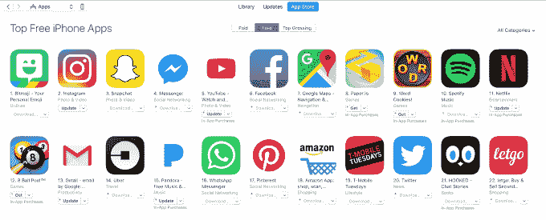

# #DeleteUber 运动在 TechCrunch 公司的性骚扰指控后回归

> 原文：<https://web.archive.org/web/https://techcrunch.com/2017/02/22/the-deleteuber-campaign-returns-following-sexual-harassment-allegations-at-the-company/>

在优步被指控性骚扰之后，愤怒的消费者再次在推特上发布了#DeleteUber 标签——这个标签表明他们正在从他们的设备上删除这个应用程序，并鼓励其他人也这样做。社交媒体运动最早始于[优步被认为利用出租车罢工反对川普的移民禁令来推广自己的服务。](https://web.archive.org/web/20221209130340/https://beta.techcrunch.com/2017/01/30/lyft-surges-to-the-top-10-on-apples-app-store-following-the-deleteuber-campaign/)

最初的运动相当有效，即使只是暂时的。活动开始后不久，竞争对手 [Lyft 在 App Store 排行榜上一路飙升](https://web.archive.org/web/20221209130340/https://beta.techcrunch.com/2017/01/30/lyft-surges-to-the-top-10-on-apples-app-store-following-the-deleteuber-campaign/)，成为 iPhone 十大移动应用。有一段时间，它的排名高于优步，以及其他流行的应用程序，如 YouTube，Messenger，谷歌地图，甚至脸书。

纽约时报[报道](https://web.archive.org/web/20221209130340/https://www.nytimes.com/2017/02/02/technology/uber-ceo-travis-kalanick-trump-advisory-council.html?_r=0)称，在此期间可能有 20 万客户删除了他们的账户。当然，全球每月有 4000 万用户，这只是优步整体客户群的一小部分。

这场运动平息后，优步也收复了失地。根据 App Annie 的数据，由于用户的努力，截至 2017 年 1 月 31 日，它在 App Store 上的整体排名已降至第 19 位。但它很快又爬上了排行榜。截至本周末，该应用总体排名第七。

请记住，排行榜的排名是由下载数量和速度决定的。大量删除一个应用程序本身不会改变它的排名——但如果下载量和安装率下降，其他顶级应用程序将能够取代这个被恶意攻击的应用程序的位置。这就是优步的遭遇。

现在，社交媒体用户正在带回#DeleteUber 标签。一些用户甚至开玩笑说，他们会安装优步，这样他们就可以再次删除它。但正如这些评论所显示的那样，那些对优步的不当行为感到足够强烈，以删除该应用程序作为回应的人可能已经这样做了。

这可能是为什么最近的这场运动没有像以前那样强烈地影响优步的排名，尽管看起来标签印象的数量有所增加，正如 [Verge 指出的，](https://web.archive.org/web/20221209130340/http://www.theverge.com/2017/2/20/14669034/uber-deleteuber-hashtag-backlash-sexism-fowler)引用了 Keyhole 的数据。报道称，该标签的浏览量比 1 月 27 日的周末多了 500 万次。

但似乎许多人现在使用这个标签只是为了表达他们的厌恶。这并不一定意味着他们这次会移除这款应用。

根据应用分析公司 Apptopia 的数据，从 2 月 20 日到 21 日，该应用在 Google Play 中的整体排名从第 20 位下降到第 27 位，但仍保持了其在美国地图和导航类别中的第一位。

与此同时，在苹果的应用程序商店，该应用程序在同一时间段内只下降了一个点。

然而，App Annie 显示，该应用在排行榜上的排名略有上升*——从 2 月 20 日到 21 日，整体排名从第 11 位升至第 10 位。不管你相信哪家公司的数据，这似乎表明新的#DeleteUber 运动迄今为止影响甚微。*

 *Apptopia 说，为了让这场运动有更多的背景，Lyft 在同一时期也下降了几个排名。Lyft 目前在 iPhone 应用商店中排名第 36 位。

#DeleteUber 运动可能是今天下降的原因之一，但现在说还为时过早。截至发稿时，优步在 iPhone 上的整体应用排名略低，位列第 14 位。如果这一排名保持一段时间或进一步下降，这将是一个显著的变化，或许表明优步的反感客户实际上正在删除其应用程序。

Apptopia 还发现，除了排名波动之外，优步的 iOS 应用在过去 30 天的负面评价比例也较高。这可能是因为 Android 设备的全球影响力更广，评论也更多，而#DeleteUber 活动则更侧重于美国。

虽然像这样的活动可能不会像用户希望的那样对应用的安装基础产生太大的影响，但它可以产生其他持久的影响。这可能会影响公司内部的士气，增加人员流动，并使招聘更加困难，因为人们会犹豫是否加入一家文化被视为有毒的公司。*