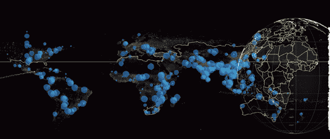
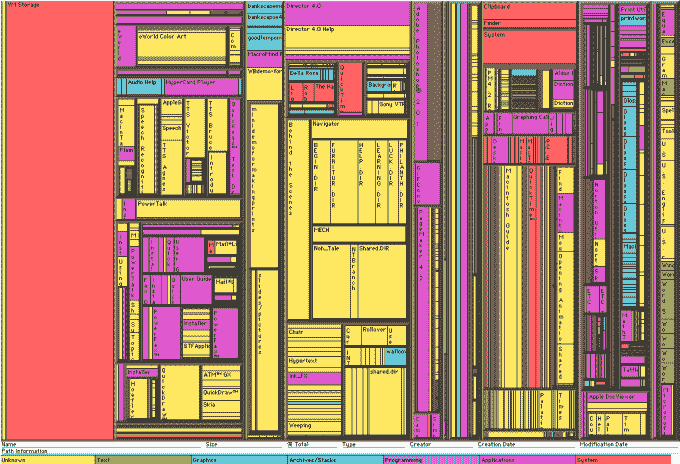
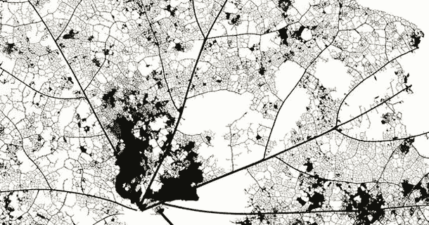
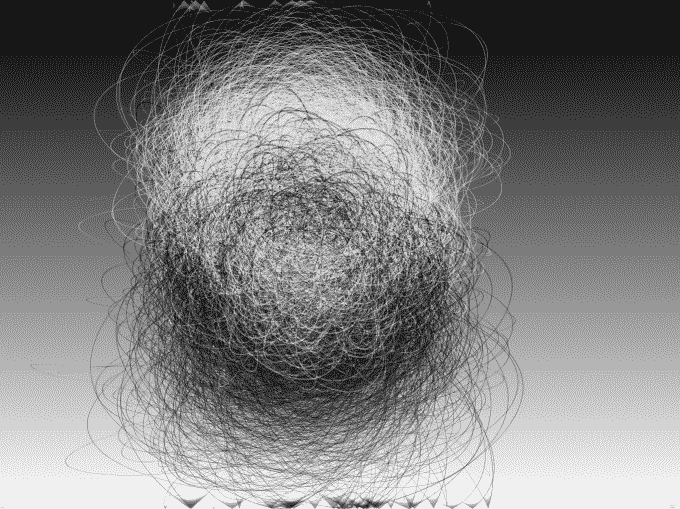
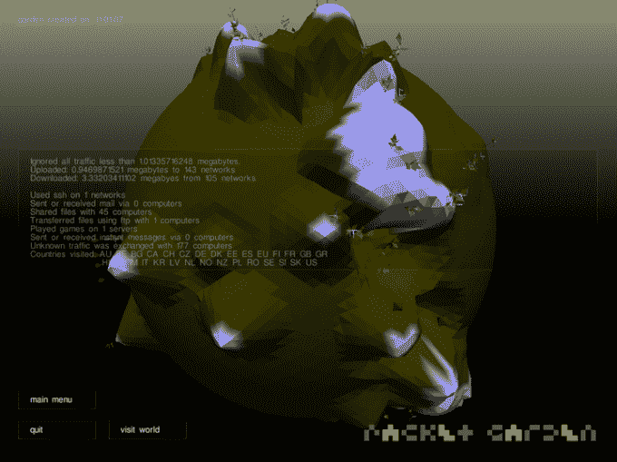
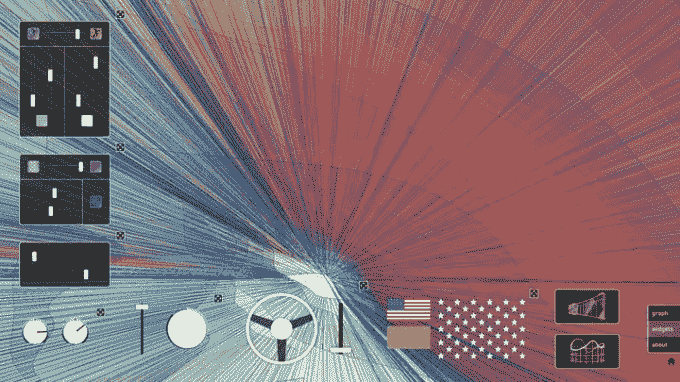
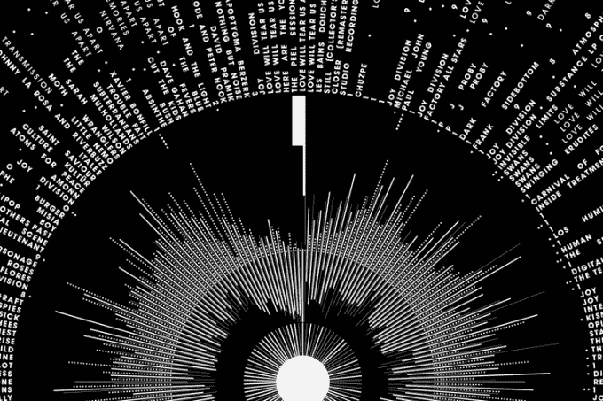
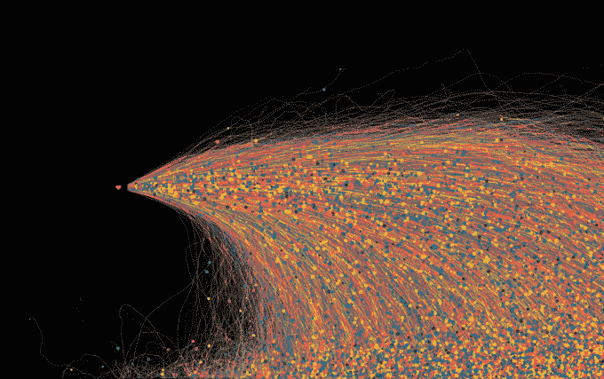

# 数据艺术的数字时代 

> 原文：<https://web.archive.org/web/https://techcrunch.com/2016/05/08/the-digital-age-of-data-art/>

马克森斯·格鲁吉尔撰稿人

Maxence Grugier 是一名法国记者，专门研究新媒体艺术和数字艺术超过 15 年，为 Digitalarti Media 和其他出版物撰稿。

许多艺术家使用我们社会产生的原始数据作为艺术材料，寻求创新的展示方式或将其转化为艺术作品。*数据艺术*通过模糊艺术和信息之间的界限，驱散了浪漫艺术家的神话，同时在我们生活的数字时代的批判性评论中提供了一种基本的艺术行为。

对非专业人士来说，这个时代应该是开放的，但却越来越模糊或不可理解。通过重新利用这些大量的信息或大数据，数据艺术家将幻想重新引入一个越来越抽象的数据和概念的时代。

数据艺术的目标是从大数据(图形、模拟、工作表、统计数据等)生成的数据的数字性质中创造美学形式和艺术作品。).我们的环境产生的任何虚拟数据都可以转换成图像、物体或声音。数据艺术还展示了我们生活中无处不在的算法之间存在的潜在联系——来自数据库的数字、原始数据、搜索引擎收集的数据、计算和统计(地理、政治、气候、金融)以及艺术创作。

世界各地的自然灾害。图片来自展览出口。东京宫(2015 年 11 月/2016 年 1 月)。

不幸的是，艺术和信息技术仍然被广泛认为是在两个相互冲突的世界中发展，但在电子媒体领域工作的新一代艺术家无法以这种方式考虑世界和艺术。使用媒体和 IT 工具是一个创造性的过程，对他们来说很自然(这通常涉及信息技术:软件开发；编程；数据分析；算法；因特网上的文档和元数据检索等。).

这种仍在兴起的审美趋势为我们生活的日益“数学化”和理性化的世界提供了一种新的解释，重新吸引了科技人的日常生活。对这些艺术家来说，这种科技视觉仅仅触及了另一个更复杂、更神秘、更奇妙的世界的表面——一个同样有意义的世界，一个数据和信息的世界。

## 算法和数据流

我们生活的世界几乎完全被算法所统治。算法是由机器或软件系统应用的一系列计算机指令。过去，操作员指示计算机并执行命令。有了算法，计算机可以在没有帮助的情况下独自执行自动任务。

一些算法是联合的关键参与者(订阅数据流；例如 RSS 流)。他们搜索信息并将其发送给在“联合供稿”上注册的用户当然，其他算法也会拾取相同的数据。这些程序根据用户先前的选择(在谷歌、亚马逊、脸书、雅虎等网站上)获取内容，并提出建议。);这些是流量聚合器和大数据收集器。

当前数字数据流的数量爆炸需要新的方法来可视化这些信息。对这些数据的研究、检索、存储和分析的处理仍然是一个新兴领域，但它为评估和分析专家以及艺术家提供了工作。处理这种极其复杂和多样化的数据导致了信息技术领域出现了一个全新的经济部门，以及新的艺术创作形式。

由 Ben Shneiderman 发明的 treemap 在有限的空间内表示分层数据。

## 数据可视化，数据艺术的第一步

随着越来越多的企业、地方议会和公共服务部门被迫发明视觉上有趣和引人注目的方法来对人口流动、消费模式、通信和旅行等产生的数据进行分类，数据可视化已成为一项基本原则。

数据艺术世界的第一步是解决如何查看这些数据。这一学科的先驱之一是理论家爱德华·塔夫特，他负责创建迷你图(一种为插入文本而开发的简明图形格式)，以及 Ben Shneiderman，他在 1990 年发明了树形图。

在其他图形表示技术和术语中，有条形图、饼图(更好地称为 Camembert 或圆环图)、散点图、线条、气泡、热图(“热点”的映射)等。它们都指的是使塑造我们日常生活的大量数据(也称为“数据图”)具有视觉吸引力，尤其是可理解性的不同方式。

数据可视化通常会生成极其复杂的图形，有时会变得很有艺术性。例如，马特·威利(Matt Willey)从这些形式中汲取灵感，以这种速度和 2060 年海报来展示经济和人类活动对环境的影响。

马特·威利，2060 海报。旨在提高人们对亚马逊雨林破坏的认识。

## 数据艺术的起源

要给今天被称为数据艺术(也称为信息艺术或信息主义)的起源一个时间线，应该参考极简主义艺术家凯纳斯顿·麦克肖恩(Kynaston McShine)和他 1970 年在纽约现代艺术博物馆举办的展览“信息”。

通过选择将科学、信息学和信息技术与最经典的艺术形式(包括行为艺术、视觉艺术、数字艺术和概念艺术)相结合，麦克肖恩提出了数据艺术的第一个定义。在 MoMA 展览目录中，他写道:“越来越多的艺术家使用邮件、电报、电传机器等。，用于传输作品本身(照片、电影、文件)或有关其活动的信息

对于凯纳斯顿·麦克森来说，艺术和信息已经形成了一个单一的进步运动，在一个字面上“由信息构成”的时期。数据艺术的其他迹象在生成艺术的先驱中也很明显，这是一种通过算法和计算机语言呼吁计算机生成创作的艺术形式。

马克·纳皮尔，《黑与白》，生殖艺术(2003)。

然而，在当今极其复杂的数据艺术形式出现之前，就有像生成艺术运动(generative art movement)的艺术家马克·纳皮尔(Mark Napier)的作品，他创作了《黑与白》(Black and White)，这是一部基于“食肉动物”(Carnivore)捕捉的信息流的作品，这是联邦调查局在 21 世纪初开发的软件程序。

朱利安·奥利弗，邮筒花园。数据艺术，让无形变得有形。

我们生活中越来越多的方面通过多重流动网络相互作用，形成了今天的信息景观。历史和技术背景激发了 Julian Oliver 的灵感，例如，Packet Garden，一个将我们在网络上的活动描绘成不可思议的工程花园的项目，以及 Jason Salavon，他与 American Varietal 一起，提供了对美国种族多元化的创造性观点。

Jason Salavon，美国品种，2013 /实时交互系统，结构钢，多点触摸屏。

这些错综复杂地联系在一起的交流和动作被算法机器汇集到巨大的数据库中。例如，这就是数据艺术的先驱之一 Aaron Koblin 创作《飞行模式》(2009)的灵感来源，这是一部可视化空中交通的数据艺术经典，是全球通信的物质表现。

[飞行模式–颜色](https://web.archive.org/web/20230212232914/https://vimeo.com/5368967)来自[亚伦·科布林](https://web.archive.org/web/20230212232914/https://vimeo.com/aaronkoblin)。

其他人，如德国艺术家 Stefan Sagmeister，希望恢复数字、流和数据恢复程序的非物质和抽象外观。Move Your Money 是一个幽默的 3D 充气隐喻，基于儿童充气城堡，使国际货币流动变得有形。

爱会再次把我们分开，彼得·克拉克。

艺术家杰弗里·多切蒂用一种更有趣——也更摇滚——的方式，用长长的黑纱，创造了一幅 20 世纪 80 年代朋克和新浪潮场景的无形地图。《爱会把我们再次分开》彼得·克诺克拉克的《爱会把我们再次分开》是一幅情感冲击的图表，再现了欢乐分裂的情景。在 2014 年的《意外发现》中，凯尔·麦克唐纳(Kyle McDonald)提出了一个地图，将在 Spotify 上同时听同一首歌的人联系起来。

## 诗意的流动

在这个领域，创造性的应用程序和想象力是相当可观的。数据艺术的目标，受到非常实际的数据可视化技术的启发，首先是让不可见的变得可见。然而，通过格式化这些大量的数据，数据艺术家并不满足于使形成这些数据的网状信息清晰可辨，他们还对我们的社会进行了批判性的审视。

通过利用这种无形的数据流，数据艺术家将自己定位为观察者，为行为作证，推断关于人类的细节，人类是永恒的创造者——无论是艺术家还是社会学家、数学家还是商人——对他们来说，数据收集表明了控制他们最抽象的环境的强迫性需求。

Jonathan Harris 和 Sepandar Kamvar，我们感觉很好，网络地图收集以“我感觉”或“我正在感觉”开头的网络句子。收集了近一千万的感受和两百多万的博客。

然而，随着生成图形和数据捕捉技术的发展，当代数据艺术艺术家有时会超越批评，立即创作出不言自明的美丽艺术作品……几乎如此。

乔纳森·哈里斯(Jonathan Harris)和塞潘达尔·卡姆瓦尔(Sepandar Kamvar)的《我们感觉很好》(We Feel Fine)，对人类情感的探索，或雷诺德·德劳欣(Reynald Drouhin)的《互联网协议城市》(Internet Protocol City)，一个“鬼城”的生成器，将互联网用户的 IP 地址转化为单色建筑，当抽象和冰冷的数据变成隐喻美的纯粹状态时。

###### 让·巴普蒂斯特·卢诺和马洛·吉罗德·艾因对此文有所贡献。