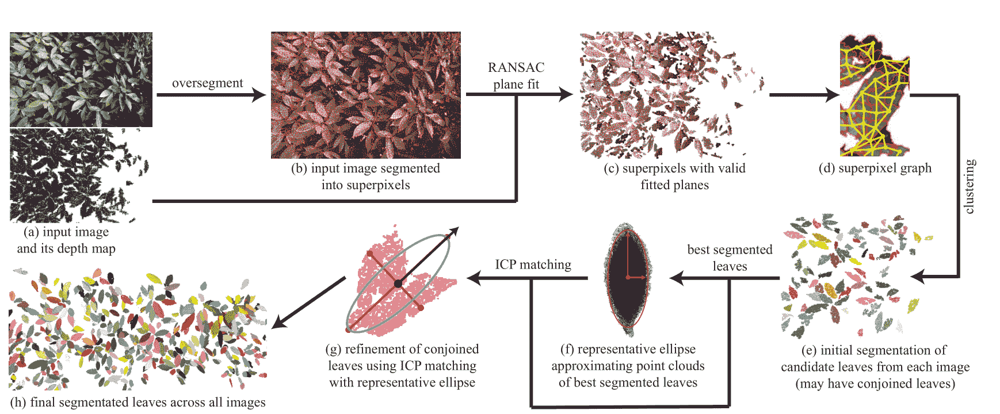
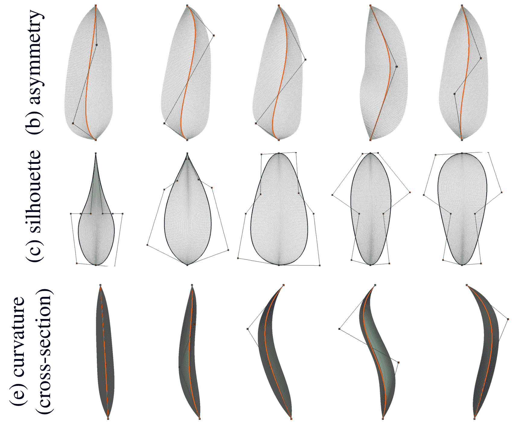

# 可定制的虚拟 3D 树叶的梦想正在迪士尼 实现

> 原文：<https://web.archive.org/web/https://techcrunch.com/2017/10/23/the-dream-of-customizable-virtual-3d-foliage-is-alive-at-disney/>

哦，在迪斯尼工作，参与创造那些美妙细致的 3D 世界，每个角色都被可爱地渲染，每个动物伙伴都是独特而有趣的，每棵树都长满了叶子。单独设计和放置。发生在广阔森林中的电影。一定有更好的方法。嗯，如果你能 3D 扫描一些树叶，然后根据你的喜好调整它们，会怎么样？

好吧，我怀疑“勇敢”和“海洋奇缘”中的每片叶子都是单独放置的，但你最好相信制作逼真的树叶不像复制和粘贴那么简单。因此，任何能让这项工作变得更容易的东西，几乎肯定会受到动画师、布景设计师和其他想让这些环境歌唱的人的欢迎。

迪士尼研究中心的 Gaurav Chaurasia 和 Paul Beardsley 在计算机视觉国际会议上发表了一篇名为“3D 捕捉的可编辑参数密集树叶”的论文。挺爽的。

 它是这样工作的:你拍摄一片树叶的深度感知图像，研究人员的算法开始从产生的点云中识别出单独的树叶。然后，它用优雅定义的贝塞尔曲线拟合它们，这些曲线捕捉了叶子的形状，从它的轮廓到远离中心轴和喙状尖端(如果适用)的平缓上升。

控制点位置的微小变化如何导致叶片形状的重大变化的几个例子。

这些曲线是存储信息的非常有效的方式，也可以非常容易地调整。通过调整曲线经过的控制点，一片叶子的形状，或者一棵树或一片森林中每片叶子的形状，可以在一瞬间调整，而不需要计算一个全新的网格。

正如研究人员在结论中指出的，“我们的目标不仅仅是对最广泛的树叶进行 3D 重建。我们寻求解决艺术家的需求，这需要轻量级的可编辑表示和自动重建。”

能够准确地复制一个给定的灌木或树对地方感也是至关重要的；一堵杂草丛生的墙、茂密的树篱或不常见的灌木可能会吸引艺术家或外景侦察员的目光，但仅仅抓拍照片并不总能抓住事物的本质。

当然，这个工具并不能完美地捕捉到整个场景，但是它可以捕捉到自然界中常见的有序混乱的形式，但却很难艺术地再现。你不会把这些直接放进电影里，但我猜它们肯定有助于重新创造空间:

这个工具的主要限制是它只能创作单叶树叶——所以不要指望皮克斯的下一部电影会发生在加拿大或者枫树常见的其他地方。