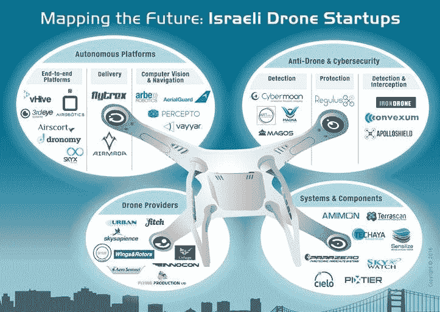

# 无人机竞赛已经开始，以色列领先 

> 原文：<https://web.archive.org/web/https://techcrunch.com/2016/09/09/the-drone-race-is-off-and-running-with-Israel-in-the-lead/>

Yoav Leitersdorf撰稿人

Yoav Leitersdorf

是 YL 风险投资公司(Bernstein Ventures)驻硅谷的管理合伙人，负责加速美国市场的网络安全创业。

More posts by this contributor

奥弗·施赖伯撰稿人

[Ofer Schreiber](https://web.archive.org/web/20221230014259/https://www.ylventures.com/people/#ofer-schreiber)

是 YL 风险投资公司的合伙人和以色列办事处的负责人，他在以色列创办并加速网络安全初创公司。

More posts by this contributor

伊伦·雷兹尼科夫撰稿人

More posts by this contributor

世界各地的观众享受了 2016 年夏季奥运会的所有活动，这在很大程度上要归功于盘旋在赛事上方([或下方](https://web.archive.org/web/20221230014259/http://www.digitaltrends.com/photography/robot-photographer/))的无人机，它们从每个角度捕捉每个动作。运动员和观众对这些无人机的存在毫不在意——这表明它们变得如此普遍。的确，几乎每个行业都可以找到无人机的身影。****

## 不再仅仅用于军事或娱乐用途

多年来，军方一直使用无人机，他们称之为无人驾驶飞行器/系统(UAV/UAS)，以获得复杂作战任务的鸟瞰图并执行情报收集。无人机的娱乐用途激增，因为个人使用它们进行航空摄影、探险、比赛等。(2016 年 1 月，在美国联邦航空管理局发布要求无人机注册的新规则[仅 30 天后，爱好者已经注册了超过 18.1 万架无人机)。](https://web.archive.org/web/20221230014259/https://www.faa.gov/news/press_releases/news_story.cfm?newsId=19856)

然而，最近，无人机进入了商业企业和公共部门机构的视野，成为帮助他们挖掘新机遇、改善服务、提高可见性和削减成本的一种方式。

媒体和娱乐、采矿、石油和天然气、零售、建筑、农业和房地产等行业已经成功地让无人机为他们工作。市政府和州政府、急救人员、教育和环境机构等。，也已经开始确定使用无人机来提高其能力和效率的方法。由于许多潜在的应用，UAS 国际协会估计无人机可以在未来 10 年创造 10 万个就业机会，产生 820 亿美元的经济活动。

## 以色列:创新的发动机

鉴于以色列在军用无人机技术方面的开创性工作，该国成为世界上最大的军用无人机出口国也就不足为奇了，自 1985 年以来，该国供应了近 61%的无人机。商用无人机是以色列强大的国防和航空工业的自然延伸，这些工业由全球梦想家领导，如[以色列航空工业](https://web.archive.org/web/20221230014259/http://www.iai.co.il/)、[埃尔比特系统](https://web.archive.org/web/20221230014259/http://elbitsystems.com/)、[拉斐尔](https://web.archive.org/web/20221230014259/http://www.rafael.co.il/Marketing/203-en/Marketing.aspx)和[航空](https://web.archive.org/web/20221230014259/http://www.aeronautics-sys.com/)。

以色列航空、机器人、自主系统和计算机视觉专家一直在将他们的军事经验转化为商业应用，亚马逊、谷歌、脸书和 DJI 等公司正在实施这些应用，以造福整个民用无人机行业。****

## 新边疆:以色列创业公司

随着新的无人机应用的确定，以色列专家已经准备好提供成功所需的军用级能力。作为许多以色列科技初创公司的种子投资者，我们亲眼目睹了以色列无人机公司的爆炸式增长。

来源:YL 风险投资公司

事实上，有近 40 家以色列商用无人机初创公司正在满足各行各业的各种需求。绝大多数公司都是在最近两三年成立的。有趣的是，这些早期公司中有 42%获得了资本，总计 8000 万美元。

总的来说，以色列商业无人机创业生态系统可以分为四个主要类别:自主平台、反无人机和网络安全解决方案、系统和组件以及无人机提供商。****

## 自主平台

端到端自主平台是商用无人机行业的未来。它们使无人机能够在不需要任何人工干预的情况下完成活动。以色列初创公司正在引领全球自主能力的发展。例如，他们正在创造将包裹运送到目的地的无人机，以及识别和规避潜在问题的智能导航和先进的计算机视觉技术。

> 以色列深厚的军事和国防专业知识使以色列企业家处于优势。

这一类别中值得关注的公司包括[air Robotics](https://web.archive.org/web/20221230014259/http://www.airobotics.co.il/)、 [Flytrex](https://web.archive.org/web/20221230014259/http://www.flytrex.com/) 、 [Arbe Robotics](https://web.archive.org/web/20221230014259/http://www.arberobotics.com/) 和 [AerialGuard](https://web.archive.org/web/20221230014259/http://www.aerialguard.systems/) 。航空机器人[最近摆脱了隐形模式，并筹集了大量资金](https://web.archive.org/web/20221230014259/https://techcrunch.com/2016/06/21/airobotics-raises-28-5m-to-pursue-autonomous-drone-platforms-for-heavy-industry/)；该公司正在开发一种能够给自己的电池充电的自主无人机。Flytrex 提供了一种用于包裹递送的无人机，该无人机已经在五个国家运营。Arbe Robotics 是 [TechCrunch 特拉维夫投球比赛](https://web.archive.org/web/20221230014259/https://techcrunch.com/2016/06/22/tel-aviv-meetup-winners/)的获胜者，AerialGuard 是 [2016 年全球创新奖的亚军](https://web.archive.org/web/20221230014259/http://www.timesofisrael.com/israeli-start-ups-take-top-prizes-in-prestigious-china-start-up-event/)，他们专注于开发智能导航和避障系统。****

## 反无人机和网络安全解决方案

无人机带来的风险需要减轻。为了确保安全、适当的使用，监管机构要求个人和商业实体注册他们的无人机。然而，这只是第一步。公众需要受到保护，免受未注册的“流氓”无人机的攻击，而无人机本身也需要受到保护，免受黑客试图篡改、破坏或在极端情况下控制其操作的攻击。以国防和网络安全专业知识闻名的以色列企业家正在开发系统，可以拦截对公共安全构成威胁的无人机，并防止试图利用无人机实施攻击的攻击。

这类公司包括阿波罗希尔公司、T2 公司、赛博月公司和 T4 公司。最近的 Y Combinator 加速器参与者 ApolloShield 正在开发一种能够检测和拦截无人机的反无人机系统。Cybermoon 提供了一个检测系统，该系统使用先进的音频分析算法来定位无人机。RegulusX 是 2016 年网络风暴竞赛[的决赛选手](https://web.archive.org/web/20221230014259/http://cyberweek.tau.ac.il/2016/index.php/events-20/67-start-up-pitch)，它正在为无人机构建一个保护解决方案，该方案可以加密通信并检测干扰企图，以确保其操作的完整性和安全使用。****

## 系统和组件

不同的用例需要不同的无人机能力。为了满足这一市场需求，初创公司正在涌现，它们提供不同的无人机系统和组件。这些产品几乎可以是任何东西，从传感器和通信解决方案到 3D 地图和无人机保险平台。

这类公司的例子包括 [ParaZero](https://web.archive.org/web/20221230014259/http://www.parazero.com/) 和 [Sensilize](https://web.archive.org/web/20221230014259/http://sensilize.com/) 。ParaZero 正在开发一种降落伞形式的故障无人机恢复系统，Sensilize 正在开发一种用于农业应用的多光谱传感器。

## 无人机供应商

特定的无人机应用催生了专业的无人机供应商，这些供应商可以提供量身定制的解决方案来满足特定行业的需求。比如巡检无人机、农业无人机、灾难恢复无人机。

垂直无人机供应商的例子包括 [Fitch](https://web.archive.org/web/20221230014259/http://www.gofitch.co/) 、 [Sky Sapience](https://web.archive.org/web/20221230014259/http://www.skysapience.com/) 和 [Colugo Systems](https://web.archive.org/web/20221230014259/http://www.colugo-sys.com/) 。惠誉正在开发第一架用于捕鱼的无人机，Sky Sapience 正在开发一架适用于安保和安全应用的无人机，而 Colugo 正在设计一架用于送货和检查目的的轻型低功耗无人机。

所有这些商用无人机技术都在推动令人兴奋的新应用。我们认为，以色列深厚的军事和国防专业知识使以色列企业家处于优势，为他们提供了引入军事级能力所需的宝贵技能，可以增长和提高无人机市场的价值。感谢以色列的创新者，我们希望看到更多无人机的使用案例，让我们所有人受益。