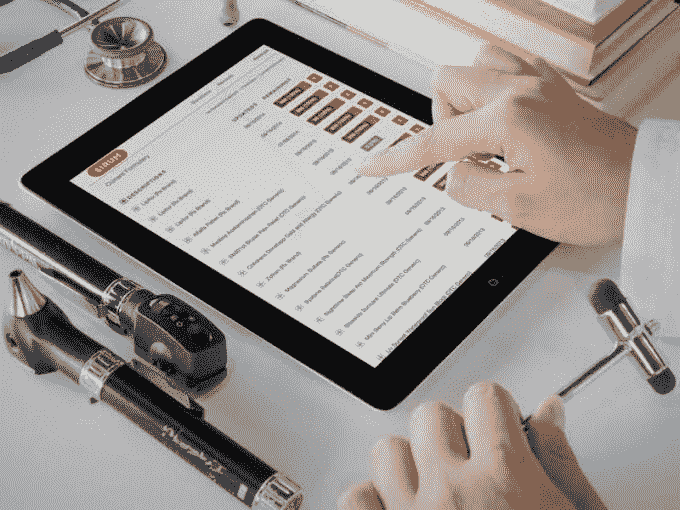

# Y Combinator 支持的 SIRUM 为低收入患者匹配未使用的药物 

> 原文：<https://web.archive.org/web/https://techcrunch.com/2015/03/10/the-drugs-still-work/>

# Y Combinator 支持的 SIRUM 为低收入患者匹配未使用的药物

据估计，每年价值 50 亿美元的处方药被烧掉、冲进下水道或扔进垃圾堆。据 T4 大学的研究人员称，大约价值 20 亿美元的 T3 在美国长期护理机构的架子上，直到它到期。

这是一种可怕的浪费，考虑到处方药是我们医疗保健系统中最昂贵的费用之一，而美国四分之一的家庭负担不起这些处方药。

SIRUM(支持重新分配未使用药物的倡议)是一个由 Y Combinator 支持的非营利组织，在斯坦福大学哈斯中心运作。这是一个正在申请专利的软件平台，可以作为药房和护理机构的一种按需库存，以便更容易地将未使用的药物重新分配给每年无力支付处方费用的患者。

法律因州而异，但 42 个州和关岛目前有某种“好撒玛利亚人”计划，为低收入患者捐赠未使用、未过期的药物，并提供有效处方。还有国营药品捐赠机构和其他第三方项目，如[处置我的药品](https://web.archive.org/web/20230216193050/http://www.disposemymeds.org/)在每个地区找到捐赠这些未使用药品的地方。

SIRUM 与这些药物捐赠机构、药店、疗养院和诊所合作，作为一个点对点的再分配平台，切断了第三方网络。相反，它让每个组织在平台上上传关于其医疗盈余和需求的数据，以便在那一刻为有需要的患者找到匹配。

SIRUM 的联合创始人凯·威廉姆斯、乔治·王和亚当·基歇尔估计，自 2011 年开始以来，这项服务已经帮助向 2 万名低收入患者重新分发了价值约 300 万美元的未开封、未过期的药片。

在来自 [Y Combinator](https://web.archive.org/web/20230216193050/https://www.ycombinator.com/) 、[罗伯特·伍德·约翰逊基金会](https://web.archive.org/web/20230216193050/http://www.rwjf.org/)、[德雷珀·理查兹·卡普兰基金会](https://web.archive.org/web/20230216193050/http://www.drkfoundation.org/)和[Google.org](https://web.archive.org/web/20230216193050/http://www.google.org/)的资助下，SIRUM 目前正在加利福尼亚州、俄勒冈州和科罗拉多州开展业务。它计划最终在所有 50 个州开放。