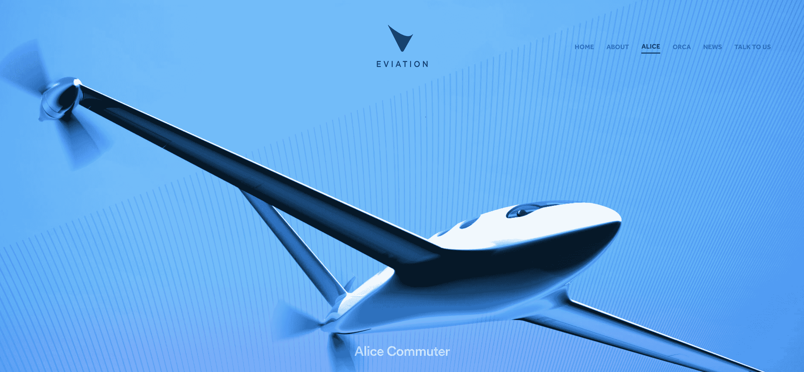

# 电动飞机正在起飞

> 原文：<https://web.archive.org/web/https://techcrunch.com/2018/07/08/the-electric-aircraft-is-taking-off/>

[Evan Gaj](https://web.archive.org/web/20230306185635/https://www.linkedin.com/in/evan-gaj-245a0648/)

是利哈伊大学的机械工程毕业生，目前获得富布莱特奖学金在华沙研究无人机。

2008 年，电动汽车经历了由油价上涨引发的重生。现在是 2018 年，是电气航空再次重生的时候了。几十年来，航空领域在各个方面都取得了进步。1986 年，伯特·鲁坦第一次不间断无燃料环球飞行。

现在，30 年后，又一次环球旅行完成了，标志着第一次电力驱动的环球航行。这段崇高的旅程从阿布扎比开始，16 个月后回到了旅程开始的地方。这架飞机，不像以前的其他飞机，不排放任何废气，也不燃烧任何燃料。相反，它使用了太阳能电池板、一个电动马达和四个 41 千瓦时的大容量锂离子电池。

它被称为太阳动力 2 号，在 2016 年完成飞行时改变了航空界。从那时起，电动商用飞机的愿景已经从梦想变成了可能。

包括电动飞行在内的未来是积极的，可以大幅削减当前航空的燃料使用，减少排放，创造更清洁的环境。

[根据欧盟委员会的数据，](https://web.archive.org/web/20230306185635/http://europa.eu/rapid/press-release_IP-06-1862_en.htm)目前，飞机排放的温室气体约占欧盟温室气体排放总量的 3%，约占全球温室气体排放总量的 4%。这是一个相当大的快速增长的百分比。相比之下，从伦敦飞往纽约的航班上的人均排放量大约相当于一个欧盟国家的人为他们的家供暖一整年。

有了电动航空，这些不断增加的排放可以减少。这将使欧盟雄心勃勃的目标更加可行，即到 2030 年将温室气体排放量减少到 1990 年水平的 40%，到 2050 年减少到 1990 年水平的 80%。

从乘客的角度来看，电动飞机是一个巨大的胜利。新飞机将会导致更便宜的机票、更低的噪音和更高的爬升率。有了电动引擎，飞机能够在空气阻力较小的高海拔地区保持性能，不像内燃机那样在这些海拔地区效率较低。因此，要产生相同的速度，飞机发动机的功率必须小一些。

照片由盖蒂图片社提供

## 挑战

尽管围绕电动飞行的理念有各种宣传和创新，但在我们的商业飞行由电动引擎驱动之前，还有很长的路要走。Burt-Rutan 设计的 Long-EZ 是近期电动飞行的一个实例。2012 年，作为飞行速度最快的电动飞机之一，这架飞机以每小时 202.6 英里的速度行驶，并搭载一名乘客。相比之下，波音 787 的飞行速度为每小时 585 英里，载客量超过 242 人。还有很长的路要走，按照目前电池和电动引擎技术的发展速度，即使是混合动力技术也要到 2030 年才能用于商业航空。

目前有一个项目正在进行中，被称为美国宇航局电动飞机试验台。这个项目着眼于目前电动飞行的技术障碍。有了这个试验台，提高效率和减轻重量就是目标。随着技术的进步，试验台可以适用于驱动越来越大的发动机。

存在的另一个挑战是创建一个实用的冷却系统。这些系统的热管理将需要一个能够在飞行中从 [50 到 800 千瓦的热量中排出的系统。用于大功率电子设备的集成电源模块需要冷却系统。需要开发材料以提高热性能，并开发轻型系统以冷却电力电子设备。超导性和超冷电子设备将被用来降低飞机的电阻。](https://web.archive.org/web/20230306185635/https://ntrs.nasa.gov/archive/nasa/casi.ntrs.nasa.gov/20160005232.pdf)

## 电池

在这一点上，最重要的限制因素不是发动机的重量或飞机的设计，而是电池。在这一点上，电池不能提供电力航空可行所需的功率重量比。目前，喷气燃料产生的能量是同等质量电池的 43 倍。电动航空业正在下大赌注，认为储能技术将在未来得到显著改善。随着电池能量密度每年上升 5%到 8 %,这是可能的。为了使电池在小型航空中经济可行，它们需要达到电流密度的五倍(T2)。好消息是，随着时间的推移，飞机的设计越来越好，需要的能量也越来越少。

一旦所有这些都想通并解决了，另一个问题就存在了。如何快速有效地更换电池，让飞机从着陆到搭载新乘客和起飞有一个快速的周转时间？最好的解决方案是电池交换，但即使这种解决方案也有其困难。与燃气轮机相比，电池的维护成本更高，而且仅在 1500 次充电后就需要更换。此外，当这些电池需要充电时，电力消耗在一天中最高。

## 当前竞争

Zunum Aero 是一家由波音公司和捷蓝航空公司支持的公司，自 2013 年以来一直致力于 10 至 50 座混合电动支线飞机系列。他们于 2017 年 10 月开始开发 12 座飞机，目标是 2020 年飞行。该设计包括一系列由电池单独供电的混合涵道风扇和一台提供 1 MW 至 4-5 MW 功率的增程发电机。一个燃气轮机将被用来驱动两个 550 千瓦的发电机，以便将飞机的航程扩展到 700 海里。2018 年 2 月，Zunum 宣布正在建造其第一台样机。

照片由 Zunum 提供

[空客 E-Fan X](https://web.archive.org/web/20230306185635/https://www.airbus.com/newsroom/press-releases/en/2017/11/airbus--rolls-royce--and-siemens-team-up-for-electric-future-par.html) 正在与罗尔斯·罗伊斯和西门子合作开发，作为混合动力航空公司的验证机。这种飞机的开发建立在空客 E-Fan 的基础上，这是一种由空客公司开发的原型双座电动飞机。它使用车载锂离子电池为两个电动马达提供动力。E-Fan 于 2014 年首飞，续航时间为 60 分钟。E-Fan X 包括一个没有低温冷却和超导的电机和发电机，导致效率损失超过 15%。他们希望在全电动飞机的道路上做的是创造一种混合电动模型[，能够在 2020 年](https://web.archive.org/web/20230306185635/http://www.ainonline.com/aviation-news/air-transport/2017-11-28/airbus-lead-bae-146-electric-propulsion-demonstration)飞行，同时进一步发展这项技术。

图片由空中客车公司提供

[埃维昂爱丽丝](https://web.archive.org/web/20230306185635/https://www.eviation.co/alice/)是以色列电动飞机，由[埃维昂飞机](https://web.archive.org/web/20230306185635/http://www.eviation.co/)公司研发。这架飞机有三个螺旋桨，两个在翼尖，一个在机身后部。这架飞机采用电力推进系统，由 95%的复合材料开发而成。该公司成立于 2015 年，目前正在制造其全电动商务和通勤飞机的第一架原型机。

照片由 Eviation 提供

莱特电气公司是一家初创公司，旨在创造一种靠电池运行的商业客机，航程不到 300 英里。[公司成立于 2016 年](https://web.archive.org/web/20230306185635/https://techcrunch.com/2017/03/21/wright-electric-planes/)，获得了硅谷加速器 Y Combinator 等集团的风险投资。2017 年 9 月，英国廉价航空公司 EasyJet 宣布，它正在与莱特电气公司合作开发一款电动 180 座飞机，将于 2027 年开发出来。到目前为止，该公司已经建造了一个双座概念验证，其中包含 600 磅的电池。

照片由莱特电气公司提供

[Ampaire](https://web.archive.org/web/20230306185635/https://www.ampaire.com/) 是一家最近的初创公司，目前正在承担开发改装电动飞机的大任务，目标是在 2020 年底获得 FAA 认证。这架飞机将能够搭载 7-9 名乘客，航程可达 100 英里。该公司希望开发一种电池更换系统，并希望明年试飞。

[Joby Aviation](https://web.archive.org/web/20230306185635/http://www.jobyaviation.com/) 在过去十年中从头开始开发他们自己的电动机和他们目前的垂直起降设计。该公司最近[获得了 1 亿美元](https://web.archive.org/web/20230306185635/https://www.bloomberg.com/news/articles/2018-02-01/air-taxi-startup-joby-has-a-working-prototype-and-a-fresh-100m)的 B 轮融资，为生产和认证做准备。据报道，这种新型交通工具正在开发中，一次充电可以载五个人飞行 150 英里。这对于电动飞机来说是非常重要的，并且可以用于商业航空领域中非常短程的飞行。

Joby/NASA 在 X57 上的合作照片由 NASA 提供

随着未来几年电动汽车充斥街道，让我们不要忘记，要让我们的天空和道路走在同一条道路上，还有很长的路要走。当我们沿着成功的电动飞机的漫长道路前进时，我们会想起成功的电动汽车的危险历程。一旦越过电池、引擎和设计的障碍，这些飞机将很快起飞。