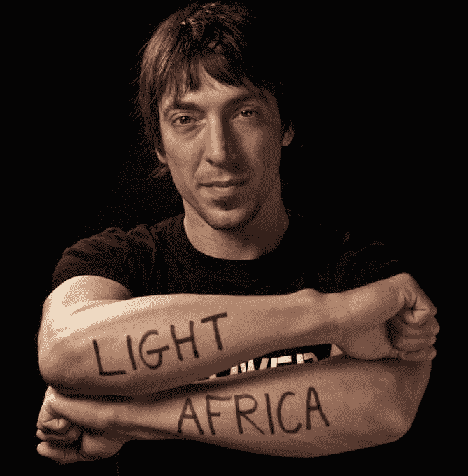
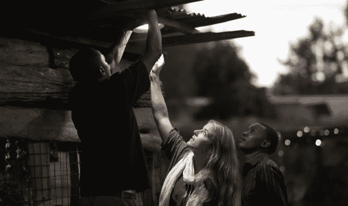
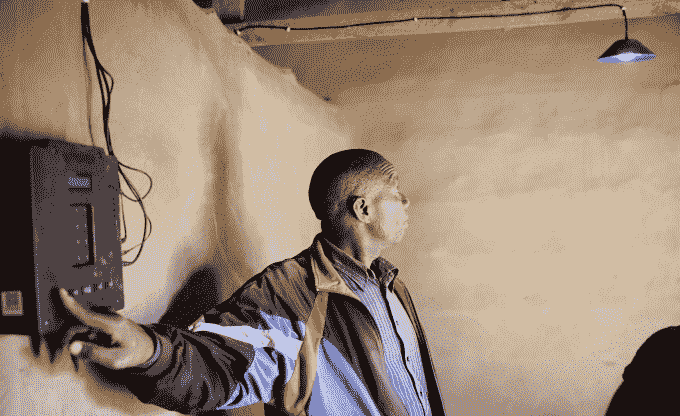

# 离网电力筹集 1600 万美元让非洲人像手机一样预付太阳能费用 

> 原文：<https://web.archive.org/web/https://techcrunch.com/2014/12/08/the-electrical-revolution/>

如果你没有信用卡或银行账户，你如何支付太阳能费用？多亏了离网电力，发展中国家的人们可以像给手机充值一样，为安装的太阳能发电系统付费。

现在，由于美国太阳能融资和安装巨头 SolarCity 提供了 1600 万美元的新资金，离网电力正在推动客户从 2.5 万增加到 10 万。“预付费手机真正打开了非洲的手机市场，”Off Grid 首席执行官兼联合创始人 Xavier Helgesen 告诉我现在是预付费太阳能时代的开始。

 **通过将家庭中低效、危险的煤油灯替换为可以运行现代灯的太阳能系统，离网正在为仍处于黑暗中的国家带来电力革命。

## 给手机充电，改变生活

虽然大多数人认为光是技术最重要的用途，但 Off Grid 发现他们的客户注册的首要原因是因为他们想给手机充电。

Off Grid Electric 首席执行官兼联合创始人 Xavier Helgesen

离网运营的坦桑尼亚的许多居民家里没有插座，他们不能用煤油给机器人充电。像发展中世界的其他地方一样，人们不得不步行到附近的便利店或商店，在那里有人会让他们支付 0.25 美元来给手机充电，同时还不得不将手机留在那里，这很不方便。

由于偏远地区没有合适的能源网，坦桑尼亚一些家庭的唯一选择就是太阳能。但是那里的平均收入只有 700 美元左右。再加上缺乏银行或信贷，安装的太阳能系统高达 1000 美元，太贵了，无法预先购买。即便如此，客户在通过更便宜的能源慢慢收回成本的同时，也承担了很大的风险。

这就是为什么 Off Grid Electric 从该地区人们支付移动电话服务的方式中得到启示。

## 按需购买太阳能产品

“我们是微型太阳能租赁的先驱，”赫尔格森说。这很重要，因为人口增长超过了技术进步，自从托马斯·爱迪生发明第一个灯泡以来，有更多的人用不上电。

客户支付 6 美元的安装费，Off Grid 在他们的房子上安装了一个自持太阳能系统，配有电池板、锂电池、超高效灯和一个电表。电池板收集能量并储存在电池中。但要使用它，客户向电网外发送移动支付，并获得一个密码，他们可以在电表上输入以解锁他们的能源。

赫尔格森告诉我，一个月大约 5 到 10 美元，相当于或少于他们购买煤油的费用，离网用户可以获得“50 倍以上的照明”,还可以给手机充电或给电视供电。他们不能运行耗能的搅拌机或烤面包机，但这都胜过在你的客厅点燃喷气燃料，这可能导致吸入健康问题或烧伤。

这个想法是，在 10 年的时间里，Off Grid 将通过让家庭支付太阳能系统的费用来收回投资。赫尔格森说，与竞争对手相比，“我们的价格感觉更像是公共事业账单。”由于它使用自带手机模式，而不是像一些太阳能安装器那样将手机放在电表内，离网可以更便宜，不需要与电信公司打交道，即使客户的家里没有手机信号也可以工作。

## 推动电气革命

赫尔格森告诉我，他在牛津大学攻读解决重大世界问题的奖学金时，遇到了他的联合创始人，并对离网的想法着迷。此前，赫尔格森创办了 Better World Books，这是最大的二手书经销商之一，他说现在的收入为 7000 万美元。但是没有光，人们就无法阅读，所以赫尔格森搬到了坦桑尼亚，通过太阳能解决了一个高阶问题。

来自之前投资者 SolarCity、微软联合创始人保罗艾伦的 Vulcan Capital 和英国 Zouk Capital 的 1600 万美元，Off Grid 计划扩大其安装劳动力，同时改善其硬件和软件。这家初创公司甚至经营自己的职业学校，教当地人如何成为太阳能安装技术人员。

该公司是垂直整合的，除了太阳能电池板的制造，什么都做。在迈向下一个 100，000 名客户的里程碑时，它可以通过简化注册、安装、计量和支付流程来获利。

潜力是巨大的，因为坦桑尼亚有 800 万个家庭没有电，另外还有 800 万个家庭在肯尼亚。这个模式可以扩展到整个发展中国家。Off Grid 表示，它希望其长期回报战略将有助于它在这个领域击败其他公司，如 [MobiSol](https://web.archive.org/web/20230123000527/http://www.plugintheworld.com/mobisol/product/) 和 [SolarNow](https://web.archive.org/web/20230123000527/http://www.solarnow.eu/) ，在那里人们预先支付更多费用。新的股权融资还可以给大银行注入信心，这些银行正在利用 Off Grid 为安装项目融资。

沉思片刻后，赫尔格森告诉我，他希望更多的企业家关注严肃的、改变生活的问题，比如能源，而不是“只是一个新的应用程序或一些在旧金山是个问题的更琐碎的事情。”赫尔格森宣称“超越湾区泡沫来思考”，指出“我当然更热衷于开发一个应用程序。”

赫尔格森并不是在没有电的情况下长大的，但他仍然走出了自己的舒适区，去了解一个没有足够多潜在解决者关注的问题。他的计划为[离网电](https://web.archive.org/web/20230123000527/http://offgrid-electric.com/)？“让我们不只是建立一个增量公司，而是点亮十亿人的生活。”**