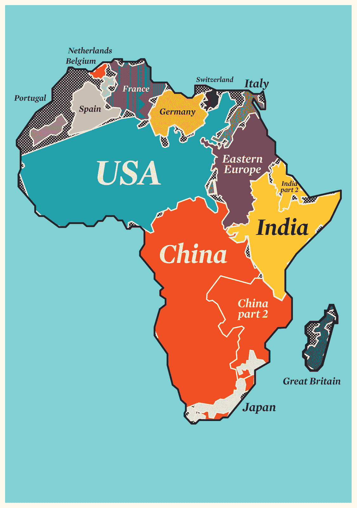

# 新兴市场对硅谷的挑战 

> 原文：<https://web.archive.org/web/https://techcrunch.com/2016/07/04/the-emerging-markets-challenge-to-silicon-valley/>

基思·琼斯是总部位于南非的加速器公司的联合创始人

[Sw7](https://web.archive.org/web/20221207050858/http://www.sw7.co/)

.

奥黛特·琼斯是总部位于南非的加速器的联合创始人

[Sw7](https://web.archive.org/web/20221207050858/http://www.sw7.co/)

.

硅谷引领着全球技术创新市场，拥有首屈一指的资质和生态系统。我们与硅谷的许多领先技术加速器有过接触，他们的开场白通常是:“你与我们有什么关系？”

然而，我们这些生活在地球其他地方的人，即“局外人”，有着相当多的 FOMO，尽管我们想成为这个聚会的一部分，但我们仍然必须问这样一个问题:“硅谷什么时候会变得与我们相关？”

非洲很大，我们面临着相当多的挑战——可能超出了我们的合理份额。我们有 12 亿人口，世界上 60%的未开垦的可耕地，以及这个星球上技术最落后的人口。新兴市场占世界人口的 60 %,因此，尽管非洲面临着独特的挑战，但我们所在的新兴市场类别将在未来市场中发挥重要作用。

非洲和新兴市场在地球的未来发展方向上发挥着主导作用。如果我们是顺其自然，我们都有机会有一个美好的未来。然而，如果我们落在后面，我们都要承受后果。这种情况已经发生的证据越来越明显。

首先，技术创新将为我们提供我们迫切需要的数据，以了解如何解决我们面临的问题；其次，技术创新将降低服务成本，使我们能够以所需的规模有效解决问题。技术创新是我们未来的一切。我们对硅谷的挑战是:“你将如何与我们相关？”

技术加速器着眼于该地区，要么看看他们能做些什么，把顶尖候选人带到硅谷，要么启动一个项目，做一次就离开。这个过程看起来更像是 A/B 测试，而不是客户或市场验证活动。在与许多本地和国际风投合作时，最常见的问题是:“你有给我们的渠道吗？”以及“你认为该地区有足够的质量来维持创新市场吗？”

> 在新兴市场，你如何创造市场准入就是一切。

首先，回答是:“你在做什么来发展自己的渠道？”其次，“我们有大量的人才。然而，它现在没有得到利用，因为我们试图效仿硅谷的模式，但这种模式在这里行不通。”我们的市场是不同的，这是我们生活的世界的乐趣所在。在一个功能失调的生态系统中，挑战就是机遇——没有什么比创造新的解决方案更令人兴奋的了。在西方，不到 30%的支付来自移动设备，而在新兴市场，这一比例为 60%。

西方说“移动优先”非洲是移动的*只有*，所以我们使用移动的方式是非常不同的。西方认为“云/个人电脑/平板电脑/移动”新兴市场认为“移动/实体”我们的付费模式不同:我们需要为更大、更复杂、多文化的用户群体提供服务，而服务成本只是西方的一小部分，基础设施较弱。

在汇款市场， [Hello Paisa](https://web.archive.org/web/20221207050858/http://hellopaisa.co.za/) 和 [Mukuru](https://web.archive.org/web/20221207050858/https://www.crunchbase.com/organization/mukuru) 都有超过一百万的客户。 [Rethink Education](https://web.archive.org/web/20221207050858/https://www.crunchbase.com/organization/rethink-education-2#/entity) 率先通过彩信向市场推出移动教育解决方案和内容。我爱 Zoona 成功地扩大了国内转账的规模，赢得了银行无法与之竞争的忠诚度和影响力。

在发达市场，标志成功的是创新本身和你如何扩大规模。在新兴市场，你如何创造市场准入就是一切。克莱顿·克里斯滕森在他的书《创新者的困境》中涵盖了三种类型的创新:1)真正的创新，2)渐进式创新和 3)部门创新。推动新兴市场的是第四种创新，市场准入创新。如果你能创新进入市场的方式，其他的创新就没那么重要了。 [MTN](https://web.archive.org/web/20221207050858/https://www.crunchbase.com/organization/mtn) 发现了这一点，并在非洲和中东的 22 个国家建立了拥有超过 2 . 28 亿用户的电信公司。

创新市场是商业经济，就像其他任何经济一样，所以硅谷加速器没有一个积极参与新兴市场的事实意味着三件事之一:1)在其他地方赚钱更容易，2)他们拥有的商业模式无法扩展或不相关，或者 3)企业不希望扩展，因为它们是克莱顿·克里斯滕森(Clayton Christensen)书中描述的传统企业。

第一种可能是最适用的。从 GDP 的角度来看，就全球而言，新兴市场更像是一个舍入误差，而不是一个战略焦点，尽管提到的所有观点都有一定的相关性，但第三点可能是最不相关的。我们的市场很复杂，运作方式与西方市场不同；进入门槛相对较高，西方营销人员的学习曲线并不陡峭，几乎是垂直的。

进入和理解市场需要时间。我们的市场被 B2B 和 B2C 领域的“缺失的中间环节”所定义。经济是分散的，西方的规模模型往往建立在足够大的同质客户基础上，以达到流动性。规模是由一个既可接近又可定位的市场驱动的。

> 非洲对商业开放，这已经开始发生了。

在新兴市场，社区变得越来越容易接近，我们正在非常迅速地动员起来——但可寻址性仍然是一个挑战。每个部门都需要满足自己的需求。利基扩展性推动了这里的市场——如何从一个而不是多个更小的利基社区中赚钱。如果硅谷能够找到如何进入这些市场并扩大规模的方法，那么回报就是对未来全球经济的贡献和相关性。

迄今为止，这一过程是将非洲最顶尖的 0.001%的初创企业转移到硅谷，在那里加速发展。许多企业留在那里，靠近他们的资助者；一些回报。这种模式符合硅谷的商业模式，虽然我们积极庆祝和支持这些个人的胜利，但它并没有将硅谷与地球上的大多数人联系起来。

我听到你说，战胜你自己。这是一个艰难的商业世界，解决你的问题。我们是。我们都在前进，尽我们所能，解决问题。三年前，我们开始加速业务发展，如今的市场已经完全不同。这正在发生，但不是以与硅谷商业模式相关的方式。

启动规则 101 表明企业需要与本地相关才能成功。产品的制造必须满足该市场顾客的需求。目前，客户是加速器的有限合伙人，市场是美国。新兴市场创新者代表了这台机器的交易流程。在新兴市场及其客户成为目标之前，我们不太可能与硅谷建立有意义的关系。

商业动态必须适用，所以机会来了。这里的商业增长速度较慢，但现金增长速度是这里的三倍。市场资金不足；也许有些人会形容它不仅仅是有点混乱。然而，混乱意味着机遇，领导一个行业并让网络效应发挥作用的成本相对较低。这更像是一个数字游戏:质量是可变的，所以你需要更多的筹码，但筹码的成本更低。股权回报需要更长时间才能显现，但技能不会。它比你所知道的西部更像狂野的西部，但机会是符合类比的。

所发展的技能将是对如何进入主流市场的理解，并学习如何、何时以及在何处扩大规模。随着创新市场的竞争加剧，投资者的关注点从足迹转向收入，这将对我们的市场和技能产生更大的影响。新兴市场错过了虚荣指标泡沫和对足迹的关注；然而，资金的历史性短缺意味着我们更倾向于现金。就盈亏平衡进行现实的对话更容易。我们的导师社区正在迅速动员起来，地方基金也是如此，因此有越来越多的人可以与之联系和合作。

非洲对商业开放，这已经开始发生了。我们正在从创新者市场转向早期采用者市场。它并不适合每一个人，正如我们当地人所说，“非洲不适合娘娘腔。”我们很乐意将新兴市场的挑战归咎于硅谷。“你什么时候会需要技能来理解如何接触这个星球的大部分？”如果你主动联系，我们希望听到的问题是:“我们如何才能与你相关？”硅谷有没有不娘娘腔的人？