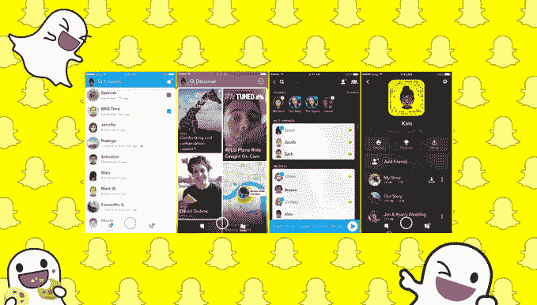
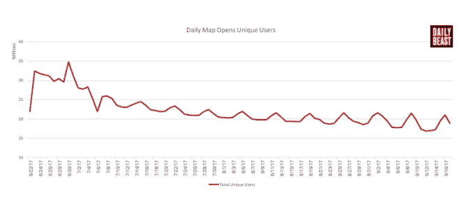
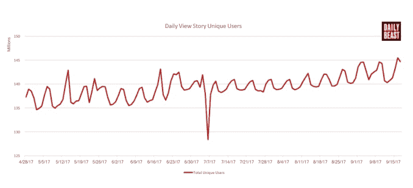
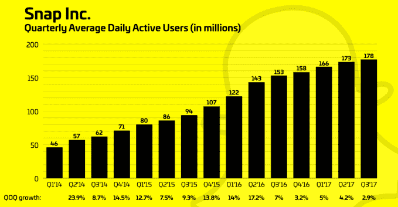

# 什么是 Snapchat，现在故事分享已经停止增长了？

> 原文：<https://web.archive.org/web/https://techcrunch.com/2018/01/09/the-ever-ending-story/>

在一次背叛忠诚的事件中，士气低落，Snapchat 的大量[使用统计数据](https://web.archive.org/web/20221124075138/https://www.thedailybeast.com/this-is-the-data-snapchat-doesnt-want-you-to-see)已经泄露。最令人担忧的是，发布故事的用户数量呈现零增长，这一表现甚至比 [Snapchat 今年低迷的总用户增长](https://web.archive.org/web/20221124075138/https://beta.techcrunch.com/2017/11/07/snap-earnings-q3-2017/)还要糟糕。Instagram 的 Stories clone 似乎已经彻底扼杀了 Snapchat 最赚钱的功能。

这解释了为什么 [Snapchat 的重新设计](https://web.archive.org/web/20221124075138/https://beta.techcrunch.com/2017/11/29/snapchat-redesign/)将朋友的故事移到聊天收件箱中，因为该应用程序上的视觉消息增长略快于总用户的增长。信息很难在不惹人讨厌的情况下被广告打断，因此将信息和故事结合起来可能是 Snap 重振收入的最佳手段。

然而，从整体上来看，这一泄密事件描绘了一幅这样的画面:这款应用辜负了它作为传播轰动效应的名声。由于士气低落，股价下跌，亏损增加，Snap 可能没有足够的动力来招募顶级人才或吸引更多的大型收购。它是进化的社交媒体，但作为一家上市公司，它正处于成熟的焦虑阵痛中。

## Snapchat 令人生厌的数字

泄密者是《每日野兽》的泰勒·洛伦兹，她很快成为社交网络和青少年科技文化领域的顶级记者。她设法获得了从 2017 年 4 月底到 9 月中旬 Snapchat 的一系列功能的使用数据[。你可以在这个故事的底部看到](https://web.archive.org/web/20221124075138/https://www.scribd.com/document/368759484/Snapchat-Data-Lorenz)[全套图表](https://web.archive.org/web/20221124075138/https://www.scribd.com/document/368759484/Snapchat-Data-Lorenz)。

据 Lorenz 报道，Snap Map 实时位置共享和地理标记内容搜索功能在 6 月份推出后，每天的独立观众人数从 3500 万下降到了 1900 万，并且还在下降，仅占 Snapchat 用户的 11%。专业出版商发布杂志式每日版本的 Discover 版块在 7 月份飙升至 3800 万，然后每日用户数降至 3400 万左右，约占所有用户的 19%。随着 Discover 在尚未向大多数用户推出的重新设计中不那么突出，使用率可能会进一步下降。

Snapchat 的全新设计

Snap 应该从用户那里获得大量时间，在 4 月至 9 月期间，该应用的平均使用时间从 32.7 分钟左右增长到 34.8 分钟。

数据中最亮点的是，每天观看的快照数量从约 39 亿增加到 46 亿，增幅为 17.9%，远远超过了同期约 7%的总用户增长率。

每日发送的快照从大约 20.8 亿增加到 22.1 亿，与用户总数的增长保持一致。今年 8 月，Lorenz 报告称，用户向朋友发送私人照片的可能性比向故事广播的可能性高 64%。

## 墨守成规的故事

这就是脸书的竞争真正伤害 Snapchat 的地方。回到 Instagram Stories 发布之前的 2016 年 Q2，Snapchat 的用户群增长了 17.2%。上个季度，它仅增长了 2.9%，因为许多用户发现他们可以继续使用 Instagram，并将故事分享到他们现有的社交图中，他们已经在那里发布了永久的图像，而不是在 Snapchat 上建立新的图表。

尽管用户总数有所增长，但从 4 月到 9 月，每天向 Snapchat 发布故事的用户数量保持在 5100 万左右。这表明，虽然人们可能会坚持使用 Snapchat 或来 Snapchat 给朋友发送消失的消息，但他们不一定需要在 Snapchat 上发布故事。

在此期间，Snapchat Story 的每日独立观众人数增长了 4.37%，从 1.37 亿增加到 1.43 亿，明显低于用户总数的增长。至少，向 Snapchat 报道的用户发帖更频繁，使用的地理过滤器也更多。但广告客户想要规模，缺乏总故事分享者是个问题。

由于消息传递仍然是其最受欢迎的功能，Snapchat 可能不得不大幅增加其增强现实赞助镜头和静态赞助 Geofilter 的销售，以弥补该功能中广告的缺乏。否则，它将不得不冒着惹恼青少年的风险，在信息体验中插入更多可扩展的显示广告。

## 影响力≠商业

总的来说，Snap 的前路坎坷。Discover 中的快照地图和专业内容等新功能似乎无法改变它的命运。该公司目前最大的希望是用户逐渐沉迷于故事的算法排序，首先显示最好的朋友，[，早在 4 月份我们就建议它采用](https://web.archive.org/web/20221124075138/https://beta.techcrunch.com/2017/04/29/sortchat/)。这一点现在终于在重新设计中体现出来了，它可以让打开 Snapchat 变得更容易，并快速查看来自你所关心的人的最相关的内容。

除此之外，Snapchat 可能需要另一笔重磅收购来恢复增长。Bitmoji 的个性化头像和 Looksery 的 AR 镜头让 Snapchat 在短暂之外获得了主流吸引力。但随着[首席执行官埃文·斯皮格尔对产品的铁腕控制、](https://web.archive.org/web/20221124075138/https://www.theverge.com/2018/1/5/16854242/snap-evan-spiegel-redesign-cheetah-corporate-structure)股价从上市后的高点下跌了 50%，以及脸书的复印机全速运转，Snap 不再像进行这些收购时那样是一个有吸引力的工作场所。

Snapchat 对文化产生了难以置信的影响。从无常的内容到垂直视频，普及增强现实并带来视觉通信时代，斯皮格尔的想法重新定义了我们分享的方式。不幸的是，Snapchat 未能从这些发明中获得太多的金钱利益，因为它们在其他地方被克隆了。

Snapchat 消息在西方青少年中的流行意味着它不会在一夜之间消失。但或许是时候让它和全世界面对这样一个事实了:Snapchat 可能会成为改变世界的产品，但永远不会成为主宰世界的企业。

[scribd id = 368759484 key = key-rcilsyv 9 puqv 46 upk grl mode = scroll]