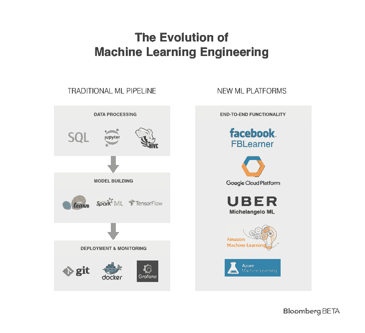

# 机器学习的演变 

> 原文：<https://web.archive.org/web/https://techcrunch.com/2017/08/08/the-evolution-of-machine-learning/>

凯瑟琳董撰稿人

凯瑟琳·董是哈佛大学的暑期助理

[Bloomberg Beta](https://web.archive.org/web/20230117233843/https://github.com/Bloomberg-Beta/Manual)

并将作为一名机器学习工程师在脸书工作。

主要的科技公司已经围绕人工智能和机器学习积极地重新定位自己:[谷歌现在是“人工智能优先”，](https://web.archive.org/web/20230117233843/https://venturebeat.com/2017/05/18/ai-weekly-google-shifts-from-mobile-first-to-ai-first-world/) [优步的血管里流着人工智能](https://web.archive.org/web/20230117233843/http://www.techrepublic.com/article/how-data-and-machine-learning-are-part-of-ubers-dna/)和内部人工智能研究实验室[保持](https://web.archive.org/web/20230117233843/https://techcrunch.com/2017/07/12/microsoft-creates-an-ai-research-lab-to-challenge-google-and-deepmind/) [上升](https://web.archive.org/web/20230117233843/https://venturebeat.com/2016/09/18/salesforce-forms-research-group-launches-einstein-a-i-platform-that-works-with-sales-cloud-marketing-cloud/) [上升](https://web.archive.org/web/20230117233843/https://venturebeat.com/2017/02/28/pinterest-forms-labs-research-group-under-chief-scientist-jure-leskovec/)。

他们正在投入资源和注意力，让世界相信机器智能革命正在到来。他们特别吹捧深度学习是推动这一转变的突破，并为新的自动驾驶汽车、虚拟助手等提供动力。

尽管艺术的状态被大肆宣传，实践的状态却没有那么超前。

从事机器学习的软件工程师和数据科学家仍然使用许多与多年前相同的算法和工程工具。

也就是说，传统的机器学习模型——而不是深度神经网络——正在为大多数人工智能应用提供动力。**工程师们仍然使用传统的软件工程工具来进行机器学习工程，它们不起作用** **:** 将数据转化为模型以产生结果的管道最终是由分散的、不兼容的片段构建而成的。变革即将到来，大型科技公司通过建立新的具有端到端功能的机器学习专用平台来平滑这一过程。

大型科技公司最近开始使用自己的机器学习工程集中平台，更干净地将以前分散的数据科学家和工程师的工作流程联系在一起。

## 机器学习三明治里有什么

机器学习工程分为三个阶段——数据处理、模型构建、部署和监控。在中间，我们有管道的肉，模型，这是学习预测给定输入数据的机器学习算法。

这种模式是“深度学习”存在的地方。深度学习是机器学习算法的一个子类，它使用多层神经网络来学习输入和输出之间的复杂关系。神经网络的层数越多，它能捕捉的复杂性就越大。

传统的统计机器学习算法(即不使用深度神经网络的算法)在捕获关于训练数据的信息方面具有更有限的能力。但这些更基本的机器学习算法对许多应用程序来说足够好，使得深度学习模型的额外复杂性往往是多余的。因此，我们仍然看到软件工程师在机器学习工程中广泛使用这些传统模型——即使在这种深度学习热潮中。

但是，将所有东西结合在一起的三明治过程的面包是在训练机器学习模型之前和之后发生的。

第一阶段涉及清理和格式化大量数据，以输入模型。最后一个阶段涉及模型的仔细部署和监控。我们发现，人工智能的大部分工程时间实际上并没有花在建立机器学习模型上——而是花在准备和监控这些模型上。

### 机器学习的精髓——避免异国风味

尽管大科技公司人工智能研究院(AI research labs)专注于深度学习，但这些公司的大多数机器学习应用都不依赖于神经网络，而是使用传统的机器学习模型。最常见的模型包括线性/逻辑回归、随机森林和增强决策树。这些是技术公司使用的其他服务背后的模型，包括朋友建议、广告定位、用户兴趣预测、供需模拟和搜索结果排名。

工程师用来训练这些模型的一些工具也同样破旧。最常用的机器学习库之一是 scikit-learn，它是十年前发布的(尽管 Google 的 TensorFlow 正在兴起)。

有很好的理由使用更简单的模型而不是深度学习。深度神经网络很难训练。它们需要更多的时间和计算能力(它们通常需要不同的硬件，特别是 GPU)。 ***让深度学习发挥作用很难***——它仍然需要大量的手工操作，涉及直觉和试错的结合。

对于传统的机器学习模型，工程师花在模型训练和调整上的时间相对较短——通常只有几个小时。最终，如果深度学习可以实现的准确性改进是适度的，那么对可扩展性和开发速度的需求超过了它们的价值。

### 尝试将所有这些整合在一起—从数据到部署的工具

所以当涉及到*训练*一个机器学习模型的时候，传统的方法效果很好。但这并不适用于将机器学习管道结合在一起的基础设施。使用相同的旧软件工程工具进行机器学习工程会产生更大的出错可能性。

机器学习管道的第一阶段——数据收集和处理——就说明了这一点。虽然大公司肯定拥有大数据，但数据科学家或工程师必须清理数据以使其有用-验证和整合不同来源的重复数据，规范指标，设计和证明功能。

在大多数公司，工程师使用 SQL 或 Hive 查询和 Python 脚本的组合来聚合和格式化来自一个或多个数据源的数百万个数据点。这通常需要几天令人沮丧的手工劳动。其中一些可能是重复性工作，因为许多公司的流程是分散的——数据科学家或工程师通常使用本地脚本或 Jupyter 笔记本来处理数据。

此外，大型科技公司的庞大规模加剧了错误，使得在生产中谨慎部署和监控模型变得势在必行。正如一位工程师所描述的，***在大公司，机器学习 80%是基础设施***

然而，传统的单元测试——传统软件测试的支柱——并不真正与机器学习模型一起工作，因为机器学习模型的正确输出事先并不知道。毕竟，机器学习的目的是让模型学会从数据中做出预测，而不需要工程师专门编写任何规则。因此，工程师们没有进行单元测试，而是采用了一种不太结构化的方法:他们手动监控仪表板，并为新模型编写警报程序。

现实世界数据的变化可能会使训练过的模型不太准确，因此工程师根据应用程序，每天或每月根据新数据重新训练生产模型。但是，在现有的工程基础设施中缺乏对机器学习的特定支持会造成开发中的模型和生产中的模型之间的脱节——正常代码更新的频率要低得多。

许多工程师仍然依赖于将模型部署到生产中的基本方法，例如将训练模型或模型权重的序列化版本保存到文件中。工程师有时需要用不同的语言或框架重建模型原型和部分数据管道，因此他们在生产基础设施上工作。机器学习开发过程的任何阶段——从数据处理到培训到部署到生产基础设施——的任何不兼容性都可能引入错误。

### 让它看起来像样——前进的道路

为了解决这些问题， ***一些拥有构建定制工具资源的大公司已经投入时间和工程努力来创建他们自己的机器学习专用工具*。**他们的目标是拥有一个无缝、端到端的机器学习平台，与公司的工程基础设施完全兼容。

脸书的 [FBLearner Flow](https://web.archive.org/web/20230117233843/https://code.facebook.com/posts/1072626246134461/introducing-fblearner-flow-facebook-s-ai-backbone/) 和优步的[米开朗基罗](https://web.archive.org/web/20230117233843/https://careers-uber.icims.com/jobs/32523/sr-software-engineer---machine-learning-platform-%28seattle%29/job?mobile=true&needsRedirect=false)就是这样做的内部机器学习平台。它们允许工程师用直观的用户界面构建训练和验证数据集，将花费在这一阶段的时间从几天减少到几小时。然后，工程师可以通过(或多或少)点击一个按钮来训练模型。最后，他们可以轻松地监控和直接更新生产模型。

像 [Azure Machine Learning](https://web.archive.org/web/20230117233843/https://azure.microsoft.com/en-us/services/machine-learning/?&WT.srch=1&WT.mc_id=AID623261_SEM_0PXh3grx&gclid=EAIaIQobChMI08rfsNuz1QIVmksNCh1GTA8yEAAYASAAEgIbkPD_BwE) 和 [Amazon Machine Learning](https://web.archive.org/web/20230117233843/https://aws.amazon.com/machine-learning/) 这样的服务是公开可用的替代品，它们提供类似的端到端平台功能，但只与其他 Amazon 或 Microsoft 服务集成，用于管道的数据存储和部署组件。

尽管大型科技公司一直强调用机器学习来增强他们的产品，但大多数公司在这个过程中仍然存在重大挑战和低效率。他们仍然使用传统的机器学习模型，而不是更先进的深度学习，并且仍然依赖于不太适合机器学习的传统工具基础设施。

幸运的是，随着这些公司目前对人工智能的关注，他们正在投资专门的工具，以使机器学习更好地工作。借助这些内部工具，或者可能借助能够紧密集成到现有基础设施中的第三方机器学习平台，组织可以实现人工智能的潜力。

*特别感谢 Irving Hsu、David Eng、Gideon Mann 和彭博 Beta 团队的真知灼见。*