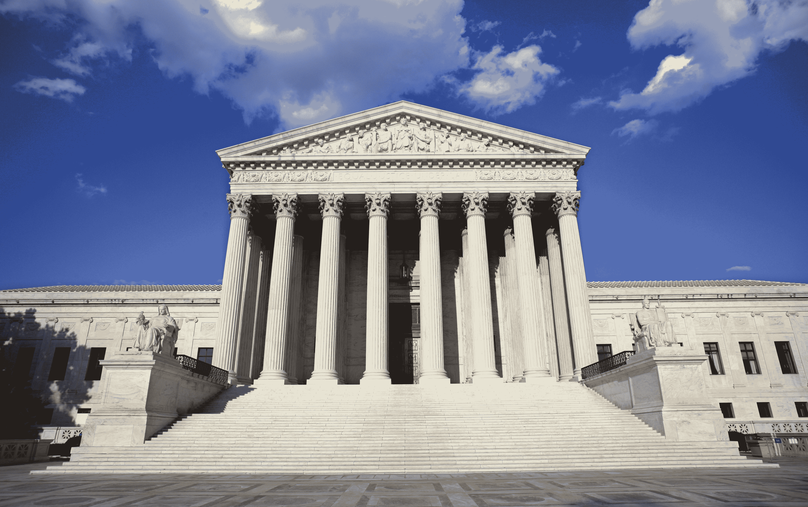
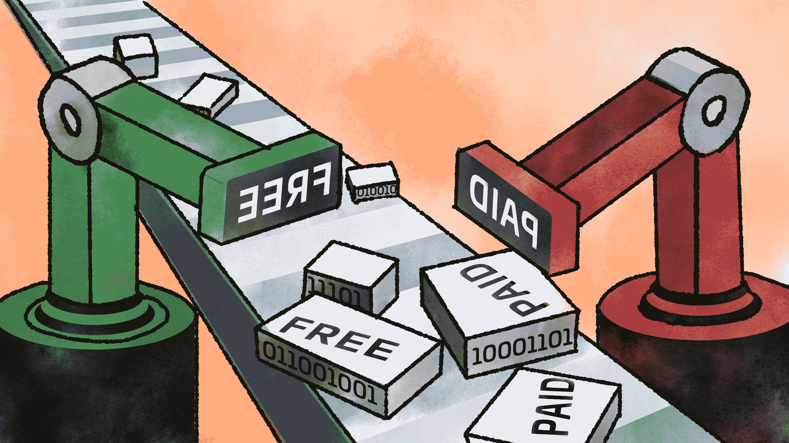

# 联邦通信委员会刚刚废除了网络中立。接下来会发生什么？

> 原文：<https://web.archive.org/web/https://techcrunch.com/2017/12/14/the-fcc-just-repealed-net-neutrality-what-happens-next/>

联邦通信委员会[今天早上投票](https://web.archive.org/web/20230307142250/https://techcrunch.com/2017/12/14/the-fcc-officially-votes-to-kill-net-neutrality/) 废除 [2015 年开放互联网秩序](https://web.archive.org/web/20230307142250/https://techcrunch.com/2017/05/30/commission-impossible-how-and-why-the-fcc-created-net-neutrality/)及其强有力的网络中立规则，代之以一个[深刻(且故意)不正确的技术理由](https://web.archive.org/web/20230307142250/https://techcrunch.com/2017/11/25/fcc-doubles-down-on-its-dead-wrong-definition-of-how-the-internet-works/)。

战斗失败了。战争怎么样了？接下来会发生什么，你可以做些什么来帮助他们。

## 首先，非常少

尽管投票很仓促，但这并没有让政府的其他部门行动得更快。投票采纳该命令不会神奇地立即消除网络中立性。首先，新的规则必须进入联邦登记册——这在一段时间内不会发生，也许是几个月。

与此同时，你会收到大量的博客文章、报纸上的观点文章、演讲、声明、意向通知以及其他任何能让这个话题在公众眼中保持活力的东西。

在此期间，联邦通信委员会将指出，尽管投票通过了新的法规，但互联网并没有变成一个自由竞争的企业。当然没有，因为规定还没生效。他们会指出，公司*可以*在该事件之前开始改变政策或发布公告，但出于我们稍后将讨论的原因，这是极不可能的，即使所述公司确实有邪恶的意图。无论如何，不要被愚弄。

然而，请继续与你们选出的官员接触。他们参与这场斗争——如果他们真的参与的话——只是因为他们的选民表示这场斗争对他们很重要。如果他们认为他们可以几个月不关注，或者选民已经转移到另一个热点问题，他们会很乐意花时间和金钱追求其他东西。不要让这种事情发生。确保他们意识到(并且意识到我们意识到)这个问题不会消失。

## 明年初:大量诉讼

当规则进入联邦登记册时，闸门就打开了。我马上就能想到一些不同的诉讼或挑战，尽管很遗憾我看不到细节。

**1。各州反对先发制人。**新法令包括大量条款，防止各州市制定与联邦法规相抵触的规则或条例。当然，2015 年的订单也是如此——但这有很大的不同。第二章授予联邦通信委员会的权力使其成为一股不可忽视的力量；它可以介入并废除不相容的州法律或惯例。然而，新规则通过恢复联邦通信委员会的第一章，大大减少了它的权限，根据第一章，它多次未能建立或执行宽带规则。如果没有第二章，各州可能会问，你有什么权力来凌驾于我们的法律之上？

**2。武断任性。从第一份草案开始，恢复互联网自由就建立在[对互联网运作方式的大规模曲解之上](https://web.archive.org/web/20230307142250/https://techcrunch.com/2017/11/25/fcc-doubles-down-on-its-dead-wrong-definition-of-how-the-internet-works/)。你可以在这里找到细节，但可以说，当那些真正创造了网络、互联网、加密、网络层和所有这些东西的人说你错了的时候，你可能错了。**

网络中立有可能最终会回到最高法院。

现在，你将听到的是一个有点技术性的问题:最高法院在 2005 年[做出了一个被称为“品牌 X”](https://web.archive.org/web/20230307142250/https://techcrunch.com/2017/05/30/commission-impossible-how-and-why-the-fcc-created-net-neutrality/)的重大决定，确立了一个先例，即在法律有歧义的情况下(如如何定义宽带公司)，法院将遵从由 FCC 等专家机构做出的任何合理解释。

在 2005 年，这是一种方式；2015 年他们走了另一条路；2017 年，他们将回到第一种方式。但它在技术上如何在现在的命令中得到证明是如此明显地错误，以至于它很可能会引起诉讼，指控这些规则可以根据《行政程序法》受到非常可信的挑战，该法禁止“任意和反复无常”的法规。

**3。欺诈性的评论和程序上的诡计。**这有点模糊不清，但笼罩在 FCC 头上的关于其处理系统中数百万条虚假评论的阴云是真实存在的。国会一再要求提供这方面的网络安全信息，纽约司法部长公开表示，他的办公室对在身份盗窃问题上受到该机构的阻挠感到沮丧。

国会可以要求进行独立调查(实际上已经这样做了),在调查结果出来之前，要求不要执行这条规定。同样，纽约 AG 可以起诉(事实上他刚刚宣布他将起诉)联邦通信委员会未能满足允许对其过程进行公平公开评论的要求——即使联邦通信委员会本身没有义务在其决定中参考该评论。

在一些诉讼中，原告可能会要求在诉讼过程中暂停执行新规则；这种“停留”在特朗普的旅行禁令中奏效，但在这里可能不会奏效。这是因为在后一种情况下，有证据表明存在直接和不可挽回的伤害:伊朗或叙利亚的人可能会因为规则受到挑战而失业或受到伤害。网络中立是一个严重的问题，但它可能造成的伤害更加微妙。法官可能不会相信新规则需要被搁置一段时间。

这些只是基本的想法(谢天谢地，我不是律师)，但它们展示了新规则可能受到法律挑战的各种方式。2015 年的命令也受到诉讼，但没有一个做出让步；事实上，让法院反复维护秩序是网络中立支持者争论的关键。

这里也有发生同样事情的风险，但是如果你不玩，你就赢不了。至于最高法院，Gorsuch 的任命可以被认为是进步裁决的一个危险，但有趣的是，著名的保守派已故大法官斯卡利亚提出了最著名的支持将宽带归类为电信的论点。因此，在这些诉讼中，政治结盟可能不像一些人认为的那样起着重要作用。

然而，它将在其他方面发挥重要作用。

## 国会行动

最终，正如许多评论家和联邦通信委员会不时指出的那样，这个问题可能必须通过立法来解决。最终，联邦通信委员会的权威来自国会制定的法律，如果这些法律被修改或被附加，它可能会讨论过去十年或二十年的争论。

当然，2018 年是一个选举年，也是特别重要的一年，原因如下。参议院的多数席位悬而未决，众议院一如既往地待价而沽，尽管共和党在那里有更大的优势。

政治行动自然会分为两部分:选举前和选举后。我不愿猜测选举后会发生什么，因为力量对比可能会发生很大变化。

然而，在准备阶段，在网络中立的话题上将会有强有力的民主党领导，因为他们的选民对此特别有发言权(而且必须保持下去！).

7 月网络中立日行动的一个场景。

他们可能会采取两种策略。首先是利用国会审查法案的可能性，该法案允许国会撤销最近制定的法规，以否决 FCC 的计划；众议员迈克·多伊尔刚刚宣布他将这样做。这是最直接的解决方案，也是共和党国会最近部署的一个方案，目的是废除几项奥巴马时代的法规，包括宽带隐私规则。这一行动尤其不受欢迎，共和党人希望看起来进步，可能会加入民主党的法案。两党会谈将不得不进行——没有两党的共同努力，这是不可能完成的。

CRA 废除恢复互联网自由的法案将对联邦通信委员会的计划造成毁灭性打击，但很可能会完整地保留导致今天问题的立法模糊性。

真正的解决办法是修改 1996 年的电信法。所有这一切的关键部分是该法案第二章下的宽带分类，如果这可以通过立法来完成——只需几句话——这将一劳永逸地结束这些问题。然而，修正一项重大法案不是一个少数党可能会尝试的事情。由于否决权的威胁笼罩着他们，在选出民主党总统之前，这是不太可能实现的。

投票结束后，我与参议员布莱恩·沙茨(D-HI)进行了交谈。他目前的建议很简单:“我们希望国会的每个成员都必须公开表明他们是否同意委员会刚刚做的事情。”

让每个人都支持一方，这使得它成为 2018 年中期选举和 2020 年总统选举辩论的一个明确问题。“我们必须将围绕这个问题的所有愤怒和热情转化为 2018 年的真正选举力量，”他说，呼应了他今年早些时候告诉我的话。“2018 年必须成为网络中立选民的第一年。”

你能找到你选出的官员对网络中立的立场吗？如果没有，发邮件、打电话或发微博问他们为什么没有。

## 互联网服务提供商将等待时机

网络中立规则可能实际上已经死亡，但宽带提供商不愿公开努力利用这一事实有几个原因。

首先，每个人都像老鹰一样盯着他们。互联网服务提供商现在正处于极度的监督之下，既有像联邦贸易委员会这样的监管者(将重新负责他们),也有草根活动家在监视任何不体面的网络行为。对于他们来说，在规则改变后立即改变他们的做法将是虚伪的，因为他们反复强调他们已经遵守了无阻塞、无节流、无付费优先规则。

这并不是说大公司通常会回避一点虚伪，但在这种情况下，这将是有风险的；他们所做的任何事情都可能会在法庭上被用来对付他们。相反，表现出完全不受这一切影响符合他们的利益。

也就是说，他们可能会到处耍花招。您可以通过报告您*看到的任何变化来提供帮助。TechCrunch 将会关注它的[热线](https://web.archive.org/web/20230307142250/https://techcrunch.com/got-a-tip/)。*

其次，真的不能保证这些法规会一直存在。互联网服务提供商强烈支持 Pai 主席的计划，但是任何有头脑的人都能看出重新划分宽带的技术理由是多么的站不住脚。

诉讼、行政挑战或两党立法极有可能推翻这些令人难以置信的不受欢迎的新规定。使用如此不稳定的东西作为任何主要实践的基础是很糟糕的事情，互联网服务提供商很清楚这一点。想象一下，他们需要投入多少时间和金钱来制定一些快车道计划、不被认为是反竞争的节流计划或诸如此类的计划，但几个月后却不得不将其关闭。

不:在这些规则被巩固或取消之前，互联网服务提供商将像过去几年一样继续运营——除了少数例外。

【T2

你可以期待他们恢复一些在过去被认为是边缘的项目。你可以打赌，零评级计划将会蓬勃发展。公司混合服务的情况——例如，康卡斯特的流媒体电视，其本身的电视流量基本上为零——也将获得绿灯。

你将会成为这些实践的目标，仔细观察它们如何工作的细节将会很有趣。普通用户将是在测试市场和定向广告中最先看到这些东西的人，所以如果你看到一些可疑的东西，请让你友好的邻居[科技网站](https://web.archive.org/web/20230307142250/https://techcrunch.com/got-a-tip/)注意到它。

互联网服务提供商还将在农村地区进行一些引人注目的投资和扩张，并把它们归功于新监管计划赋予它们的自由。当然，事实证明这些投资是提前几年计划好的，或者完全不受第二章的影响。但尽管如此，这些公司仍会表现得好像肩上卸下了一大块重担。

基本上，你可以期待宽带提供商(包括移动提供商)在密切关注法院、国会和所有其他机构的同时，安全行事。

## 抓紧了

毫无疑问，这很糟糕。但现实是，网络中立性被取消的影响在一段时间内不会被感觉到，即使如此，其不稳定的地位意味着在可预见的未来，互联网服务提供商不会变得肆无忌惮。

你们现在的角色是司法部长、国会议员和为你们而战的倡导组织的耳目。接下来的几个月将用于准备，接下来的几个月将用于激烈的诉讼——如果我们幸运的话，几个月后，立法。

这次投票就像一年前确定的那样，鉴于激烈的党派分歧，这是一个预料中的结论，但我们没有停止谈论它，也没有让公司和官员承担责任。现在不要停下来。

