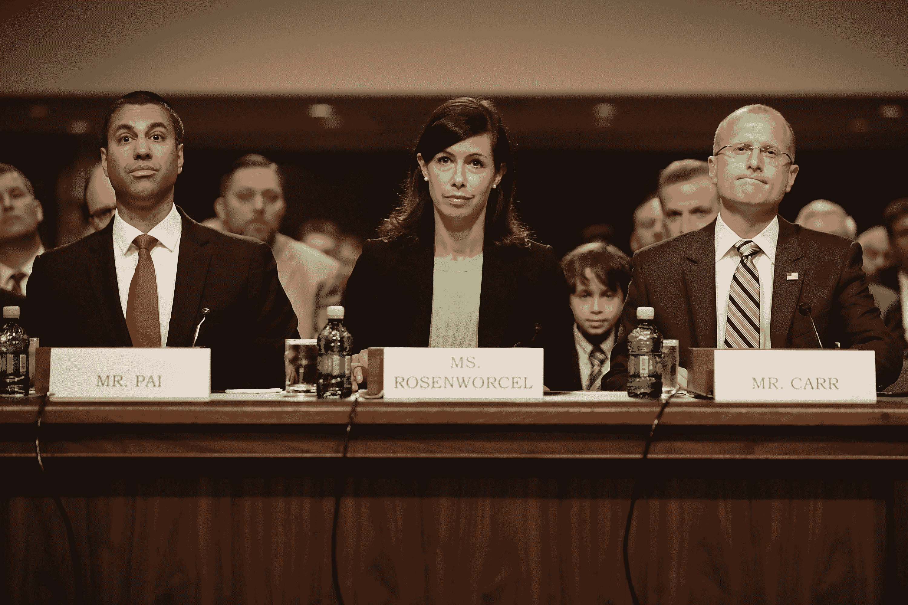
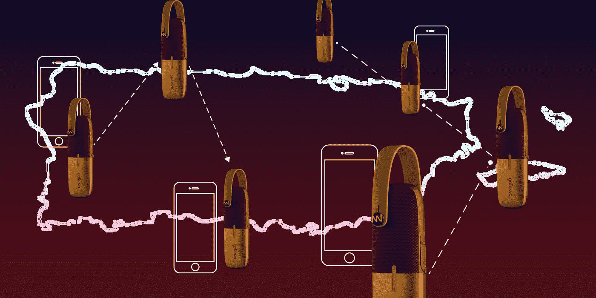

# FCC 透过玫瑰色眼镜回顾灾难性的一年 

> 原文：<https://web.archive.org/web/https://techcrunch.com/2018/01/27/the-fcc-looks-back-on-a-disastrous-year-through-rose-tinted-glasses/>

从去年席卷联邦通信委员会的狂热中，你可能会认为该机构几乎没有取得什么成就，但却为其赞助者电信公司鼓吹隐私并跳舞。但正如政府中经常出现的情况一样，很多事情都是低调进行的，结果却被更具争议性的项目所掩盖。

联邦通信委员会主席 Ajit Pai[公布了一份“成就”清单](https://web.archive.org/web/20221209140414/https://www.fcc.gov/document/chairman-pai-releases-summary-first-year-accomplishments)，这提醒我们许多费力不讨好的项目占据了该机构的大部分时间(并需要其许多员工的大量辛勤工作)，但也提醒我们自选举以来[不断展开的恶意议程](https://web.archive.org/web/20221209140414/https://beta.techcrunch.com/timeline/a-timeline-of-the-fccs-quest-to-destroy-net-neutrality/)。

这样一个听起来可怕的介绍，我应该公平地指出，主席所说的消除宽带鸿沟的优先事项已经得到大力推行。

Pai 报告中列出的第一批项目(实际上是第一批通过的项目)是移动和连接美国基金(Mobility and Connect America funds)，该基金将拨款数亿美元(最终数十亿美元)，具体目标是在服务不足的地区建立高速无线覆盖和固定宽带。1 . 7 亿美元已经被指定用于纽约州北部。

这种认真的行动受到几件事的阻碍。最近，我们了解到，宽带部署行动委员会，表面上是为了这个同名目的而召集的各种各样的人，被电信行业所主导，因此效率低下，圣何塞市长厌恶地离开了它。

他在他的辞职信中写道:“很明显，尽管一些参与者的意图是好的，但 BDAC 以工业为主的结构只会让这个机构沦为推进电信工业利益而非公众利益的工具。”。

宽带部署还勉强避免了一个重大挫折，即移动数据服务应该算作宽带服务，以找出谁有足够的连接，谁没有。当然，这一提议是不可思议的不合逻辑，并且会导致，例如，由 LTE 提供服务，但部署像样的固定宽带很昂贵的市中心社区，被归类为服务充分。幸运的是，这个不明智的想法在数月的公众抗议后被否决了。

当然还有削减生命线计划的压力，该计划帮助穷人和孤立的人支付移动服务和互联网。没有人想要欺诈，该计划处理的是其规模和众多分包商的后果，但正如专员 Rosenworcel 所说，该计划的变化“只会将太多的社区置于数字鸿沟的错误一边”。

罗森沃尔瑟委员在她的听证会上。

继续往下看主席的清单，Pai 提到的扩大远程医疗基础设施的努力当然是值得称赞的，因为连通性在有效和可获得的治疗中越来越重要。

但是，虽然我们可以为该计划本身喝彩，但很难忘记远程医疗在网络中立的辩论中受到了不真诚的对待；废除该法案的支持者认为，网络中立性会在某种程度上干扰医疗数据的传输，因为它与 cat videos 在互联网架构上处于同一水平。这种轻易否定 FUD 的观点是许多其他论点误导性的特征。

Pai 吹嘘他的 20 次旅行与宽带部署有关，当然，当涉及到像这样的本地问题时，有一双靴子在地面上是很好的。但正如持异议的委员们在 12 月的投票中指出的那样，他完全没有去询问普通人对消除网络中立的提议有何看法。一两次市政厅会议可能是一次发人深省的经历，甚至可能改善人们对新规则的看法。

令人费解的是，Pai 还愉快地回忆说，他:“结束了 2016 年对无线运营商免费数据服务的调查。事实证明，这些免费数据计划在消费者中很受欢迎，尤其是低收入的美国人，并且增强了无线市场的竞争。"

首先，谁会祝贺该机构放弃一项调查(顺便说一下，是几项调查中的一项，这是它的职责所在)？尤其是当这些计划被故意曲解的时候？考虑到这些计划是选择退出，而不是选择加入，它们的受欢迎程度几乎没有关系。许多消费者可能不知道他们正在使用一个。不仅如此，这些零评级的做法听起来无害[，但基本上是优先支付 lite](https://web.archive.org/web/20221209140414/https://beta.techcrunch.com/2017/04/16/wtf-is-zero-rating/) 。

当然，关于撤销 2015 年网络中立规则的决定在通常的话题中得到了突出的提及。[我们已经详细报道了这场灾难。](https://web.archive.org/web/20221209140414/https://beta.techcrunch.com/tag/net-neutrality-vote/)

在“保护消费者”的标题下，Pai 提到了一些针对手机短信和误导性计费的有效措施——全国数百万人经常会遇到这种情况。

奇怪的是，联邦通信委员会和国会共同努力[将一套强大的新隐私法规扔进垃圾堆](https://web.archive.org/web/20221209140414/https://beta.techcrunch.com/2017/03/29/everything-you-need-to-know-about-congress-decision-to-expose-your-data-to-internet-providers/)并没有出现在主席的名单上。也许他忘了那个。

美国残疾人没有被遗忘，他们努力改善与助听器相关的法规，提高主要由聋人使用的视频转播服务以及为盲人提供的视频内容的质量和可用性。但很少有人关注监狱电话和围绕这一有利可图的业务建立的敲诈勒索的持续丑陋。

2017 年纽约 TechCrunch Disrupt 的联邦通信委员会委员米农·克莱伯恩

值得注意的是，所有这些都是克莱伯恩专员(如上)的优先事项。当我问她对本届政府联邦通信委员会第一年的工作有何看法时，她给出了以下声明:

> 在本届政府的第一年，我很高兴主席推进了我的几个优先事项，包括流动基金第二阶段、Connect2Health 和增加盲人或视障人士可获得的视频节目数量。与此同时，毫无疑问，在这位主席的领导下，联邦通信委员会的大多数成员已经批准了十几项直接针对消费者和小企业的行动，包括废除网络中立、取消宽带隐私保护和取消关键媒体所有权规则。正是这些反消费者行为最能说明该机构的发展方向。

主席自豪地确立了一项规则，即在表决前三个星期向公众提供将要表决的项目。这无疑是一个进步，尽管在此期间及之后进行编辑时可能会[导致误解](https://web.archive.org/web/20221209140414/https://beta.techcrunch.com/2018/01/02/the-fcc-is-still-tweaking-its-net-neutrality-repeal-but-thats-normal/)。

但与掩盖更重要的事情相比，这种程度的透明度增加看起来微不足道，比如在恢复互联网自由评论期间遭受的网络攻击的性质，或者提交的大量虚假评论。幸运的是，国会和近 24 名司法部长正在调查此案。再说一次，透明度是亲身经历过的最好的东西，当涉及到网络中立规则时，它的提议者避免了这一点。

Pai 对 FCC 对波多黎各在异常强烈的飓风季节后持续广泛的连接中断做出了很大的反应。事实上，它最终访问了该岛，并为运营商拨款 7700 万美元，以帮助恢复那里和美属维尔京群岛的服务。

但很少有人会说联邦通信委员会是成功的，甚至履行了自己的职责。我已经与恢复人员和在那里努力重建通讯的[人员交谈过，他们大多已经放弃了及时获得联邦援助的希望。撇开总统的许多失态和外交失误不谈，联邦通信委员会的反应还有很多不足之处，灾难发生几周后，超过一半的人仍然没有联系上。](https://web.archive.org/web/20221209140414/https://beta.techcrunch.com/2017/11/14/a-mesh-network-spontaneously-erupts-in-the-us-and-helps-connect-puerto-rico/)

由于基础设施修复进展缓慢，一些公关人员转向网状网络

当然，这不能完全归咎于联邦通信委员会，但将一个太少、太迟的回应作为一项“成就”来强调似乎是不真诚的。

与此同时，该机构向主要的有线电视和宽带提供商示好，做出了一系列被伪装成“使过时的法规现代化”的决定。

在媒体资产前所未有的整合时期，以及由此带来的许多明显和微妙的风险，联邦通信委员会决定，它应该放宽对多个新闻资产所有权和媒体公司全国覆盖范围的管理规则。像往常一样，这条规则的年龄被引用，Pai 发现它已经“过时了”Rosenworcel 委员强烈反对:

这个机构没有进行我们应该进行的深思熟虑的改革，而是点燃了它最基本的价值观。他们走了。这一决定的结果是，无论你住在哪里，联邦通信委员会都允许一家公司在你的社区拥有报纸和多家电视台和广播电台。我很难在结果中看到任何对多样性、地方主义或竞争的承诺。

事情已经到了这种地步，国会议员们直截了当地质问联邦通信委员会是否在让一家大型媒体公司 Sinclair 受益，而让本地媒体和消费者付出巨大代价。

这篇文章绝不是 FCC 在过去一年中所做事情的完整列表，无论是好的还是坏的，善意的还是恶意的。我想说明的是，这一年确实取得了许多小成就——但不仅更多的重大努力和趋势是反消费者的，而且公众对该机构的信任也受到了极大的侵蚀。

在 2015 年之前，很少有美国人对 FCC 有太多了解，或者认为它对他们的日常生活有很大影响(尽管即使在那时也是如此)。但是网络中立让它在地图上大放异彩——而且是一种很好的方式，当然除了在电信行业的盟友中。

2017 年，联邦通信委员会将这种存在降低到了令人沮丧的程度，数百万美国人感到被忽视或被积极反对，一个曾经以悄悄实现其目的而闻名的机构变成了党派和企业利益的跟踪马。