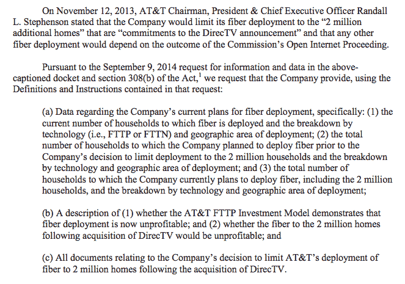

# FCC 回应美国电话电报公司的网络中立威胁 

> 原文：<https://web.archive.org/web/https://techcrunch.com/2014/11/14/the-fcc-responds-to-atts-net-neutrality-saber-rattling/>

# 联邦通信委员会回应美国电话电报公司的网络中立威胁

美国电话电报公司[本周早些时候](https://web.archive.org/web/20221005154219/http://www.reuters.com/article/2014/11/12/us-at-t-regulations-internet-idUSKCN0IW1JC20141112)宣布，它将“[暂停](https://web.archive.org/web/20221005154219/http://www.fierceenterprisecommunications.com/story/its-war-att-ceo-suspend-broadband-buildout-claims-fccs-wheeler-his-side/2014-11-13)几十个城市的光纤互联网连接部署，因为可能实施的严格的网络中立规则可能会导致市场的不确定性。总统最近[在辩论](https://web.archive.org/web/20221005154219/https://beta.techcrunch.com/2014/11/10/the-fcc-fires-back-at-the-presidents-net-neutrality-plan/)中呼吁根据第二章对宽带进行重新分类，引起了骚动。

来自美国电话电报公司的消息称，它将停止在当前开放的互联网废料上铺设新的光纤连接，这是自我面对预言成真的一个鲜明例子。*惊喜*，在同一个公司[做出关于自己的预言](https://web.archive.org/web/20221005154219/https://beta.techcrunch.com/2014/11/10/the-presidents-net-neutrality-proposal-draws-opprobrium-praise-and-threats-of-legal-action/)后，一个公司推动的公司叙事实现了。

你几乎可以相信。

进入联邦通信委员会。在今天发送给 AT & T 的一封[信中，联邦通信委员会调查了这家电信公司到底发生了什么变化——经济中的什么出了差错？以下是关键摘录:](https://web.archive.org/web/20221005154219/http://transition.fcc.gov/Daily_Releases/Daily_Business/2014/db1114/DOC-330489A1.pdf)

其中的要点不难解析:联邦通信委员会想知道有多少推广受到限制，哪些新的经济学正在改变商业决策，以及这对美国电话电报公司提议的 DirecTV 交易有何影响。

美国电话电报公司已经承诺做出回应。

如果美国电话电报公司能够拿出像样的论据，证明其对新光纤*的投资实际上受到了可能转向严格的网络中立法规的威胁，那么我们就有了新的前景。相反，该公司迄今为止的评论一直保持谨慎——[谁知道会发生什么](https://web.archive.org/web/20221005154219/http://www.fierceenterprisecommunications.com/story/its-war-att-ceo-suspend-broadband-buildout-claims-fccs-wheeler-his-side/2014-11-13)！我不确定联邦通信委员会将会发现这种论点有多有说服力。*

与此同时，联邦通信委员会并没有给新的叙事创作留下多少空间。在& T 很乐意展示一个它的朋友们可以大肆宣扬的案例:我们说过网络中立将会冷却投资，而且，让我大吃一惊的是，*看*！如果 AT & T 不能很好地论证，整个前提可能会蒸发，限制开放互联网对商业小说是不利的。