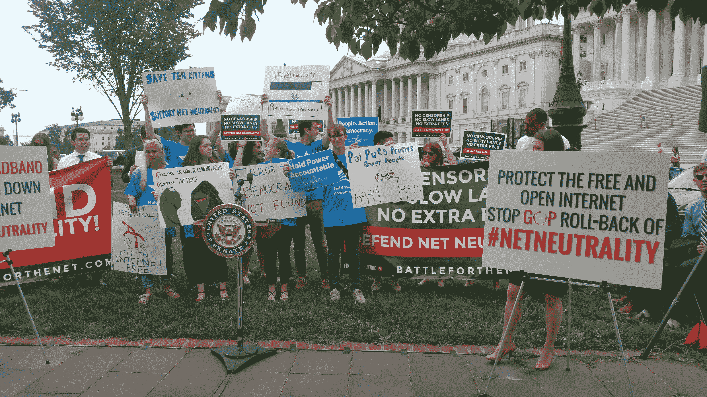

# FCC 的克雷文网络中立投票公告没有提及提交的 2200 万条评论 

> 原文：<https://web.archive.org/web/https://techcrunch.com/2017/11/21/the-fccs-craven-net-neutrality-vote-announcement-makes-no-mention-of-the-22-million-comments-filed/>

对于一个声称为美国人民工作的人来说，FCC 主席 Ajit Pai 肯定不在乎他们要说什么。在他今天宣布委员会将于 12 月 14 日投票决定是否撤销网络中立规则时，他没有提到一个不方便且尴尬的事实，即他的提议已经引起了历史性的关注，获得了超过 2200 万条评论——其中大多数都反对。

该声明五次提到让消费者受益或保护消费者，因此很明显，这里的想法是帮助互联网服务的用户。然而，数百万的消费者写信给主席说，他们觉得现有的规则很好地保护了他们，取消这些规则会损害他们的安全和隐私。

就像今年早些时候,[取消宽带隐私条例](https://web.archive.org/web/20221207132734/https://beta.techcrunch.com/2017/03/29/everything-you-need-to-know-about-congress-decision-to-expose-your-data-to-internet-providers/)将他们的安全和隐私置于风险之中一样。奇怪的是，主席当时也不听抗议。

事实上，反应如此强烈，以至于 FCC 不得不升级其备案系统，然后[延长了意见征询期](https://web.archive.org/web/20221207132734/https://beta.techcrunch.com/2017/08/11/fcc-adds-2-weeks-to-comment-period-for-the-proposal-to-eliminate-net-neutrality-rules/)，以容纳大量的意见。

从技术上讲，联邦通信委员会在提出规则时没有义务将公众评论纳入考虑范围，这是 Pai 和其他官员不断重复的。事实上，就在今天上午，在一次媒体电话采访中，委员会的一名代表说,“没有给记录带来新的事实，而只是陈述一种观点……的评论对决定没有多大影响”,这就等于说数百万人表达的立场无关紧要。

但是这将是一个极好的机会来解决数百万条虚假评论，国会指控欧盟委员会对网络安全管理不善，行业偏袒的指控，以及其他问题。当然，如果能听到主席承认公众参与的空前程度，那也是值得的。

相反，主席的声明重复了他的提议的老生常谈的理由，从[有问题的](https://web.archive.org/web/20221207132734/https://beta.techcrunch.com/2017/04/27/the-fccs-anti-net-neutrality-proposal-is-a-giant-question-mark/)到[误导](https://web.archive.org/web/20221207132734/https://beta.techcrunch.com/2017/08/06/10-members-of-congress-rake-fcc-over-the-coals-in-official-net-neutrality-comment/)到[彻头彻尾的错误](https://web.archive.org/web/20221207132734/https://beta.techcrunch.com/2017/05/23/the-fccs-case-against-net-neutrality-rests-on-a-fundamental-deliberate-misunderstanding-of-how-the-internet-works/)。(我在这里收集了[论点和反论点](https://web.archive.org/web/20221207132734/https://beta.techcrunch.com/2017/05/19/these-are-the-arguments-against-net-neutrality-and-why-theyre-wrong/)。)

Pai 写道，2015 年的规定“抑制了建设和扩大宽带网络的投资，阻碍了创新。”

事实上，这些数字在这方面远非决定性的，许多行业专家和 ISP 自己都表示，网络中立规则与投资变化无关——相反，它们遵循更新基础设施、适应 5G 等技术变化的长达数年的周期。

即使这些数字确实显示出轻微的变化，也不能证明这些规则不起作用。正如几位实际参与 1996 年《电信法》工作的代表所写的那样(所有这些都是在该法的授权下进行的):

> 该提案只专注于一个问题，而排除了所有其他问题:网络部署的原始费用。这种狭隘的关注显然违背了公众利益——如果我们打算将网络投资作为 FCC 决定政策的唯一衡量标准，我们就会明确地将这一点写入法律。

Pai 也称这些规则是“失败的”,但他没有引用任何可以被认为是失败的标准。也许他已经从总统那里继承了这个习惯。

他称之前缺乏基于第二章的网络中立规则是“长期共识”但两者都不是。[事实上，自 2002 年](https://web.archive.org/web/20221207132734/https://beta.techcrunch.com/2017/05/30/commission-impossible-how-and-why-the-fcc-created-net-neutrality/)以来，网络中立规则就一直在法院内外出现，联邦通信委员会和各种行业在“信息服务”和“电信服务”的构成上存在根本分歧，这是这场冲突的核心二分法。

他所说的“共识”是，电信行业将网络中立置于法律控制模式已有十多年。值得注意的是，他没有提到美国人民目前压倒性的一致支持 2015 年规则。

 声明称，新规则将“简单地要求互联网服务提供商对他们的做法保持透明，以便消费者能够购买最适合他们的服务计划。”其他委员对让互联网服务提供商经营荣誉系统的想法并不热衷。今年早些时候，当我采访专员克莱伯恩时，她向观众保证这是一个糟糕且相当幼稚的想法。更不用说互联网服务提供商已经报告了这些信息，今年早些时候联邦通信委员会拒绝要求进一步披露用户信息的使用情况。

Pai 和他的同事们在推销这一提议时如此不努力也就不足为奇了。12 月 14 日的投票是一个既成事实，几乎被委员会目前的党派构成所保证:三名共和党人赞成，两名民主党人强烈反对。讽刺的是，Pai 一再批评 2015 年的秩序是由“党派投票”建立的，但没有提到他的提案将以完全相同的方式制定。这种小小的虚伪与它的同行相比几乎不算什么，但是值得一提。

最后，主席 Pai 吹嘘在投票前三周向“美国人民”发布了“恢复互联网自由”的草案版本，这是一个他从未厌倦吹捧的过程中的变化。

但是不清楚他期望“美国人民”如何处理它。评论一下？数百万人已经这么做了，他却无视他们。

【T2