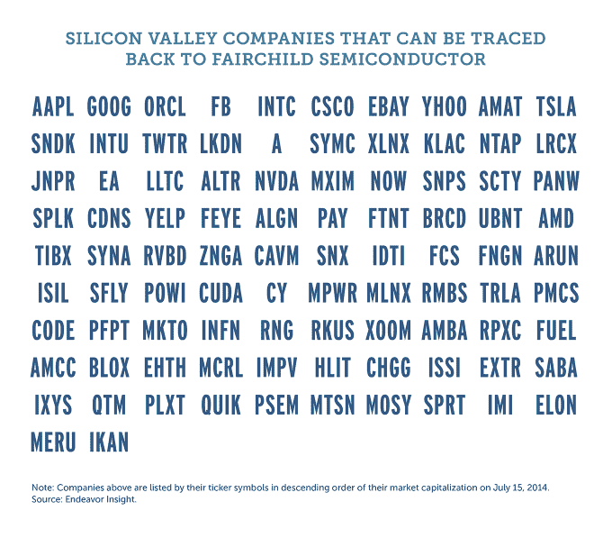

# 第一个万亿美元的创业公司

> 原文：<https://web.archive.org/web/https://techcrunch.com/2014/07/26/the-first-trillion-dollar-startup/>

More posts by this contributor

**编者按:** *瑞德·莫瑞斯是奋进洞察的主管，奋进洞察是一家支持 20 个国家 900 多名企业家的非营利组织[奋进](https://web.archive.org/web/20230406214425/http://endeavor.org/)的研究部门。他在这里编辑关于创业生态系统的博客和每月时事通讯。*

1957 年，八个企业家决定做一件看起来很疯狂的事情。他们在旧金山南部的一个小镇创办了一家名为[仙童半导体](https://web.archive.org/web/20230406214425/http://www.fairchildsemi.com/)的新科技公司。企业家们起步艰难，但 Fairchild 最终成为该地区第一家大型计算机芯片公司。

尽管许多人都熟悉飞兆半导体的成功，但很少有人知道其影响的全部程度。去年，我们在 [Endeavor Insight](https://web.archive.org/web/20230406214425/http://www.crunchbase.com/organization/endeavor) 的团队追踪了飞兆的故事，并收集了有趣的新数据。我们发现了一些非常令人惊讶的事情:如果飞兆创造的价值以今天的美元来衡量，我们相信该公司将有资格成为世界上第一个万亿美元的初创公司。

**飞兆的发布和早期成功**

当你考虑 Fairchild 联合创始人的成就时，你会发现他们的成就更加令人印象深刻。旧金山湾区现在是一个繁荣的科技中心，但在 20 世纪 50 年代中期，它是一个非常不同的地方。当时，该地区没有风险资本投资者。斯坦福大学没有对计算机芯片组件进行任何重大研究，移民只占人口的一小部分。

如下图所示，在构成早期计算机芯片产业的晶体管公司的发展方面，旧金山地区远远落后于美国其他城市。没人想到该地区会成为这些科技企业的中心。

飞兆半导体的八位联合创始人中，有七位最近从晶体管公司和投资者较多的城市搬到了旧金山地区。其中三位企业家——杰伊·拉斯特、鲍勃·诺伊斯和谢尔登·罗伯茨——在波士顿的麻省理工学院获得了博士学位。尤金·克莱纳和朱利叶斯·布兰克是纽约市的工程师，吉恩·霍尔尼和戈登·摩尔曾在洛杉矶附近的加州理工学院工作。(最后一位联合创始人维克多·格里尼希(Victor Grinich)曾是斯坦福大学的研究员和博士生。)

他们利用自己在这些城市的专业网络，找到了两个关键的支持者，帮助他们筹集资金，并与第一个客户签订了合同。这些联系使他们走上了成功之路。仅仅三年后，Fairchild 的年收入就超过了 2000 万美元。到 20 世纪 60 年代中期，该集团发明了一种新产品，集成电路，并产生了 9000 万美元的年销售额。然而，这仅仅是两位创始人成就的开始。

**仙童谷**

随着 Fairchild 开始成长，员工开始离开公司去开展新的衍生业务。这些公司中的许多也发展迅速，鼓舞了仍在公司工作的其他员工。

一位前经理回忆道:“你让这些人离开并创办公司，而这些公司还在运转、工作。”。“你环顾四周，照照镜子，然后说，‘嗯，你知道，你怎么样？“你打算怎么办，”"

八位联合创始人支持了许多这样的新企业。凯鹏华盈鼓励一名员工创办一家公司，生产飞兆半导体制造过程中使用的玻璃组件。诺伊斯在当地电子设备制造商[应用材料](https://web.archive.org/web/20230406214425/http://www.appliedmaterials.com/)的董事会任职，并指导该公司年轻的创始人。

没过多久，飞兆的企业家们就开始创建自己的衍生公司。“创办这家公司并看着它成长的经历——我想我还想再做一次，”拉斯特回忆道。1961 年，他与飞兆的三位联合创始人合作创建了 Amelco，这是一家生产专用设备的新公司。其他两位联合创始人，摩尔和诺伊斯，几年后离开飞兆创立了计算机芯片公司英特尔。

这八位联合创始人还将他们的资本再投资到一些新的本地创业公司。1961 年，他们中的四个人帮助资助了海湾地区的第一家风险投资公司。另一位创始人提供了资金，帮助一名前雇员创办了[和](https://web.archive.org/web/20230406214425/http://www.crunchbase.com/organization/amd)。当摩尔和诺伊斯创办英特尔时，其他六位联合创始人帮助为新业务提供资金。

这些新公司的成长开始重塑该地区。在短短 12 年间，飞兆的联合创始人和前员工创建了 30 多家分拆公司，并投资了更多公司。到 1970 年，旧金山地区的芯片企业总共雇用了 12，000 人。

“这是飞兆的遗产的一部分，可能没有得到应有的关注，”摩尔说。“每次我们想出一个新点子，就会有两三家公司尝试利用它。”

这些公司的成就最终引起了关注。1971 年，一位名叫唐·霍夫勒的记者写了一篇关于湾区计算机芯片公司成功的文章。他所描述的公司都使用硅生产芯片，并且位于旧金山南部的一个大山谷。霍夫勒将这两个事实结合在一起，为这个地区创造了一个新的名字:硅谷。

Hoefler 的文章和他创造的名字变得非常有名，但他的分析中有一个关键部分经常被忽略:他描述的几乎所有硅芯片公司都可以追溯到 Fairchild 及其联合创始人。

**增加飞兆的影响**

在 Hoefler 的文章发表后的几年里，Fairchild 的成功继续推动着硅谷公司的发展。当史蒂夫·乔布斯在 20 世纪 70 年代开始他的职业生涯时，他经常骑着摩托车去诺伊斯家，花上几个小时听取这位老企业家的建议。据诺伊斯的妻子说，乔布斯还有一个独特的习惯，就是在午夜时分给他们家打电话。苹果的第一个投资者也是前飞兆员工。

> 可以追溯到 Fairchild 的 92 家上市公司现在价值约 2.1 万亿美元，超过加拿大、印度或西班牙的年度 GDP。

1972 年，凯鹏华盈共同创立了风险投资公司凯鹏华盈，该公司投资了数百家公司，包括谷歌和赛门铁克。在凯鹏华盈创办凯鹏华盈的同时，一位名叫 T2·唐·瓦伦丁的前飞兆高管正在创办另一家名为红杉资本的风险公司，该公司也投资了数百家公司，如思科和 LinkedIn。

这两家公司资助的许多公司都是由企业家和高管领导的，他们后来成为了重要的投资者。像[太阳微系统](https://web.archive.org/web/20230406214425/http://www.oracle.com/us/sun/index.html)、网景和贝宝这样的公司催生了投资公司，如科斯拉风险投资公司、安德森霍洛维茨公司、方正集体公司和 500 家创业公司。

我们在 Endeavor Insight 的团队最近致力于量化飞兆半导体及其联合创始人的影响。我们确定了 130 多家在纳斯达克或纽约证券交易所交易的湾区科技公司。我们的分析表明，这些公司中大约 70%可以直接追溯到飞兆的创始人和员工。

这些业务的总体影响是惊人的。可以追溯到 Fairchild 的 92 家上市公司现在价值约 2.1 万亿美元，超过加拿大、印度或西班牙的年度 GDP。这些公司还雇用了 80 多万人。

如果我们不局限于上述上市公司，飞兆的影响会更大。总的来说，我们可以追踪 2000 多家公司，追溯到公司的八位联合创始人。这包括 Instagram、Palantir、Pixar、Nest、WhatsApp、Yammer 和 YouTube 等公司。

Fairchild 的故事说明了企业家如何重塑他们的当地社区。当成功的创始人创建新的衍生公司、指导他人并充当早期投资者时，新一代企业家的机会就会增加。成功的创业者向新公司再投资的智力、社会和金融资本强化了当地的企业家群体，并使成功的中心(如最初的硅谷)得以发展。

飞兆半导体在纳斯达克交易，市值约为 20 亿美元。然而，公司的全部价值只能通过追踪公司的成功被再投资到新的创始人和公司的方式来衡量。以此衡量，Fairchild 是硅谷第一家价值万亿美元的初创公司。它甚至可能是过去一百年中最重要的创业公司。

这篇文章是 Endeavor Insight 在 Omidyar Network 的支持下撰写的一份新报告的浓缩和摘录。有关飞兆半导体的成长及其创始人的影响的更多详细信息，您可以下载题为“硅谷是如何成为硅谷的？”[此处](https://web.archive.org/web/20230406214425/http://www.endeavor.org/blog/new-endeavor-insight-report-analyzes-the-source-of-silicon-valleys-development/)。