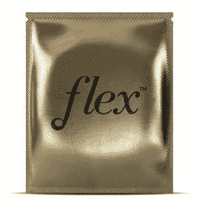

# Flex 是一种卫生棉条替代品，你可以在做爱时佩戴 

> 原文：<https://web.archive.org/web/https://techcrunch.com/2016/03/31/the-flex-company/>

# Flex 是一种卫生棉条替代品，你可以在做爱时穿

如果你在经期做爱，事情会变得一团糟，所以许多夫妇会避免这样做。但是 Flex 公司希望用一种光滑的圆盘状血液阻挡器来取代过时的卫生巾和卫生棉条。做爱时可以穿 Flex，防止弄得一团糟。

弹性光盘是一次性的，可以佩戴长达 12 小时，甚至有一个时尚的小包装。他们是医生批准的低过敏性，不含 BPA，不会引起中毒性休克综合症。

Flex 将于 4 月开放预购，9 月发货。已经有 2 万人报名尝试了。最终它们可以在商店出售，尽管价格尚未公开。现在，你可以在 Flex 公司的网站上注册免费样品。

“Flex 非常舒适，以至于女性告诉我们，当她们穿着它的时候，她们会忘记自己正在例假，”首席执行官劳伦·舒尔特说。

Flex 直到 8 月份才计划其大规模媒体推广，但我认为它是 Y Combinator 创业加速器的虚拟演示日的突出公司。这家[公司由 Amplify.LA 资助](https://web.archive.org/web/20221218040807/https://www.crunchbase.com/organization/the-flex-company)

在她的推销中，Flex 的 Schulte 解释说:“我们已经开发出一种产品，可以让夫妇增加 23%的性生活机会。人们在经期避免性生活的最大悲剧在于，这确实是女性最想要性生活的时候。”

这就是为什么它 25%的试用注册来自男性！

虽然 TechCrunch 的女作家不喜欢 Flex 的营销依赖于经期太长的想法，但有些人说她们会尝试一下。Flex 将不得不与 SoftCups 竞争，soft cups 是一个销售良好的品牌，拥有类似的产品，尽管它并不关注便携性或性。

