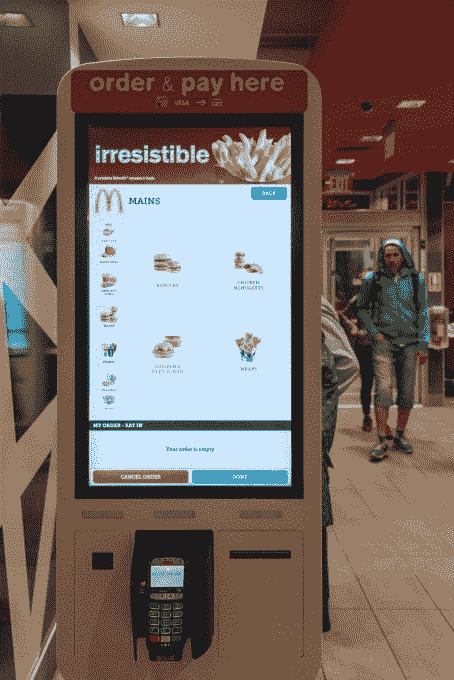

# 通往奇点的路上发生的趣事 

> 原文：<https://web.archive.org/web/https://techcrunch.com/2016/04/09/the-funny-things-happening-on-the-way-to-singularity/>

More posts by this contributor

人们经常问我 3D 打印对工作的影响。技术将会是工作的创造者还是破坏者？简而言之，它将带来更多的工作岗位——3D 打印是 [而不是单独的](https://web.archive.org/web/20221209225224/http://www.techinsider.io/obama-warns-congress-about-robot-job-takeover-2016-3) 。

技术最终会让工作过时。我们的大问题将是弄清楚如何度过过渡期，然后弄清楚如何利用这些空闲时间。

## 奇点

大约 10 年前，发明家、未来学家、现谷歌工程总监雷·库兹韦尔(Ray Kurzweil)接受了“奇点”的概念——即机器智能超过人类智能的时刻。库兹韦尔预测奇点将在 2045 年出现，人和机器将变得不可分。

鉴于大多数人与智能手机的关系，你可以说这种情况已经发生了。

对大多数人来说，奇点会让人联想到两个主题中的一个:一些人想象一个类似终结者的世界，在那里机器处于控制之中；其他人有一个更乌托邦的愿景，机器人做所有的工作，而人们享受其他更放松的追求。

两者都是截然不同的可能性；哪种情况会出现取决于我们。

## 透明度

谁不想要更多的透明度呢？如果政府、宗教、企业和其他人诚实的话，生活会变得容易得多。想象一下，如果美国政府国家档案馆或梵蒂冈图书馆的大门敞开着，我们会了解到什么。比我们今天知道的多得多，这是肯定的。

但是秘密的存在是有原因的。他们对国家、教派和其他保护他们的组织来说是一种优势。对个人来说，它们甚至更有价值。它们让我们投射出一个不同于真实自我的形象。

在奇点时代，这些真的重要吗？

计算能力持续增长。摩尔定律表明，处理速度每 18 个月翻一番。但是，还有一个指数级的 [影响](https://web.archive.org/web/20221209225224/http://www.singularity.com/charts/page17.html) 。

我们用这些能量做什么？过去，DNA 测序需要数年的工时，成本高得惊人。看看过去 15 年发生了什么

[graphiq id="7lW9Znz6F2B" title= "一段时间内每个基因组的成本" width = " 600 " height = " 555 " URL = " https://w . Graphiq . com/w/7 lw9 znz 6 f2b " link _ text = "一段时间内每个基因组的成本| Graphiq " link = " https://www . Graphiq . com/WLP/7 lw9 znz 6 f2b "]

量子技术的进步可能会推动我们超越目前的速度。但是这些和透明度有什么关系呢？

计算机技术正在发展到很快就很难保守秘密的地步。不仅在更多的地方收集了更多的数据，而且查找、索引和处理所有这些信息所需的算法也在不断改进。

那些数据正被用在各种 [有趣的方面](https://web.archive.org/web/20221209225224/http://bgr.com/2015/12/17/microsoft-crime-prediction-app-minority-report/) 。它不仅允许警察识别潜在的犯罪和其他高风险事件，还可以帮助预测这些犯罪将在何时、何地以及如何发生。

但是在什么时候，技术会从预测变成诱捕，或者更糟，变成自我实现的预言？

## 我们的界限在哪里？

一些世界上最聪明的人，包括比尔·盖茨和埃隆·马斯克，认为人工智能有可能对人类非常有害。

斯蒂芬·霍金绝对属于终结者阵营。在最近的一封信中，他写道

人工智能技术发展到能够部署能够“暗杀、破坏国家稳定、征服人口和选择性杀死特定族群”的自主武器，“只是时间问题”

这不是普通的末日预言家，这是史蒂芬·霍金！

## 更好的数据带来更好的诊断

无论智能是人类的还是人工的，它都始于对数据的访问。例如，如果目标是针对一个特定的群体，那么首先需要确定这个群体。遗憾的是，有了网上的所有数据，这可能相对容易些；具有讽刺意味的是，其中大部分是通过社交媒体自我报道的。

> 机器会比我们更擅长数学、科学和工程。

但是考虑另一种情况。假设你真的病了，去了急诊室。医院用人工智能来诊断你的症状。机器会实时扫描你的 DNA，查看你的病史，分析你的生命体征。

人工智能可以更快更准确地诊断问题。此外，医生工作时间疯狂，平均每周看 80 个病人。机器永远不会累。

如果你的生命危在旦夕，你会希望机器访问你的私人信息吗？在上述任何一种情况下，都可能已经太晚了。

## 隐私问题

隐私和透明之间的斗争仍在继续。加密，网络中立和其他相关问题是每天的新闻。但如果是战争，我们就像双重间谍——我们站在哪一方。

物联网是 [下一个前沿](https://web.archive.org/web/20221209225224/http://www.latimes.com/business/la-fi-lazarus-20160115-column.html) 。越来越多的智能设备——从手机到汽车、电视和冰箱——被制造出来并销售给消费者。音高是方便。

考虑 Nest 恒温器。消费者购买它们，这样他们就可以更精确地控制家里的温度——他们可以通过一个应用程序远程控制。但是那个恒温器是一个传感器，它连接到互联网，共享它的数据。

至少在这种情况下，我们愿意为了自动化的便利而放弃一些隐私。但是透明真的是一种好处吗？

想象一下，如果我们的能源使用完全透明。虽然这可能会对整体消费产生积极影响，但也可能会造成一些非常奇怪的情况。想象一下，和你的朋友打高尔夫球，他说，“昨晚我看见你把恒温器调到 65 了。你知道，如果你把它设置为 70 或 72…”这是正确的时间，你威胁要用你的 5 号铁杆打他。

## 自动化的盈亏平衡点

“你可以用劳动杀死它，也可以用技术杀死它。”这是我在职业生涯中说过很多次的一句话，我应该把它印在我名片的背面。

然而，大多数人不明白的是，总有一个盈亏平衡点——我指的是一个具体的数字——当用技术杀死它更有意义的时候。

几年前，我在 2D 的一家印刷公司工作。他们的销售额在增长，但是遇到了一个共同的瓶颈:订单管理。这就是它是如何解决的。他们开了个会，问客服他们每天能处理多少订单。客服经理说，她坚持审查工厂的每一份订单。销售经理问她每天能审查多少订单。她说:“30 左右。”销售经理转向首席执行官说:“太好了，我去告诉销售人员一天不要接超过 30 个订单。”

三十是个数字。不久之后，他们实现了自动化。

这也不仅仅是软件的事情。硬件决策也是如此。在数字化之前，2D 印刷过程通常包括 30 多个步骤，需要 20 名不同的人员。效率很低。

> 你可以用劳动杀死它，也可以用技术杀死它。

当人们开始按需印刷时，订单数量开始减少。关于是否购买数字印刷机的决定归结为一个数字。当打印店的平均订单价值下降到一定数量时，他们再也承受不起低效率了。他们必须采取行动。

金额为 500 美元；当他们的平均订单规模下降到这一水平以下时，他们就自动化了。

要做到这一点，他们需要精简的流程、更好的技术和更少的人员。在某些情况下，数字硬件和软件的结合有助于将打印过程减少到四个步骤，只需一个人就可以完成。

不仅仅是印刷业。快餐工人要求更高的工资，快餐店开始尝试自助服务亭。

加拿大安大略省多伦多市央街(YONGE STREET)——2015/05/27:技术入侵商业以拯救工作岗位:安装在一栋大楼里的麦当劳自助点餐亭。(照片由 Roberto Machado Noa/LightRocket 通过 Getty Images 提供)

许多人会认为每小时 15 美元是个合适的数字。除此之外，他们将自动化。

## 用科技杀死它

理论上，每个人都懂。但是当解雇通知书开始流动时，事情就变得私人化了。

随着印刷业从“用劳动杀死它”转向“用技术杀死它”，成千上万的工作岗位消失了抵制转型的公司灭亡了。该行业合并，因此，今天有少得多的打印店。

那些留下来的人被迫变得更有生产力。

员工更少的商店，以更高的生产力运营。聪明的人甚至开始衡量他们的进步。

假设你是一家拥有 50 名员工、价值 1000 万美元的商店。每个员工的平均生产率是 20 万美元。你如何改进？雇佣更好的人，提供更好的培训，改进业务流程，尽可能利用技术。结果，也许你实现了 300，000 美元的生产率。

如果你成功了，你可以在不增加人手的情况下增长到 1200 万美元！或者，您可以用少 12 名员工来满足当前的业务。

## 我们都被自动化了

考虑一下卡车运输行业。自动驾驶汽车可能很快会产生巨大影响。与由人驾驶的钻机相比，使用自动驾驶卡车，一辆卡车整个生命周期(约 60 万英里)的运营成本将下降约一半。

即使人们还在驾驶室里，技术的影响也可能是巨大的。仅司机安全辅助设备就可以在事故、罚款和其他成本上节省数十亿美元。

还是那句话，机器不会累。

## 步伐正在加快

不仅仅是创新的速度，还有采用的速度。iPhone 在不到 10 年前推出。现在全球有近 20 亿人拥有智能手机。PC 用了 25 年才变得如此普及。

想象一下，如果你明天坐上车，屏幕上出现一个提示:“新功能已经安装完毕。”一夜之间，通过一个软件下载，制造商更新了你的汽车，使它可以或多或少地自动驾驶。你会怎么想？

嗯，这确实发生了。去年 10 月，特斯拉发布了一个软件更新，让车主能够在“自动驾驶”模式下驾驶。不久之后，一辆特斯拉在不到 60 个小时的时间里被驾驶 [越野](https://web.archive.org/web/20221209225224/http://jalopnik.com/we-set-a-cross-country-record-in-a-telsa-that-drove-its-1739410767)——并且在 96%的时间里是自动驾驶的。在某些情况下，长达 40 分钟没有司机触摸方向盘。

## 面向未来的设计

我应该期待我的 2015 款福特 Fusion 收到这样的更新吗？不行，太机械了。尽管我车上的计算机处理的代码比 50 年前世界上所有计算机处理的代码加起来还要多，但它没有实现半自动驾驶所必需的传感器和控制，更不用说完全自动驾驶了。

但是特斯拉发出了挑战，现在汽车行业正在花费数十亿美元来追赶。

## 机器应该违法吗？

随着机器变得更加自主，这是一个需要解决的重要问题；本能地，我们会说不，他们不应该违反法律。但是这个例子怎么样？你坐在一辆自动驾驶汽车里，它正在高速公路上行驶。手动驾驶的车辆都在 55 度区域内以 75 英里/小时的速度行驶。自动驾驶汽车是否加速合并，并在此过程中违反法律，或者它是否试图在限速下合并。如果是后者，我想公路暴怒的可能性会大大增加。

我和很多人谈过，他们建议自动驾驶汽车应该有自己的车道，或者以某种方式进行地理围栏。虽然从长远来看这可能行得通，但从那时到现在，会有一个巨大的转变。普通汽车在路上行驶的时间是 11 年。至少还需要 20 年，自动驾驶汽车的数量才会超过人类驾驶的汽车。

## 渡过过渡期

人类和机器将一决雌雄，还是我们将达到人类摆脱工作束缚的乌托邦式的愿景？这归结于我们如何处理过渡。

以最低工资为例。是的，每小时 15 美元可能是催化剂，但即使它保持在目前联邦政府强制规定的每小时 7.25 美元，这些工作中的一些，如果不是全部，最终将实现自动化。

不久前，哈迪公司和小卡尔公司的首席执行官安迪·普兹德(Andy Puzder)以为例，解释了为什么他的公司正在试验自助服务亭。他说，“你不仅会在机场和杂货店看到自动化，也会在餐馆看到。”他补充说，机器总是很有礼貌，它们总是追加销售，它们从不休假，它们从不迟到，从来不会滑倒，也不会有年龄、性别或种族歧视的情况

我还要指出，机器不吃快餐。谁知道呢，对吧？讽刺的是，哈迪公司和小卡尔公司的 20，000 多名员工中的大部分，首先。

令人惊讶的是，在他们之外，与其说是穷人，不如说是中下层和中产阶级。当收入超过 6 万美元时，快餐顾客开始减少。但是，根据一篇不太近期的文章，同样“公认的是，低收入社区往往是‘食物沙漠’——新鲜的、全天然的食物稀缺，大部分可获得的食物都是便利店里高脂肪、高糖分的存货。”

通过减少低收入工作，自动化最成熟的行业也可能会减少他们最好的客户，这是不可持续的。

## 7 Ps

经过数百或数千年的建设，一些文明的领导人开始意识到城市规划的必要性。罗马人是规划大师。在美国，最早的例子之一是卡罗莱纳州的大模型。

最初 [由约翰·洛克起草](https://web.archive.org/web/20221209225224/https://en.wikipedia.org/wiki/Grand_Model_for_the_Province_of_Carolina) ，它极大地影响了南卡罗来纳州查尔斯顿等地的发展。他的城市规划提供了街区大小、地段大小、街道宽度、滨水区后退和其他标准的详细标准。可以说，它为美国的现代规划和分区条例定下了基调

## 奇点规划

即使在那个时候，洛克先生也知道糟糕的计划会导致糟糕的表现。越来越明显的是，人和机器正在迅速同化。技术固有的透明性最终会破坏隐私。自动化将最终消除对人力的需求。从那时到现在只有一小段时间。我们需要一个总体规划来管理随之而来的混乱。

> 技术最终会让工作过时。

人们需要明白将要发生什么，并且必须做好准备。他们需要新的技能。我们需要新的金融模式。有的有 [建议](https://web.archive.org/web/20221209225224/http://www.nytimes.com/2016/03/03/technology/plan-to-fight-robot-invasion-at-work-give-everyone-a-paycheck.html) 一种万能基本收入。他们认为，自动化带来的生产率提高将产生支付自动化所需的财富。他们还认为，有了这种经济保障，我们都会成为艺术家、诗人和剧作家。

也许是这样，但是现在我们正在训练我们的孩子做相反的事情。我们强调科学、技术、工程和数学。虽然这些技能可能是让我们到达奇点的必要条件，但一旦我们到达那里，它们也就过时了。机器会比我们更擅长数学、科学和工程。

如果这一切真的像库兹韦尔先生预测的那样发生在 2045 年，那么今天出生的孩子将有 30 岁，并有可能永远活着。也许最大的问题是，他们会用这些时间做什么？