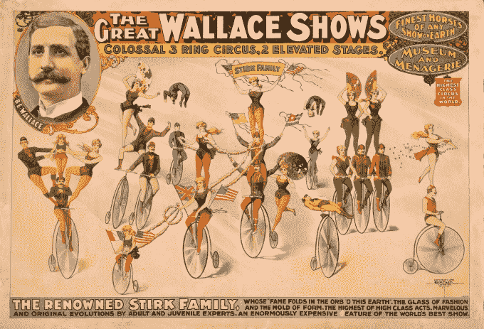
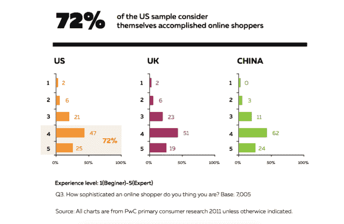

# 数字销售线索挖掘的未来 

> 原文：<https://web.archive.org/web/http://techcrunch.com/2016/05/02/the-future-of-digital-lead-generation/>

德米特里·萨维列夫撰稿人

领导一代已经走过了漫长的道路。根据[的一项分析，铅的产生可以追溯到公元前 27 年](https://web.archive.org/web/20230217015851/http://www.grosocial.com/graphics/evolution-of-lead-gen/)，当然，假设我们接受罗马贸易市场是贸易商最初的铅产生平台。在罗马时代，开发线索的方式是通过口口相传。

通过口头传播信息，拥有关系网的人们根据经验交换信息和建议。这种情况至今仍在发生。你可能会问你的邻居他们雇了谁来改造他们的厨房，或者问一个朋友他们建议你去看哪一位医生，但是你会因为许多其他原因而寻求参考吗？你可能不知道。

随着技术的进步，获取销售线索的方式也发生了变化。如今，当你需要购买特定的东西时，你依赖于互联网。这是最大的便利，甚至比问你认识的人还容易，而且无论你在哪里都可以得到——在家、在工作中还是在路上。既然我们寻找信息的方式已经改变，我们接收信息的方式也不同了。在了解我们今天已经走了多远以及我们将向何处去之前，我们必须了解销售线索的产生是从哪里开始的。

## 技术时代

美国公众在 18 世纪早期就可以买到报纸(欧洲稍微早一点)。这是信息以有组织的官方方式在整个社会传播的第一种方式。随着公众对免费信息需求的增长，报纸所有者意识到了对广告收费的机会。读者享受着获取信息的能力，广告商找到了一个新的渠道来产生商机。

18 世纪末，技术不断进步。新的印刷技术让广告商有机会印刷图文并茂的海报，创造了一种额外的方式来达到目标和创造商机。大约在 19 世纪 30 年代，广告牌被引入美国，到 1860 年，广告牌广告成为一个独立的行业。

1864 年，突破性的电报技术被用来向富裕的美国家庭发送营销信息。虽然这主要是垃圾广告，但它仍然是一个有效的潜在客户生成模型，并导致了两种极端广告的分类:垃圾广告和相关广告。据《时代》杂志报道，如今 78%的电子邮件都是垃圾邮件。这与[帕累托法则](https://web.archive.org/web/20230217015851/https://en.wikipedia.org/wiki/Pareto_principle)不谋而合，即 20%的适当邮件自然会产生 80%的垃圾邮件。

第一个广播商业广告于 1922 年在 WEAF 播出；1941 年，[第一个电视广告](https://web.archive.org/web/20230217015851/http://www.openculture.com/2013/08/watch-the-first-commercial-ever-shown-on-american-tv-1941.html)播出；1950 年，[门到门模式](https://web.archive.org/web/20230217015851/https://en.wikipedia.org/wiki/Door-to-door)开始流行。新的销售线索生成模型列表还在继续，每个新模型都比下一个更复杂。呼叫中心营销兴起于 20 世纪 60 年代，1969 年，第一个超级碗广告出现，随后在 1984 年出现了电视购物。

**电脑时代**

接下来的发展是计算机的引入，以及后来的个人计算机(在 20 世纪 80 年代中期)。这是一场革命的开始:1985 年桌面出版，1990 年 CRM 系统的引入，1991 年第一个网页，1992 年第一个网络横幅，1995 年第一个搜索引擎和在线市场出现，1996 年互联网病毒式营销，1998 年谷歌的创立，2003 年社交网络和 2005 年 YouTube。

自 2004 年以来，我们几乎每年都见证一条新的销售线索生成途径。智能手机创造了扩大接触范围和直接接触个人的机会，移动应用程序使品牌能够以全新的方式与消费者互动，脸书和 Twitter 等社交媒体平台为品牌创造了根据消费者的好恶锁定特定消费者的机会。

> 技术的实施是由企业家决定的。

如果我们查看销售线索生成模型的每个步骤之间的年数，我们会看到以下模式:1700、100、50、34、58、19、9、10、9、5、5、1、1、3、1… 1。这种模式表明，线索生成模型中进化步骤之间的间隔正在以一种渐进的方式缩小——与技术进步成镜像平行。然而，技术不仅从营销人员的角度塑造了潜在客户生成模型的形式，还从消费者的角度提出了新的趋势和需求。

换句话说，技术能力取决于创新。然而，技术的实施是由企业家决定的，他们基于研究或创新的愿望，发明解决方案，进而给予他们巨大的估值。

**赋权时代**

[成立于 2009 年的优步](https://web.archive.org/web/20230217015851/http://www.uber.com/)推出了他们的[领先一代模式](https://web.archive.org/web/20230217015851/http://www.businessinsider.com/uber-fights-california-class-action-lawsuit-2015-7):

“优步称自己是连接买家和卖家的‘领先一代’应用——在这里，是指想要乘车的人和出售乘车的司机。所以优步和其他打车服务实际上类似于易贝和 Etsy。优步等领先一代平台同样协调司机和乘客之间的交易，”[优步聘请的专家贾斯汀·麦克拉里教授写道](https://web.archive.org/web/20230217015851/http://www.businessinsider.com/uber-fights-california-class-action-lawsuit-2015-7)。

这个模型很棒。事实证明，它不仅利润丰厚，增长速度超过了易贝，而且在社会行为方面也产生了人类学意义上的转变，这导致了按需服务和共享经济的传播。那么“[优步效应](https://web.archive.org/web/20230217015851/http://www.cnbc.com/2015/03/13/how-the-uber-effect-is-changing-work.html)有哪些影响呢？”

根据自由职业者联盟和自由职业平台 Elance-oDesk 最近发布的一项调查，大约 5300 万或 34%的美国工人现在是自由职业者，技术是帮助他们大多数人找到工作的关键力量之一。

技术和企业家塑造了市场，因此消费者可以从有竞争力的价格中受益。为了拥有可持续的商业模式和服务，每一个新的竞争者都必须展现出至高无上或多样化的价值。换句话说，引线的质量应该更好或者成本应该降低。

这种结合自由职业或按需工作的技术可以带来顶级的财务成就。这是对优步(620 亿美元)和 Airbnb(255 亿美元)等公司的证明，它们引领着独角兽的稳定。但是小公司呢？其他利用相同的线索挖掘模式的创业公司呢？

[Carwow](https://web.archive.org/web/20230217015851/https://www.carwow.co.uk/) ，一家创业公司[筹集了 1840 万美元的种子资金](https://web.archive.org/web/20230217015851/https://techcrunch.com/2014/12/14/carwow-fuel-injection/)，通过向用户提供搜索新车的信息来增强消费者的能力。这项服务可以比较不同汽车的各种品牌和型号，同时让消费者看到经销商在他们的地区提供什么，价格是多少。

因此，代理商获得了合格的销售线索，而消费者则获得了最好的交易。该服务对消费者是免费的，并且可由希望加入该系统的经销商购买。由于 carwow 的技术，经销商被迫适应有利于客户的市场条件。从 carwow 过去六年的成功以及 B 轮融资的完成来看，这种潜在客户挖掘模式显然是有效的。

获得[260 万美元](https://web.archive.org/web/20230217015851/https://www.crunchbase.com/organization/mydealeronline#/entity)资助的 MyDealerOnline ，是另一家授权购车者的公司。该服务帮助消费者以尽可能好的价格购买二手车，同时为经销商提供最合格的线索。这个想法的基础是汽车在拍卖中以最好的价格出售；然而，根据美国法律，拍卖的车辆只能由特许经销商购买。这迫使消费者只能购买经销商库存中的车辆。MyDealerOnline 的技术将车辆拍卖与经销商联系起来。

> 企业家需要适应不断发展的技术。

这使得经销商能够将拍卖的车辆直接展示给消费者，从而消除经销商先购买的需要。根据埃德蒙兹[的一项调查](https://web.archive.org/web/20230217015851/http://static.ed.edmunds-media.com/unversioned/img/car-news/data-center/2014/shopping-report/edmunds-shopping-report-2014.pdf)，100%的智能手机用户使用手机进行购车活动，包括比价。通过 MyDealerOnline 的技术，经销商可以直接向消费者的智能手机、平板电脑或台式机展示他们的产品。现在，消费者可以从拍卖中了解最佳交易，并利用专业销售人员为他们争取最佳价格。

同行业的其他公司也利用了这种模式。Beepi 筹集了近 1 . 5 亿美元，目的是为那些想直接向其他人出售汽车的人提供合格的线索，完全不需要经销商。Beepi 知道这种交易的一个主要障碍是车辆注册流程，这就是为什么他们的业务模式提供了现金返还的保证，以简化流程并帮助达成更多交易。

从这些汽车和酒店的例子中可以看出，许多行业已经改进了他们的销售线索生成模型。其他非传统的例子是销售私人飞机、经营研究实验室、贷款和提供家居装修服务的公司。

世界上发展最快的喷气式飞机公司jet smarter，本质上就像天空中的优步。飞机运营商找到了合格的潜在客户，而消费者收到了私人飞机或共享飞机座位的即时价格。

既然你这么做了，为什么不在一家豪华酒店订一个房间呢？[充值](https://web.archive.org/web/20230217015851/https://techcrunch.com/2016/03/24/recharge-lets-you-book-a-hotel-room-for-minutes-at-a-time/)允许用户查找和预订酒店房间，有一个小小的变化:使用充值的人可以预订任何时间段的房间，甚至只是 10 分钟的淋浴或 30 分钟的小睡。酒店现在以每小时相对较高的速度寻找客人，而用户很容易找到他们寻求的便利。

这些潜在客户服务带来的便利不仅能让您到达酒店并找到房间，还能确保您在访问期间吃饱喝足！尝试使用 [DoorDash](https://web.archive.org/web/20230217015851/https://techcrunch.com/2016/03/24/doordash-update/) ，这个应用程序可以将参与餐厅的食物直接送到你的门口。

私人飞机、10 分钟的酒店房间和送餐服务——为什么要止步于此？如果你是一名科学家，需要租一个实验室，[科学交流](https://web.archive.org/web/20230217015851/https://www.scienceexchange.com/)可能会让你感兴趣。在获得 2500 万美元的 B 轮资金后，科学交流为研究人员创造了一个市场，为他们找到合适的实验室服务，考虑到大多数人没有资源、时间或金钱来创建自己的实验室。这些实验室现在能够接收来自寻求外包其研究的制药行业的私人、学术、政府和制造部门的线索。这是一个被证明的成功——公司在过去的一年里增长了 500%。

## 人类购买逻辑

由于消费者接受了从优步到网飞的一系列公司的教育，购买者的购物习惯也发生了变化。根据普华永道 2011 年的一份报告，个人已经转向“多渠道购物”模式，消费者从一到五个渠道购物，以确定每个行业和每个产品的最佳解决方案。2011 年，65%的美国购物者已经使用了至少两个渠道，21%的人使用四个或更多的渠道进行网上购物。

从上图中可以看出，72%的美国消费者认为自己是老练的消费者，他们会在四五个网上渠道寻找最划算的交易。2011 年，[普华永道](https://web.archive.org/web/20230217015851/https://www.pwc.com/us/en/retail-consumer/publications/assets/pwc-us-multichannel-shopping-survey.pdf)预测如下:

“从我们的调查结果来看，很明显，零售商需要更好地调整他们的业务运营模式，以适应消费者的成熟度和期望。缩小这一差距需要零售商通过更深入地了解客户来大幅提高敏捷性和灵活性…未来成功的零售业务模式将与过去不同。获胜者将是那些已经认识到这些趋势，并且正在建立敏捷组织的人，这些组织能够提供跨渠道的一致体验，具有可识别和令人欣慰的相似性，并且始终令人印象深刻，与时俱进。”

一波创业公司和组织的目标是站在消费趋势的最前沿——提供最好的产品，并因此成为行业领导者。每年有数万家各种规模的初创公司成立——有些成功，有些失败，但所有这些公司都旨在推出成为未来公司参考点的解决方案。

> 每天都在发生的创新赋予了企业和消费者同样的权利。

参考点公司的一个例子是亚马逊。亚马逊于 1994 年推出；随之而来的是亚马逊效应，它改变了电子商务和零售业的世界，同时也创造了一些可供其他网站效仿的东西。亚马逊支持每一个行业，销售超过 1.2 亿种不同的商品。亚马逊提供了一项在当时与众不同的服务，为顾客提供关于产品和价格的完整信息以及便利。[亚马逊](https://web.archive.org/web/20230217015851/http://www.fool.com/investing/general/2014/05/24/how-many-customers-does-amazon-have.aspx)用这种新模式吸引了多少人？

“亚马逊将活跃客户定义为在过去 12 个月内购买过商品的账户。活跃客户通常都有有效的信用卡记录。据 GeekWire 报道，亚马逊拥有大约 2.44 亿用户，是易贝贝宝支付服务的两倍多，后者拥有 1.1 亿活跃用户，但它落后于苹果，后者拥有 8 亿 iTunes 账户。

## 消费者增强或削弱潜在客户生成模型

如今，我们在销售线索生成模式的两个极端之间转换:一个是消费者被赋予权力，另一个是消费者被剥夺权力。以打车应用为例；[截至 2013 年，至少有 10 家。它们唯一相关的地方是没有优步或类似服务的地方。众所周知，拼车服务在几个方面击败了出租车，包括乘车成本、汽车质量、应用服务、支付等。最重要的是，司机选择为拼车公司工作，而不是选择做出租车，就像乘客选择优步而不是出租车一样。这是一个双赢的模式，或者说是一个赋权的模式。](https://web.archive.org/web/20230217015851/http://www.androidheadlines.com/2013/12/featured-top-10-best-android-taxi-apps.html)

拼车司机的资源与众不同。这就是为什么拼车公司认为自己是“引领一代应用程序”由于技术平台的透明性，结合大数据，司机可以获得更多信息，以增加最需要提货的地区的销售线索转化率，如果有针对性，司机可以赚更多的钱。这些服务还共享关于费率在特定时间如何变化的信息，以及在繁忙时段或事件发生时何时收取额外费用的信息。司机也可以持续访问他们的乘车历史，能够很容易地看到他们开车去了哪里，他们载了谁，他们赚了多少钱。价值不菲。

打车应用模式正在削弱力量；骑手们没有真正的优势。虽然他们可以使用应用程序，但与优步或 Lyft 相比，司机的可用性更低，整体服务也很差。此外，出租车司机需要有驾照，这限制了可用司机的数量，使乘客更难找到出租车。

出租车司机也得不到与拼车应用程序工作人员相同的资源。他们无法跟踪他们的乘坐情况，也无法获得关于如何改善个人业务以赚更多钱的信息。打车应用就像是简单地叫车的平行解决方案，而不是真正为乘客或自由司机解决问题的创新解决方案。这几乎是一个双输的模式，乘客吃亏，司机无利可图，这是一个真正的削弱实力的模式。

与 Airbnb 相比，从酒店登记应用程序中也可以得出同样的见解。这家初创公司让房主和那些寻求住宿的人受益，服务本身每笔交易的利润为 6-12%。这些团体选择集中他们的资源来提供满足每个通信者的手段，从而赋予每个人权力。

## 今后

由于新技术和不断变化的消费者趋势，销售线索生成模型在历史上不断发展。计算机和互联网时代大大加快了向世界推出新的领先一代模型的速度。曾经需要几百年，然后几周，然后几天才能改变的事情，现在只需要几个小时就能改善。每天都在发生的创新赋予了企业和消费者同样的权利。

今天的[潜在客户生成模型](https://web.archive.org/web/20230217015851/https://techcrunch.com/2016/01/19/with-google-facebook-and-nextdoor-whats-next-for-lead-generation/)可以被最好地描述为:免费列表、按印象付费、优质列表、打折交易、按互动付费和按交易付费。我们看到的问题是，每个人都在使用相同的销售线索挖掘模型，在相同的领域竞争。我们可以从过去学到的是，企业家需要适应不断发展的技术，拥抱变化，以保持竞争力，并在各自的行业中脱颖而出。