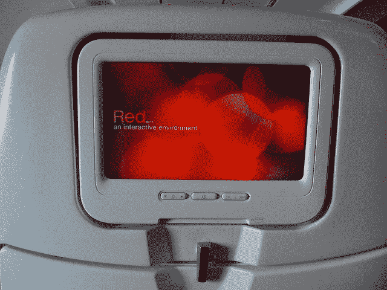
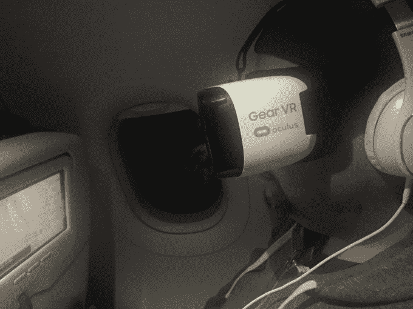

# 飞机上娱乐的未来是虚拟现实

> 原文：<https://web.archive.org/web/https://techcrunch.com/2015/12/15/the-future-of-in-flight-entertainment-is-virtual-reality/>

如果你碰巧上周乘坐维珍美国航空从旧金山飞往西雅图，或者昨晚返回，你可能会注意到我。我是那个圆顶上戴着大头盔的家伙，像个怪人一样晃着脑袋。不过，我没看到你。据我所知，当时我一个人在飞机上(抱歉，是坐在我旁边的 April)。

我经常乘飞机出差，从两个小时或不到两个小时的飞机到西雅图，再到十几个小时的飞机到德国，以及这两者之间的一切。我真的不太喜欢飞行，我也不确定是否有很多人喜欢它。每个人都有自己的带上飞机的物品清单，以及让自己尽可能感到舒适和愉快的小程序。说到维珍美国航空，他们的机上娱乐是你飞往目的地所能找到的最好的娱乐之一。

这次旅行我带了[三星 Gear VR](https://web.archive.org/web/20230315231520/https://techcrunch.com/2015/11/20/samsung-gear-vr/) ，而且没有回头路。我希望永远不要在无法再次跳入虚拟现实的情况下飞行。

## 来和我一起飞吧…或者不要

我不擅长乘坐客机。不能在飞机上睡觉来救我的命。我紧张起来。我拉小提琴。我很容易分心，所以在飞机上看电影或玩游戏通常会在 30 分钟后消失。如果有 Wi-Fi，我通常会买，因为我会很快厌倦。我会检查一些邮件，发关于飞行的微博，查看 Instagram。基本上，和我在地面上的空闲时间做的一样。不过瘾。

在真正的长途飞行中，我甚至会在过道里走来走去，看看前面座位上的其他人在看什么，希望得到一个有助于我在着陆前消磨时间的想法。这是一个令人悲伤的情况。

如果我和某人一起飞行，这次是我的另一个重要的四月，我真的不喜欢聊天。她看了一整部电影，这是我很少做的事情，除非是我一直推迟看的事情，直到我没有其他事情可做…比如在飞机上。如果我坐在一个陌生人旁边，我就更不爱说话了。

这一次，我有了另一个选择。一个或多个不同的世界。

## 让我离开这架飞机

打开手机，对我来说是三星 S6 Edge+,将它放入 Gear VR，插上耳机，打开蓝牙控制器，总共花了两分钟。也不需要 Wi-Fi，因为我的 Oculus 商店图书馆已经装满了不需要连接的游戏和体验。此外，大多数飞机 Wi-Fi 会屏蔽网飞之类的东西，所以看电影不是一个选择。再说一次，我可能无论如何也不会这么做。

通常我会点一杯饮料和一份小吃，摆弄一下地图，看看我们在哪里，我们走得多快，什么时候着陆。这次不会。我把虚拟现实设备放在头上，然后去了一个遥远的地方。

我不得不强调，你需要一副好的耳机，如果你能摆动它，就能消除噪音，使体验完整。

Gear VR 上有几款游戏让我爱不释手，其中一款是 Climax Studios 出品的 *Bandit Six: Salvo* 。这就是我的目标。

## 在那边，在那边！

一旦你被劫持，戴上耳机，你就不再是在飞机上了。我这么说不是为了让它听起来不像。你真的是在 Oculus 的世界里，飞机的轻柔运动(如果你幸运的话)是这种体验的一个很好的补充。

具有讽刺意味的是，我选择的游戏是一个你必须射击各种军事对手的游戏…包括飞机。一旦我克服了在飞机上拍摄飞机的怪异，我就没事了。在游戏中，直升机在你周围飞来飞去，所以你当然要把头转向两边，有时甚至是你的身后。是的，我肯定我看起来像个十足的混蛋。

我不在乎。

我不是超级喜欢游戏，但很难*不*进入你在 Gear VR 上做的事情。我以为我会在游戏之间跳来跳去，但我没有。我只是继续玩。我忘记了我周围的世界，我周围的人，通常会让我分心的闲聊，以及我们何时着陆的疑惑。有几次，我通过扬声器听到了通知，但我没有把耳机移到一边，因为我根本不在乎。

因为你的头控制着炮塔，我很确定乘务员以为我癫痫发作了。但我还是不在乎。我玩得很开心，基本上没有意识到周围的环境。在回来的路上，我甚至没有喝我习惯喝的伏特加。我确实发现自己不得不每隔一段时间就重新调整视角…这可能与飞机轻微的冲撞有关。

四月不在乎，因为她全神贯注于她正在看的电影。有几次我握着她的手，想让她知道我还没有完全疯掉，但是除了给我拍了上面那张傻傻的照片，她很高兴我很满足。

## 明显的未来

维珍美国或其他公司会向每位乘客提供 VR 吗？还没有。这是一个昂贵的想法，即使他们有一个有线体验，需要使用他们现有的娱乐系统。即便如此，我怀疑他们是否有马力运行像真正的 Oculus Rift 耳机这样的东西。这就是为什么 Gear VR 做到了这一点，它完全是移动的。

不过也有不好的地方，尤其是电池。如果你不能给你的手机充电，你就不能在这上面呆上 10 个小时。我连续使用了大约一个半小时，耗尽了我手机 40%的电量。遗憾的是，S6 Edge+不能换电池。即便如此，想着抓住这样的时刻去抢 Gear VR 和手机也不算疯狂。这种类型的娱乐会让长途飞行、火车旅行或家庭轿车后座短途旅行变得更加精彩。

当然，虚拟现实适合飞行旅行听起来像一个大“咄”。我经常开玩笑说要花更多的钱买一个座位，这个座位可以在飞机下面兼作隔音舱，在整个飞行过程中没有人会打扰我。现在不需要它，只是我大脑的一个小诡计。

当我被告知该着陆时，我有点沮丧，因为我不得不回到天空中即将着陆的大锡飞机上。我本来可以再玩几个小时的。我想其他人也有同样的经历。

如果航空公司在未来的飞行娱乐中不考虑这样的体验，他们将会被远远地甩在后面。我很快就会多付一点钱，买一个等我登机的设备。但在那之前，mobile Gear VR 会做得很好。